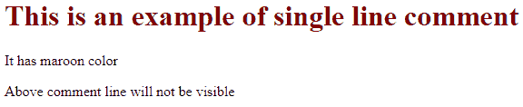
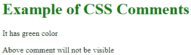
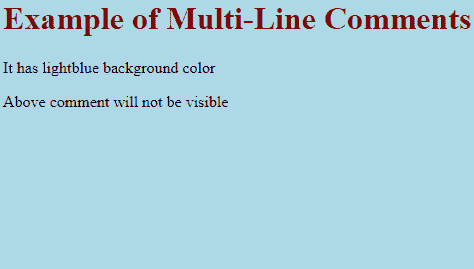

# CSS 注释

> 原文：<https://www.tutorialandexample.com/css-comment/>

**CSS 注释**:一般来说，CSS 中的注释是用来描述我们的代码的。此外，它将为许多关心代码的用户提供支持。在某种程度上，这些都被浏览器忽略了。

CSS 注释可以是多行或单行语句。这些注释以/*开头，以*/结尾。以下示例有助于理解这一概念:

**举例:**

```
<!DOCTYPE html>
 <html>
 <head>
 <style>
 /* Single Line Comment Example */
 h1 {
 color: maroon; 
 }
 </style>
 </head>
 <body>
 <h1> This is an example of single line comment </h1>
 <p> It has maroon color </p> 
 <p> Above comment line will not be visible </p>
 </body>
 </html> 
```

**输出:**



我们可以随时在代码中插入注释:

**举例:**

```
<!DOCTYPE html>
 <html>
 <head>
 <style>
 h1 { 
 color: green; /* This is green*/
 }
 </style>
 </head>
 <body>
 <h1> Example of CSS Comments </h1> 
 <p> It has green color </p>
 <p> Above comment will not be visible </p>
 </body>
 </html> 
```

**输出:**



此外，CSS 注释可以跨越多行:

**举例:**

```
<!DOCTYPE html>
 <html>
 <head>
 <style>
 /* This is a multi-line comment */ 
 body {
 background-color: lightblue;
 }
 h1 {
 color: maroon;
 } 
 </style>
 </head>
 <body>
 <h1> Example of Multi-Line Comments </h1>
 <p> It has lightblue background color </p>
 <p> Above comment will not be visible </p>
 </body>
 </html> 
```

输出:

