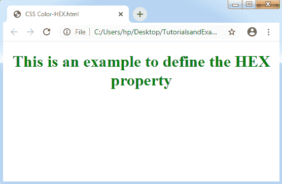
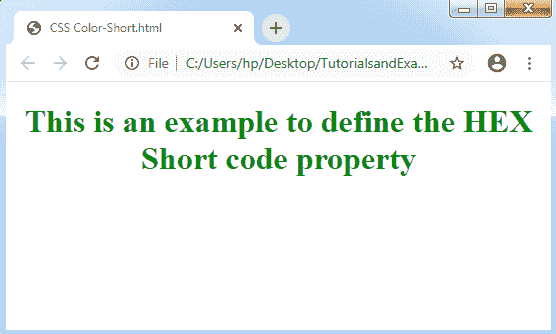
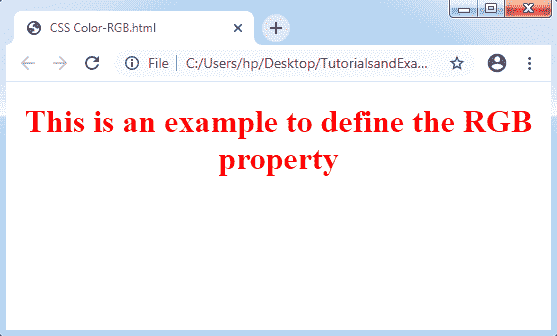
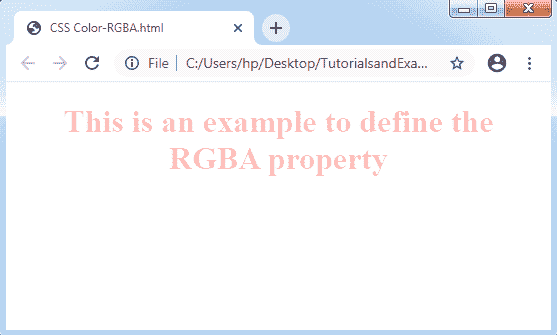
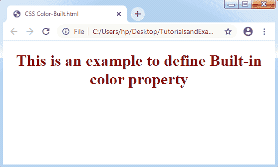
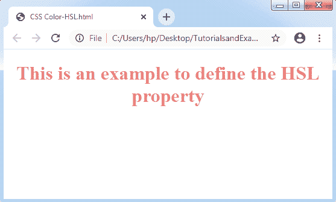
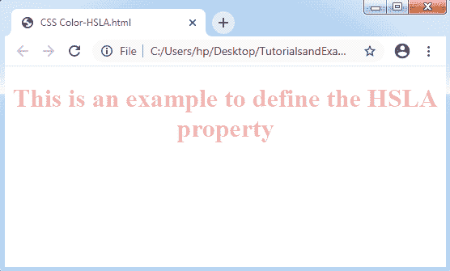

# CSS 颜色

> 原文：<https://www.tutorialandexample.com/css-color/>

**CSS Colors**:CSS color 属性用于设置 HTML 元素的颜色。可以使用该属性设置字体颜色和背景颜色。定义了几个值来指定颜色。它还可以应用于设置边框的颜色和其他各种装饰效果。以下是我们可以指定颜色的一些值:

*   十六进制符号
*   RGB 格式
*   RGBA 格式
*   内置颜色
*   high-speedlaunch 高速快艇
*   high-strength low-alloy 高力低合金

### 十六进制符号

十六进制表示法表示为颜色的任何六位数字表示法。它以一个 **#** 符号开始。这个符号由从 0 到 f 的任意六个字符组成。

十六进制记数法的最后两个数字将颜色值显示为蓝色( **BB** )。中间的两个数字将颜色值表示为绿色(GG)。前两个数字将颜色值定义为红色(RR)。

*   代码#000000 用于表示黑色的符号。
*   代码#FFFFFF 用于表示白色的符号。
*   其他一些代码是- #FFFF00、#0000FF、#00FF00 和#FF0000。

**语法:**

```
color: #(0-F)(0-F)(0-F)(0-F)(0-F)(0-F);
```

**举例:**

```
<!DOCTYPE html>
<html> 
<head> 
<style> h1 { text-align: center; } #hex { color: #008000; } </style> 
</head> 
<body> <h1 id="hex">This is an example to define the HEX property</h1> 
</body> 
</html>
```

**输出:** 



### 短十六进制代码

它是十六进制记数法的缩写，其中每个数字都可以重新设计为十六进制值**。比如说，** #7B6 会换成十六进制码#77BB66。代码#000 用于表示黑色的符号。代码#FFF 用于表示白色的符号。其他一些代码有- #F00、#0FF、#0F0 和#FF0 等。

**举例:**

```
<!DOCTYPE html>
<html>
<head>
<style>
h1 {
text-align: center;
}
#short {
color: #080;
}
</style>
</head>
<body>
<h1 id="short">This is an example to define the HEX Short code property</h1>
</body>
</html>
```

**输出:**



### RGB 格式

它表示“**红绿蓝**”格式，即用于描述 html 元素的颜色，只需指示范围从 0-255 的 R、G、B 值。在代码中应用 rgb()属性来定义颜色的值。它允许三个值，可以用整数或百分比(0-255)来定义。

注意:所有的浏览器都不允许这个属性。因此，rgb()属性不能在所有浏览器中使用。

**语法:**

颜色:rgb(R，G，B)；

**举例:**

```
<!DOCTYPE html>
<html>
<head>
<style>
h1 {
text-align: center;
}
#rgb {
color: rgb(255,0,0);
}
</style>
</head>
<body>
<h1 id="rgb">This is an example to define the RGB property</h1>
</body>
</html>
```

**输出:**



### RGBA 格式

RGBA 格式包括 Alpha (A)，它定义了元素的透明度。这种格式非常类似于 RGB 格式，除了 A (Alpha)。其值范围从 0.0 到 1.0，其中 1.0 值用于不透明的内容，0.0 值用于完全透明的内容。

**语法:**

颜色:rgba(R，G，B，A)；

**举例:**

```
<!DOCTYPE html>
<html>
<head>
<style>
h1 {
text-align: center;
}
#rgba {
color: rgba(255,0,0,0.3);
}
</style>
</head>
<body>
<h1 id="rgba">This is an example to define the RGBA property</h1>
</body>
</html>
```

**输出:**



### 内置颜色

内置属性描述了先前定义的颜色集合。它可以通过提及颜色的名称来使用，比如绿色、红色、蓝色、黄色等等。

**语法:**

```
color: color-name;
```

**举例:**

```
<!DOCTYPE html>
<html>
<head>
<style>          
h1 {
text-align: center;
}
#built {
color: maroon;
}
</style>
</head>
<body>
<h1 id="built">This is an example to define Built-in color property</h1>
</body>
</html>
```

**输出:**



### high-speedlaunch 高速快艇

在这个格式中，H 代表**色相**，S 代表**饱和度**，L 代表**明度**，下面讨论:

**色相:**色相可以描述为颜色在色轮上的度数，范围从 **0-360** 。数值 0 定义**红色**颜色，120 定义**绿色**颜色，240 定义**蓝色**颜色。

**饱和度:**饱和度以百分比的形式取值，100%定义一个**完全**饱和，这意味着没有灰色阴影。50%定义了 50%的灰色，这里颜色仍然可见。0%定义完全不饱和，这意味着内容将不可见，它将以全灰色显示。

**明度:**颜色的明度可以描述为我们希望赋予颜色的光的颜色。这里，100%定义白色，意味着全亮度。50%既不定义亮也不定义暗。0%定义黑色，意味着没有光。

**语法:**

```
color: hsl(H, S, L);
```

**举例:**

```
<!DOCTYPE html>
<html>
<head>
<style>
h1 {
text-align: center;
}
#hsl {
color: hsl(0,70%,70%);
}
</style>
</head>
<body>
<h1 id="hsl">This is an example to define the HSL property</h1>
</body>
</html>
```

**输出:**



### high-strength low-alloy 高力低合金

HSLA 格式包括 Alpha(α)，代表元素的透明度。除了 Alpha (A)之外，它非常类似于 HSL 格式。其值的范围是从 0.0 到 1.0，其中 1.0 值用于不透明的内容，0.0 值用于完全透明的内容。

**语法:**

```
color: hsla(H, S, L, A);
```

**举例:**

```
<!DOCTYPE html>
<html>
<head>
<style>        
h1 {
text-align: center;
}
#hsla {
color: hsla(0,60%,60%,0.5);
}
</style>
</head>
<body>
<h1 id="hsla">This is an example to define the HSLA property</h1>
</body>
</html>
```

**输出:**



一些颜色及其十六进制和十进制值如下:


| 南号码 | 颜色名称 | 小数值 | 十六进制值 |
| 1. | 浅绿色 | rgb(0，255，255) | #00FFFF |
| 2. | 黑色 | rgb(0，0，0) | #000000 |
| 3. | 褐色的 | rgb(165，42，42) | #A52A2A |
| 4. | 蓝色 | rgb(0，0，255) | #0000FF |
| 5. | 绿色的 | rgb(0，128，0) | #008000 |
| 6. | 灰色的 | rgb(128，128，128) | #808080 |
| 7. | 柑橘 | rgb(255，165，0) | #FFA500 |
| 8. | 粉红色 | rgb(255，192，203) | #FFC0Cb |
| 9. | 红色 | rgb(255，0，0) | #FF0000 |
| 10. | 紫罗兰 | rgb(238，130，238) | #EE82EE |
| 11. | 怀特（姓氏） | rgb(255，255，255) | #FFFFFF |
| 12. | 黄色 | rgb(255，255，0) | #FFFF00 |

