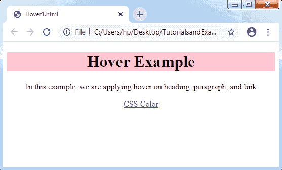
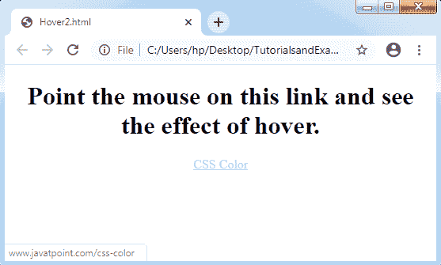
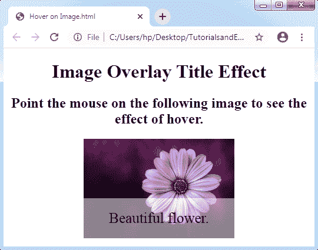

# CSS 悬停

> 原文：<https://www.tutorialandexample.com/css-hover/>

CSS 悬停 : CSS **:悬停**用于在我们将鼠标指向这些元素时选择各种元素。我们也可以在所有的 HTML 元素上使用这个选择器，而不是只在链接上使用。要设计未访问页面的链接，可以使用**:链接**选择器。为了开发被访问页面的链接，可以使用一个 **:visited** 选择器，为了设计活动链接，可以有效地使用一个:active 选择器。

CSS 悬停是在 CSS1 版本中引入的。它被应用在网页上，在适当的网页设计程序中根据用户的喜好突出显示它们。

它包含以下一些效果:

*   它可以用来改变背景颜色和字体。
*   它可以用来改变图像的不透明度。
*   它可以用于文本嵌入。
*   它可以用来设计图像上的翻转效果。
*   它可以用来交换图像。

**重要:**为了有效地创建悬停选择器，我们需要在声明了:**访问过的**和:**链接**选择器之后定义它，如果这些选择器在 CSS 的定义中可用的话。

悬停改变元素的属性值以允许对所述文本/图像或互易元素的各种动画修改。在网页中嵌入悬停的各种元素允许它们具有功能性和交互性。

悬停选择器与所有主浏览器兼容。相反，在几个触摸设备上执行它将是一个挑战。认识到当与特定的非支持设备一起使用时，主动悬停操作被卡住。

**语法:**

```
:hover {
css declaration;
}
```

**示例 1:** 将鼠标悬停在标题、链接和段落上

```
<!DOCTYPE html>
<html>
<head>
<style>
body {
text-align: center;
}
p:hover, h1:hover, a:hover {
background-color: pink;
}
</style>
</head>
<body>
<h1>Hover Example</h1>
<p>In this example, we are applying hover on heading, paragraph, and link</p>
<a href='https://www.javatpoint.com/css-color'>CSS Color</a>
</body>
</html>
```

**输出:**



**示例 2:** 使用 CSS 改变悬停时链接的颜色

当我们将光标指向链接时，链接的颜色将会改变。如果我们用 CSS 编写，它的执行很容易理解和编写。会产生一种时尚的效果。

```
<!DOCTYPE html>
<html>
<head>
<style>
body {
text-align:center;
}
a {
color: green;
}
a:hover {
color: lightblue;
}
a:active {
color: cyan;
}
</style>
</head>
<body>
<h1>Point the mouse on this link and see the effect of hover.</h1>
<a class= "link" href='https://www.javatpoint.com/css-color'>CSS Color</a>
</body>
</html>
```

**输出:**



**示例 3:** 文本覆盖在图像悬停上

这段 CSS 代码在鼠标悬停时显示图像上的文本。让我们看看鼠标悬停时的叠加图像效果。

```
<!DOCTYPE html> 
<html> 
<head> 
<meta name="viewport" content="width=device-width, initial-scale=1"> 
<style> 
   body{ 
      text-align:center; 
   } 
* {box-sizing: border-box;} 
.container { 
  position: relative; 
  width: 50%; 
  max-width: 300px; 
} 
.image { 
  display: block; 
  width: 100%; 
  height: auto; 
} 
.overlay { 
  position: absolute;  
  bottom: 0;  
  background: rgba(255, 255, 255, 0.5);  
  width: 100%; 
  opacity: 0;  
  transition: .9s ease; 
  font-size: 25px; 
  padding: 20px; 
}
.container:hover .overlay { 
  opacity: 1.5; 
} 
</style> 
</head> 
<body> 
<h1>Image Overlay Title Effect</h1> 
<h2>Point the mouse on the following image to see the effect of hover.</h2> 
<center> 
<div class="container"> 
       
      <div class="overlay">Beautiful flower.</div> 
</div> </center>   
</body> 
</html> 
```

**输出:**

