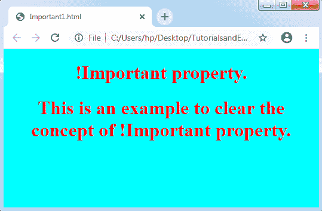
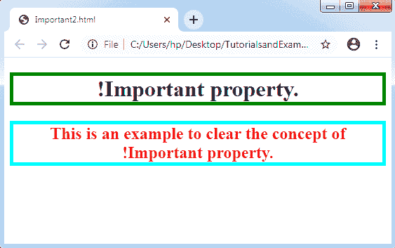

# CSS 很重要

> 原文：<https://www.tutorialandexample.com/css-important/>

**CSS 重要** : CSS！与其他 CSS 属性相比，重要属性用于提供更高的重要性。**这个属性的意思是“这是重要的。**"这个属性使 CSS 拥有了**层叠**的特性。当我们在文本中使用这个属性时，文本的优先级将高于其他优先级。

建议我们不要将这个属性应用到我们的代码中，直到程序是必需的。这种情况经常发生是因为！重要属性可能会导致几种意外的行为。

当我们用这个属性定义一个规则时，它会忽略常规的关注点，即后来建立的规则会覆盖之前描述的任何规则。如果我们申请 200 或更多！重要的标记声明，定期级联再次举行。意思是新标记的！重要声明将取代先前的声明。

它增强了 CSS 属性的优先级，并避免了所有的重写属性。

**语法:**

```
element {
font-size: 14px !important;
color: red !important;
....
}
```

**举例:**

```
<!DOCTYPE html>
<html>
<head>
<style>
h1 {
color: white;
}
h1 {
color: red !important;
}
body {
background-color: cyan  !important;
text-align: center;
background-color: red;
}
</style>
</head>
<body>
<h1>!Important property.</h1>
<h1>This is an example to clear the concept of !Important property.</h1>
<p></p>
</body>
</html>
```

在上面的代码中，主体的背景颜色是青色而不是红色。这是因为我们应用了青色背景色之前！重要。

**输出:**



让我们看另一个例子来清楚地理解这个属性。

**举例:**

```
<!DOCTYPE html>
<html>
<head>
<meta name="viewport" content="width=device-width, initial-scale=1">
<style>
body {
text-align: center;
}
h1 {
border-color: green !important;
border: 5px red solid;
border-color: violet;
}
h2 {
color: red !important;
color: cyan;
border-color: aqua !important;
border: 5px yellow solid;
}
</style>
</head>
<body>
<h1>!Important property.</h1>
<h2>This is an example to clear the concept of !Important property.</h2>
</body>
</html>
```

在上面提到的代码中，我们使用了！文本边框的重要属性。相对于其他声明，标题 h1 的边框颜色为绿色。标题 h2 的边框颜色将为浅绿色和红色，与其他陈述形成对比。

**输出:**

