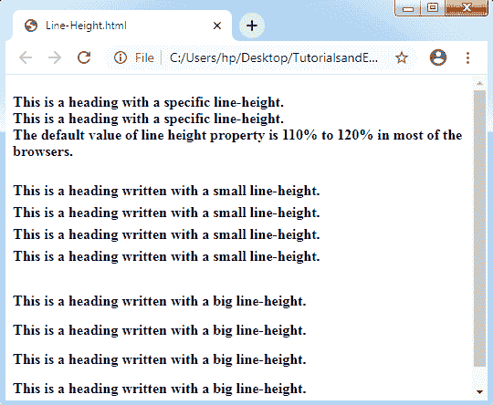
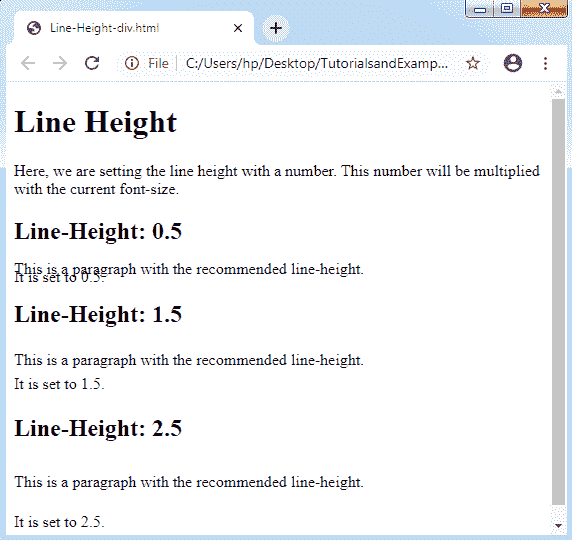

# CSS 线条高度

> 原文：<https://www.tutorialandexample.com/css-line-height/>

**CSS 行高**:CSS 中的这个属性可以用来描述元素内部的行框的最小高度。它在我们的内容中设置了两行之间的区别。

它描述了行内元素上下的空间量。它还允许我们设置行高，这与各种字体大小无关。

**行高值**

以下是一些可应用于行高属性的值属性:

**正常值:**正常值用作默认值。它正常描绘行高。

**数字:**表示一个数字，该数字将与当前使用的字体大小相乘，以设置行高。

**长度:**长度值应用于用 **pt、cm、px、**等设置行高。

**%:** 可以使用当前字体的百分比来设置行高。

**初始:**用于将该属性设置为默认值。

**inherit:** 从父元素中获取该属性。

**举例:**

```
<!DOCTYPE html>
<html>
<head>
<style>
h4.small {
line-height: 150%;
}
h4.big {
line-height: 200%;
}
</style>
</head>
<body>
<h4>This is a heading with a specific line-height.<br>
This is a heading with a specific line-height.<br>
The default value of line height property is 110% to 120% in most of the browsers.
</h4>
<h4 class="small">
This is a heading written with a small line-height.<br>
This is a heading written with a small line-height.<br>
This is a heading written with a small line-height.<br>
This is a heading written with a small line-height.<br></h4>
<h4 class="big">
This is a heading written with a big line-height.<br>
This is a heading written with a big line-height.<br>
This is a heading written with a big line-height.<br>
This is a heading written with a big line-height.<br></h4>
</body>
</html>
```

**输出:**



**举例:**

在下面的例子中，行高是用一个数字和不同的< **div** >标签设置的:

```
<!DOCTYPE html>
<html>
<head>
<style>
div.x {
line-height: 0.5;
}
div.y {
line-height: 1.5;
}
div.z {
line-height: 2.5;
}
</style>
</head>
<body>
<h1>Line Height</h1>
<p>Here, we are setting the line height with a number.
This number will be multiplied with the current font-size.</p>
<h2>Line-Height: 0.5</h2>
<div class="x">This is a paragraph with the recommended line-height.<br>
It is set to 0.5.</div>
<h2>Line-Height: 1.5</h2>
<div class="y">This is a paragraph with the recommended line-height.<br>
It is set to 1.5.</div>
<h2>Line-Height: 2.5</h2>
<div class="z">This is a paragraph with the recommended line-height.<br>
It is set to 2.5.</div>
</body>
</html>
```

**输出:**

