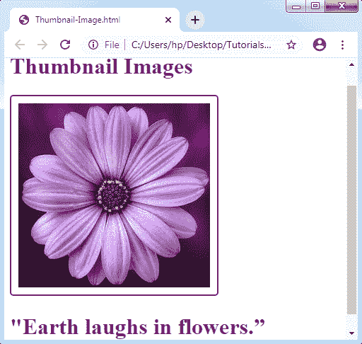
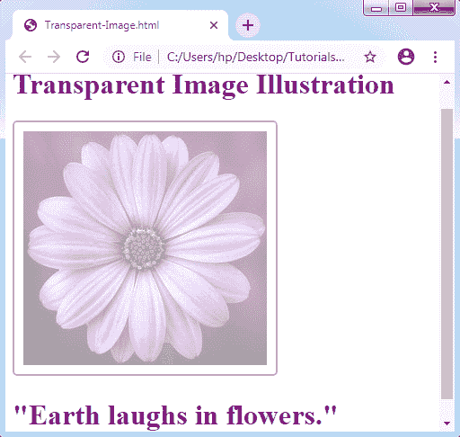
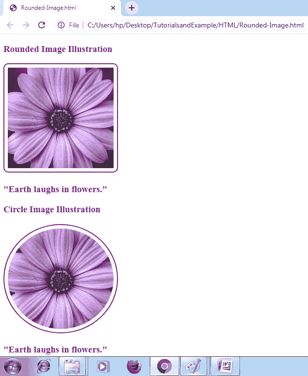
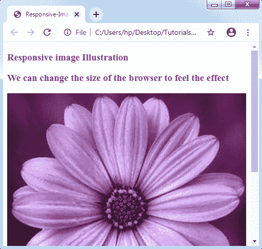
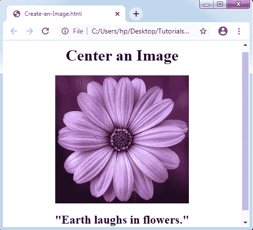

# CSS 图像

> 原文：<https://www.tutorialandexample.com/css-images/>

CSS 中的图像:图像是 web 应用程序的重要组成部分。它包括 web 应用程序中不推荐的各种类型的图像。但是，在需要时使用任何图像都是必不可少的。CSS 有助于控制图像在 web 应用程序中的显示。

借助边距和边框，图像样式非常类似于元素样式。这里有几个 CSS 属性，比如**宽度属性、高度属性、**和**边框属性**，它们将帮助我们设计图像的样式。

**支持的浏览器:**各种样式图像支持一些重要的浏览器，如下所列:

*   微软公司出品的 web 浏览器
*   谷歌浏览器
*   歌剧
*   火狐浏览器
*   旅行队

有一些插图将有助于理解这种图像属性。

**缩略图**

可以使用 border CSS 属性创建或设计缩略图。下面举个例子:

**举例:**

```
<!DOCTYPE html>
<html>
<head>
<style>
img
{
 border: 2px solid purple;
 border-radius: 5px;
 padding: 10px;
}
h1
{
 color: purple;
}
</style>
</head>
<body>
<h1> Thumbnail Images </h1>
</img>
<h1> "Earth laughs in flowers.” </h1>
</body>
</html>
```

**输出:**



### 透明图像

可以使用 opacity CSS 属性创建透明图像。不透明度属性值的范围分别为 0.0-1.0。让我们考虑下面的例子:

**举例:**

```
<!DOCTYPE html>
<html>
<head>
<style>
img
{
 border: 2px solid purple;
 border-radius: 5px;
 padding: 10px;
 opacity: 0.4;
}
h1
{
color: purple;
}
</style>
</head>
<body>
<h1> Transparent Image Illustration </h1>
</img>
<h1> "Earth laughs in flowers." </h1>
</body>
</html>
```

**输出:**



### 圆形图像

使用**边框半径属性**创建圆角图像，因为它可以设置图像的半径。设置圆角图像的一些可能的基本值如下:


| **值** | **描述** |
| 边框半径 | 它允许边界半径的每四个属性。 |
| 边框-右上-半径 | 它可以设置右上角的边界的角落。 |
| 边框-左上半径 | 左上角边框的角可以通过使用此属性来处理。 |
| 边框-底部-右侧-半径 | 它设置了一个右下角的边框。 |
| 边框-右上-半径 | 它处理左下角的边框。 |


**举例:**

```
<!DOCTYPE html>
<html>
<head>
<style>
.img1
{
 border: 2px solid purple;
 border-radius: 10px;
 padding: 7px;
}
.img2
{
 border: 2px solid purple;
 border-radius: 50%;
 padding: 7px;
}
h3
{
 color: purple;
}
</style>
</head>
<body>
<h3> Rounded Image Illustration </h3>
</img>
<h3> "Earth laughs in flowers." </h3>
<h3> Circle Image Illustration </h3>
</img>
<h3> "Earth laughs in flowers." </h3>
</body>
</html>
```

**输出:**



### 响应图像

响应图像能够自动适应屏幕的大小。它可以用于将图像调整到指定的框中。

**举例:**

```
<!DOCTYPE html>  
<html>  
<head>  
<style>
.img
{
 max-width: 100%;
 height: auto;
}
h3
{
 color: purple;
} 
</style>  
</head>  
<body> 
 <h3> Responsive image Illustration </h3> 
 <h3> We can change the size of the browser to feel the effect </h3> 
</img> 
<h3> "Earth laughs in flowers." </h3> 
</body>  
</html> 
```

**输出:**



### 将图像居中

可以通过使用**右边距**和**左边距**属性来应用图像值的中心。如果我们希望设计块元素，我们可以在**自动**模式中应用这些类型的属性。

**举例:**

```
<!DOCTYPE html>
<html>
<head>
<style>
.img
{
 margin-left: auto;
 margin-right: auto;
 display: block;
}
h1,h2
{
text-align: center;
}
</style>
</head>
<body>
<h1> Center an Image </h1>
</img>
<h2> "Earth laughs in flowers." </h2>
</body>
</html>
```

**输出:**

