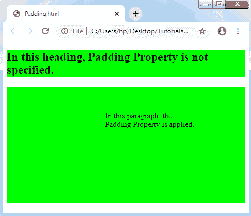

# CSS 填充

> 原文：<https://www.tutorialandexample.com/css-padding/>

**CSS 填充**:CSS 中的**填充属性**用于描述元素边框和元素内容之间的空间。
这个属性与 CSS 的 **margin 属性有很大不同，因为 CSS 的 margin 属性描述了元素上的空间。CSS 背景色影响 CSS padding 属性。它清除内容上方的空间。**

左、右、上和下填充可以通过使用单独的属性独立地改变。我们也可以通过使用**速记 CSS 填充**属性一次改变每个属性。

**填充属性**


| **房产** | **描述** |
| **填充** | 应用此属性仅在一个声明中设置每个属性。 |
| **左填充** | padding-left 属性用于设置元素的左填充。 |
| **右填充** | CSS 中的这个属性用于设置元素的八个填充。 |
| **填充顶部** | CSS 中的 padding-top 属性用于设置元素的顶部填充。 |
| **底部填充** | CSS 中的这个属性用于设置元素的底部填充。 |


**填充值**


| **值** | **描述** |
| **长度** | 它可以用来描述 em、px 和 pt 的固定填充。 |
| **%** | 它用于描述任何包含元素的填充百分比。 |


**填充示例**

让我们看看下面的填充示例，它将帮助我们理解填充属性:

```
<!DOCTYPE html>
<html>
<head>
<style>
p,h2
{
 background-color: lime;
}
p.padding
{
 padding-top: 50px;
 padding-right: 100px;
 padding-bottom: 150px;
 padding-left: 200px;
}
</style>
</head>
<body>
<h2> In this heading, Padding Property is not specified. </h2>
<p class= "padding"> In this paragraph, the Padding Property is applied. </p>
</body>
</html>
```

**输出:**

