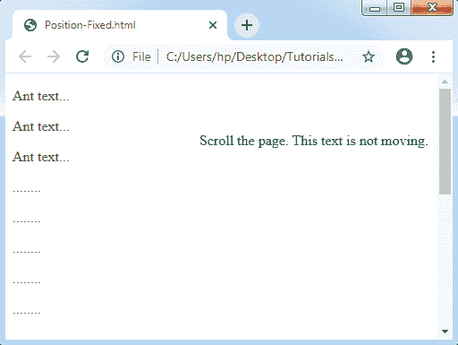
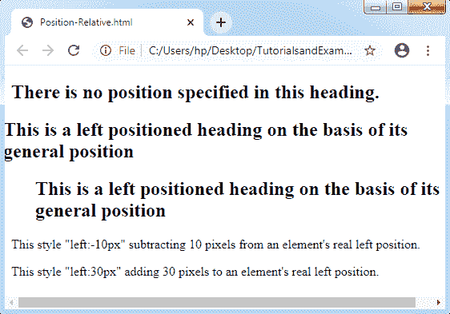
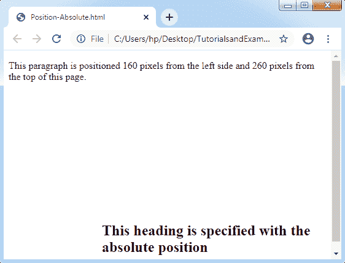

# CSS 位置

> 原文：<https://www.tutorialandexample.com/css-position/>

**CSS Position** :应用 CSS 中的 Position 属性设置元素的位置。它可用于定位元素的背面。这也有助于脚本动画的结果。

我们可以使用 **left，right，top，**和 **bottom 属性来放置一个元素。**首先，我们必须在使用这些属性之前设置位置属性。位置元素的计算位置可以是绝对的、相对的、粘性的和固定的。

CSS 中有一些定位，列举如下:

*   CSS 中的静态定位
*   CSS 中的固定定位
*   CSS 中的相对定位
*   CSS 中的绝对定位

**CSS 中的静态定位**

静态位置用作网上的默认位置。它总是根据页面的**总流程来设置元素的位置。此属性不受任何左、右、上和下属性的影响。**

**CSS 中的固定定位**

通过使用这个固定中毒 CSS 属性，可以有效地使用浏览器上的固定文本。即使我们滚动窗口，文本也不会移动。

**举例:**

考虑下面的例子:

```
<!DOCTYPE html>
<html>
<head>
<style>
p.pos_fixed
{
 position: fixed;
 top: 50px;
 right: 10px;
 color: green;
}
</style>
</head>
<body>
<p> Ant text...</p>
<p> Ant text...</p>
<p> Ant text...</p>
<p> ........</p>
<p> ........</p>
<p> ........</p>
<p> ........</p>
<p> ........</p>
<p> ........</p>
<p> ........</p>
<p> ........</p>
<p> ........</p>
<p> ........</p>
<p> ........</p>
<p> ........</p>
<p> ........</p>
<p> Ant text...</p>
<p> Ant text...</p>
<p> Ant text...</p>
<p class= "pos_fixed"> Scroll the page. This text is not moving. </p>
</body>
</html>
```

**输出:**



**CSS 中的相对定位**

CSS 中的这个属性设置了一个相对于正常位置的元素。

**举例:**

考虑下面的例子:

```
<!DOCTYPE html> 
<html> 
<head> 
<style> 
h2.pos_left
{ 
 position: relative; 
 left: -10px; 
} 
h2.pos_right
{ 
 position: relative; 
 left: 30px; 
} 
</style> 
</head> 
<body> 
<h2>There is no position specified in this heading. </h2> 
<h2 class="pos_left"> This is a left positioned heading on the basis of its general position </h2> 
<h2 class="pos_right"> This is a left positioned heading on the basis of its general position </h2> 
<p>This style "left:-10px" subtracting 10 pixels from an element's real left position.</p> 
<p>This style "left:30px" adding 30 pixels to an element's real left position.</p> 
</body> 
</html> 
```

**输出:**



**CSS 中的绝对定位**

CSS 中的绝对定位用于定位任何组件，即相对于其第一个父组件，包括除静态位置之外的任何位置。如果没有找到这样的组件，对应的块是 HTML。通过使用这种绝对定位，我们可以将组件放置在页面上的任何位置。

**举例:**

看一下下面的例子:

```
<!DOCTYPE html> 
<html> 
<head> 
<style> 
h2
{ 
 position: absolute; 
 left: 160px; 
 top: 260px; 
} 
</style> 
</head> 
<body> 
<h2> This heading is specified with the absolute position </h2>
<p> This paragraph is positioned 160 pixels from the left side and 260 pixels from the top of this page. </p>
</body>
</html> 
```

**输出:**

