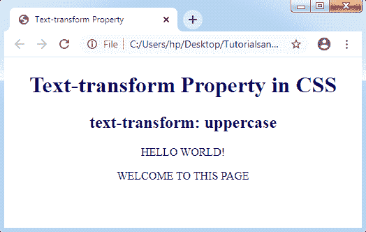
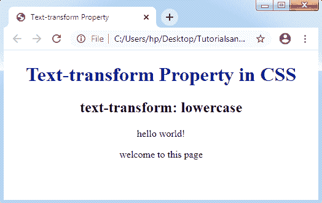
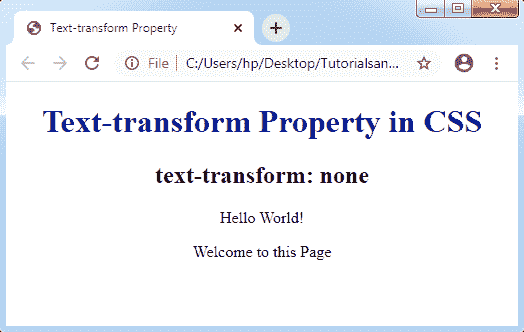

# CSS 文本转换属性

> 原文：<https://www.tutorialandexample.com/css-text-transform/>

**CSS 中的文本转换**

 **文本转换属性允许我们**改变文本大小写**。它控制文本的大小写。该属性用于设计全部大写或全部小写的文本外观，或者它可以将每个单词的第一个字符转换为大写。

**语法:**

```
text-transform: capitalize| uppercase| lowercase| none| initial| inherit;
```

下面我们用一个例子来逐一了解一下上面的属性值。

*   **大写**

它将每个单词的第一个字符转换成大写的。但是，它不能将任何数字后面的第一个字母变成大写形式。它只能影响任何单词的第一个字母，而不是改变任何单词的其他字母。

通过使用该属性，任何已经定义为大写形式的单词中的字母都不会被转换为小写形式。
下面是描述 ***资本化资产*** 的例子:

**语法:**

```
text-transform: capitalize;
```

**举例:**

```
<!DOCTYPE html>
<html>
<head>
<title> Text-transform Property </title>
<style>
body
{
 text-align: center;
}
h1
{
 color: navy;
}
p
{
text-transform: capitalize;
}
</style>
</head>
<body>
<center>
<h1> Text-transform Property in CSS </h1>
<h2> text-transform: capitalize </h2>
<p> Hello World! </p>
<p> Welcome to this Page </p>
</body>
</html>
```

**输出:**


*   **大写**

顾名思义，它将 word 的每个字符都转换成大写。

**语法:**

```
text-transform: uppercase;
```

**举例:**

```
<!DOCTYPE html>
<html>
<head>
<title> Text-transform Property </title>
<style>                
body
{
 text-align: center;
}
h1
{
 color: navy;
}
p
{
text-transform: uppercase;
}
</style>
</head>
<body>
<center>
<h1> Text-transform Property in CSS </h1>
<h2> text-transform: uppercase </h2>
<p> Hello World! </p>
<p> Welcome to this Page </p>
</body>
</html>
```

**输出:**



*   **小写**

这个属性可以将 word 的每个字符转换成小写。

**语法:**

```
text-transform: lowercase;
```

**举例:**

```
<!DOCTYPE html>
<html>
<head>
<title> Text-transform Property </title>
<style>
body
{
 text-align: center;
}
h1
{
 color: navy;
}
p
{
text-transform: lowercase;
}
</style>
</head>
<body>
<center>
<h1> Text-transform Property in CSS </h1>
<h2> text-transform: lowercase </h2>
<p> HELLO WORLD! </p>
<p> WELCOME TO THIS PAGE </p>
</body>
</html>
```

**输出** **:**



*   **无**

该属性不提供任何大写，它被定义为默认值。它按原样传递任何文本形式。

**语法:**

```
text-transform: none;
```

**举例:**

```
<!DOCTYPE html>
<html>
<head>
<title> Text-transform Property </title>
<style>
body
{
 text-align: center;
}
h1
{
 color: navy;
}
p
{
text-transform: none;
}
</style>
</head>
<body>
<center>
<h1> Text-transform Property in CSS </h1>
<h2> text-transform: none </h2>
<p> Hello World! </p>
<p> Welcome to this Page </p>
</body>
</html>
```

**输出:**

**