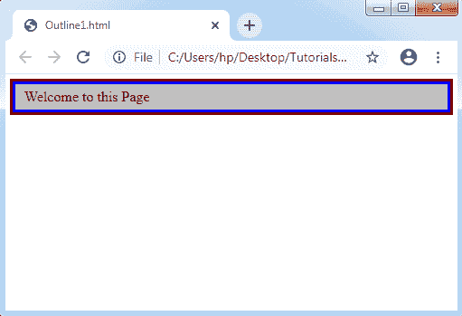
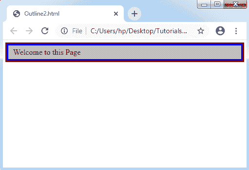
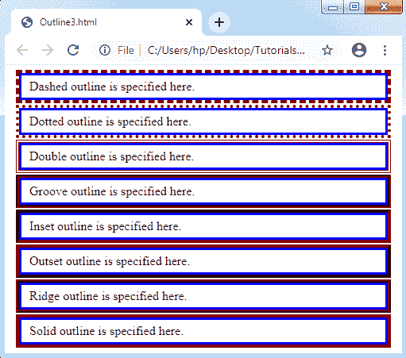
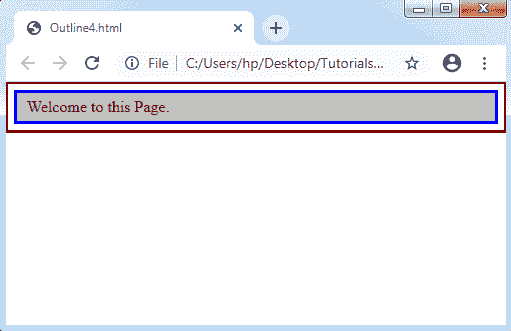

# CSS 大纲

> 原文：<https://www.tutorialandexample.com/css-outline/>

**CSS 轮廓**:这个 CSS 属性和 CSS 的 ***边框属性*** 很像。这使得我们可以在元素周围设计一个额外的边框来获得视觉上的关注。CSS Outline 属性作为 border 属性很容易实现。

让我们考虑一个例子，如下所示:

```
<!DOCTYPE html>
<html>
<style type="text/css">
#box {
        background-color: #bbb;
        outline: 3px solid maroon;
        border: 3px solid blue;
        padding: 5px 10px;
}
</style>
<body>
<div id="box">Welcome to this Page</div>
</body>
</html>
```

**输出:**



“边框”和“轮廓”属性非常相似，但也有一些本质上的区别，这些区别将在下面讨论:

*   第一个区别是不可能为任何元素的四个边设置不同种类的颜色、样式和轮廓。另一方面，在使用 outline 属性时，我们可以为任何元素的每四条边设置给定值。
*   边界是元素尺寸的关键部分；然而，轮廓不是元素维度的任何部分。这说明它不会影响我们在任何元素上应用的轮廓的厚度。因此，它的尺寸不会改变。

该 CSS 属性被确定为关键的 ***速记属性*** 。可以分为**轮廓颜色、轮廓样式、**和**轮廓宽度属性**。它允许我们在需要时单独应用这些属性。

参见如下示例:

```
<!DOCTYPE html>
<html>
<style type= "text/css">
#box
{
 background-color: #bbb;
 border: 3px solid blue;
 padding: 5px 10px;
 outline-width: 3px;
 outline-style: solid;
 outline-color: maroon;
}
</style>
<body>
<div id= "box"> Welcome to this Page </div>
</body>
</html>
```

**输出:**



对上述示例的解释我们使用了轮廓的三个属性，讨论如下:

**outline-width:** 这个属性非常类似于填充和边距属性。该属性可以是轮廓宽度的相对值、绝对值或任何预定义值，即粗、中或细。

建议使用相对值或绝对值，因为通过使用轮廓宽度的任何预定义值，如**粗、**或**细**，不同类型的浏览器会有不同的描述。

**outline-color:**CSS 中的 outline-color 属性描述轮廓的颜色。它支持并允许 CSS 和 HTML 中可用的每种颜色。

**轮廓样式:**轮廓有多种样式可用，如**点状、隐藏、虚线、双点、实心、凹槽、插入、开头、**和**脊状。**

考虑下面的例子，其中我们演示了各种轮廓样式的应用:

**举例:**

```
<!DOCTYPE html>
<html>
<style type= "text/css">
#box
{
 border: 3px solid blue;
 padding: 5px 10px;
 outline-width: 4px;
 outline-color: maroon;
 margin: 10px;
 float: center;
}
</style>
<body>
<div id= "box" style= "outline-style: dashed;"> Dashed outline is specified here. </div>
<div id= "box" style= "outline-style: dotted;"> Dotted outline is specified here. </div>
<div id= "box" style= "outline-style: double;"> Double outline is specified here. </div>
<div id= "box" style= "outline-style: groove;"> Groove outline is specified here. </div>
<div id= "box" style= "outline-style: inset;"> Inset outline is specified here. </div>
<div id= "box" style= "outline-style: outset;"> Outset outline is specified here. </div>
<div id= "box" style= "outline-style: ridge;"> Ridge outline is specified here. </div>
<div id= "box" style= "outline-style: solid;"> Solid outline is specified here. </div>
</body>
</html>
```

**输出:**



**轮廓偏移**

可以应用轮廓偏移来确定边框和轮廓之间的距离。它抓取一个空白空间，轮廓和边框之间的 CSS 长度单位将是透明的。然后它获取父元素的背景色。因此，我们可以看到边界和轮廓之间的明显差异。

请参见以下示例:

```
<!DOCTYPE html>
<html>
<style type= "text/css">
#box
{
 background-color: #bbb;
 border: 3px solid blue;
 padding: 5px 10px;
 outline: 3px solid maroon;
 outline-offset: 6px;
}
</style>
<body>
<div id= "box"> Welcome to this Page. </div>
</body>
</html>
```

**输出:**

