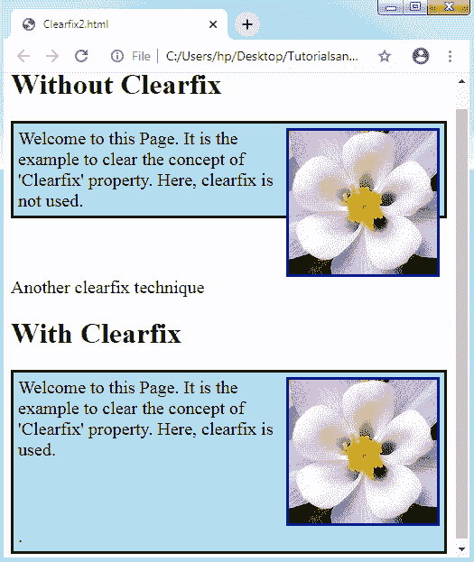

# CSS Clearfix

> 原文：<https://www.tutorialandexample.com/css-clearfix/>

**CSS clear fix**:CSS 中的一个 ***clearfix*** (或 ***clear float*** )是为一个组件清除或修复子组件，所以我们不需要插入额外的标记。clear float 决定了 bug，当两个或更多的浮动组件相继加载时，就会出现这个 bug。

假设我们将任何侧边栏的位置设置在主要内容块的左侧。不过，我们可以让组件相互重叠和折叠。此外，我们可以假设任何子组件都比其父组件高，并且是浮动的；它会开始溢出到容器外面。

为了克服上述问题，我们可以应用***overflow:auto；*将**属性归于一个包含组件。

我们举个例子来理解一下:

**举例:**

在下面的示例中，图像比包含它的组件高，并且是浮动的，因此它溢出到其容器之外。

我们正在制作***【flo】***级和 ***溢出:自动；*** 属性对应的构件如下:

```
<!DOCTYPE html> 
<html> 
<head> 
<style> 
div
{ 
  border: 3px solid black; 
  padding: 5px; 
  background-color: lightblue; 
  font-size:20px; 
} 
img
{ 
  float: right; 
  border: 3px solid navy; 
} 
p
{ 
 font-size:20px; 
 clear:right; 
} 
.flo
{ 
  overflow: auto; 
} 
</style> 
</head> 
<body> 
<h1> Without Clearfix </h1> 
<div> 
   
   Welcome to this Page. It is the example to clear the concept of 'Clearfix' property. Here, clearfix is not used.
</div> 
<p> Use the overflow:auto; CSS attribute </p> 
<h1> With Clearfix </h1> 
<div class="flo"> 
   
   Welcome to this Page. It is the example to clear the concept of 'Clearfix' property. Here, clearfix is used.
</div> 
</body> 
</html> 
```

如果我们处理好边距和填充，上面提到的 clear float 方法可以很好地实现。尽管一种新清除漂浮物的方法使用起来更安全。

**输出:**


让我们举另一个例子来更清楚地理解这个概念:

**举例:**

在下面的例子中，我们在 ***【两者】*** 上应用了 ***清除*** 属性，也就是说，浮动组件不允许同时出现在左右两侧。同样，我们在***【table】***上应用了 ***display*** 属性，这样就创建了行为类似 HTML 的***<table>***组件的组件。那么我们必须让 ***内容*** 空白。

```
<!DOCTYPE html> 
<html> 
<head> 
<style> 
div
{ 
  border: 3px solid black; 
  padding: 5px; 
  background-color: lightblue; 
  font-size: 20px; 
} 
img
{ 
  float: right; 
  border: 3px solid navy; 
} 
p
{ 
 font-size: 20px; 
 clear: right; 
} 
.flo:after
{ 
  content:'.';
  clear: both;
  display: table;
} 
</style> 
</head> 
<body> 
<h1> Without Clearfix </h1> 
<div> 
   
   Welcome to this Page. It is the example to clear the concept of 'Clearfix' property. Here, clearfix is not used.
</div> 
<p> Another clearfix technique </p> 
<h1> With Clearfix </h1> 
<div class="flo"> 
   
   Welcome to this Page. It is the example to clear the concept of 'Clearfix' property. Here, clearfix is used.
</div> 
</body> 
</html> 
```

**输出:**



### CSS 图标

***CSS 图标*** 被指定为像一个在计算机界面内部使用的符号或图像分配给任何元素。CSS 图标是任何程序或文件的图形描述，支持用户快速识别文件类型。

使用 ***图标库*** 将图标插入任何 HTML 页面是最舒适的方式。用 CSS 格式化一个图标库是可行的。我们可以根据图标的大小、阴影和颜色定制任何图标。

这里我们提到一些基本的图标库，如 ***谷歌图标*** 、 ***字体图标*** 和 ***引导图标*** ，它们可以在 CSS 中有效地使用。我们不需要下载或安装这些图标库。

上述库的描述如下:

**字体牛逼的图标**

我们必须插入一个链接来使用字体真棒图标库。该链接将在下面提到的部分定义:

```
<link rel="stylesheet" href="https://cdnjs.cloudflare.com/ajax/libs/font-awesome/4.7.0/css/font-awesome.min.css">  
```