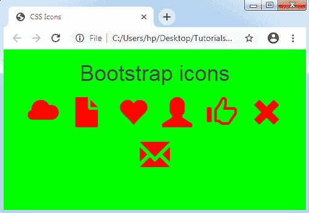

# CSS 图标

> 原文：<https://www.tutorialandexample.com/css-icons/>

**CSS 图标**

 *****CSS 图标*** 被指定为像一个在计算机界面内部使用的符号或图像分配给任何元素。CSS 图标是任何程序或文件的图形描述，支持用户快速识别文件类型。

使用 ***图标库*** 向任何 HTML 页面插入图标是一种舒适的方式。用 CSS 格式化一个图标库是可行的。我们可以根据图标的大小、阴影和颜色定制任何图标。

这里我们提到一些基本的图标库，如 ***谷歌图标*** 、 ***字体图标*** 和 ***引导图标*** ，它们可以在 CSS 中有效地使用。我们不需要下载或安装这些图标库。

上述库的描述如下:

### 字体超赞图标

我们必须插入一个链接来使用字体真棒图标库。该链接将在下面提到的部分定义:

```
<link rel="stylesheet" href="https://cdnjs.cloudflare.com/ajax/libs/font-awesome/4.7.0/css/font-awesome.min.css">    
```

下面举个例子:

**例子**

```
<!DOCTYPE html>  
<html>  
<head>  
<title> CSS Icons </title> 
<link rel= "stylesheet" href="https://cdnjs.cloudflare.com/ajax/libs/font-awesome/4.7.0/css/font-awesome.min.css">  
<style> 
body
{ 
text-align: center; 
background-color: lime; 
} 
.fa
{ 
color: red; 
font-size: 50px; 
margin: 10px; 
} 
</style> 
</head>  
<body style="text-align: center">  
<h1>Font Awesome Library</h1> 
      <i class= "fa fa-cloud"></i>  
      <i class= "fa fa-file"></i>  
      <i class= "fa fa-heart"></i>  
      <i class= "fa fa-bars"></i>  
      <i class= "fa fa-car"</i>  
</body>  
</html>   
```

**输出:**


### 引导图标

类似地，我们必须在 HTML 页面中插入一个链接来使用这个图标库。该链接将在下面提到的<**标题** >部分中定义:

<link>

**例子**

```
<!DOCTYPE html>  
<html>  
<head>  
<title> CSS Icons </title> 
<link rel= "stylesheet"  
href="https://maxcdn.bootstrapcdn.com/bootstrap/3.3.7/css/bootstrap.min.css"> 
<style> 
body
{ 
text-align: center; 
background-color: lime; 
} 
.glyphicon
{ 
color: red; 
font-size: 50px; 
margin: 10px; 
} 
</style> 
</head>  
<body style="text-align: center">  
<h1> Bootstrap icons </h1> 
      <i class= "glyphicon glyphicon-cloud"></i>  
      <i class= "glyphicon glyphicon-file"></i>  
      <i class= "glyphicon glyphicon-heart"></i>  
      <i class= "glyphicon glyphicon-user"></i>  
      <i class= "glyphicon glyphicon-thumbs-up"></i>  
      <i class= "glyphicon glyphicon-remove"></i> 
      <i class= "glyphicon glyphicon-envelope"></i>     
</body>  
</html>   
```

**输出:**



**谷歌图标**

和上面提到的库一样，我们必须在 HTML 页面中插入一个链接来使用这个图标库。该链接将在下面提到的部分定义:

```
<link rel="stylesheet" href="https://fonts.googleapis.com/icon?family=Material+Icons"> 
```

**例子**

```
<!DOCTYPE html>  
<html>  
<head>  
<title> CSS Icons </title> 
<link rel= "stylesheet" href="https://fonts.googleapis.com/icon?family=Material+Icons"> 
<style> 
body
{ 
text-align: center; 
background-color: lime; 
} 
.material-icons
{ 
color: red; 
font-size: 50px; 
margin: 10px; 
} 
</style> 
</head>  
<body style="text-align: center">  
<h1> Google icons </h1> 
      <i class= "material-icons"> cloud </i>  
      <i class= "material-icons"> attachment </i>  
      <i class= "material-icons"> computer </i>  
      <i class= "material-icons"> favorite </i>  
      <i class= "material-icons"> traffic </i>    
</body>  
</html>   
```

**输出:**

**