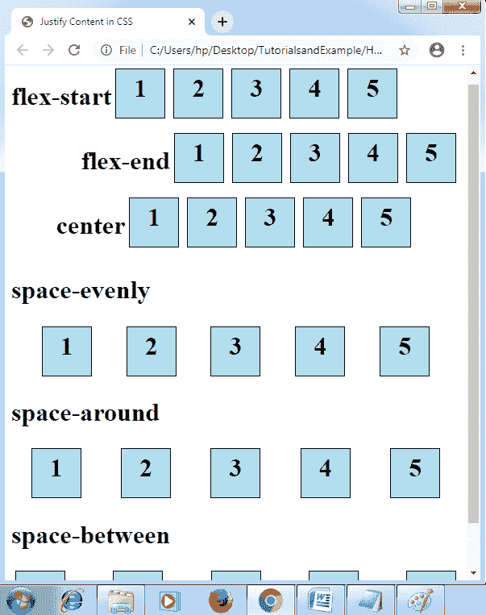

# CSS 对齐内容

> 原文：<https://www.tutorialandexample.com/justify-content/>

**对齐内容**:如果任何项目没有覆盖主轴上的每个可用空间，即水平方向，这些属性应用于柔性盒容器的项目对齐。 ***调整内容*** 属性指定浏览器如何对任何地方和任何内容项之间的区域进行分类。

它不用于定义任何垂直轴内的项目或容器。我们可以应用该属性，即 ***align-items*** ，来进行项目的垂直对齐。

**语法:**

```
justify-content: center | flex-start | flex-end | space-around | space-evenly | space-between | initial | inherit;  
```

***弹性启动*** 值用作默认值。看看下面的描述:


| **值** | **描述** |
| **居中** | 顾名思义，它在容器的开始处设置了一个项目的位置。 |
| **灵活启动** | 它被用作默认值，并将一项放在容器的开始处。 |
| **挠性端** | 该值用于设置某项在容器末端的位置。 |
| **空间环绕** | 这些应用于沿彼此平行的间距定位任何项目。“周围空间”值以相同的间距将行内的几个项目均匀分类。 |
| **间距** | 通过使用该值，项目的间距是均匀的。这里，任何第一个项目(元素)都在起点，任何最后一个项目(元素)都在终点。 |
| 等间距 | 它将这些项目与一个平行空间放在一起。尽管如此，所有角的间距是不同的。 |


请看下面这些属性值的图示:

**举例:**

```
<!DOCTYPE html>  
<html>          
<head>  
<title>Justify Content in CSS </title>  
<style>    
#flexstart
{ 
 display: flex; 
 justify-content: flex-start; 
} 
#flexend
{ 
 display: flex; 
 justify-content: flex-end; 
}   
#cent
{ 
 display: flex; 
 justify-content: center; 
} 
#evenly
{ 
 display: flex; 
 justify-content: space-evenly; 
} 
#around
{ 
 display: flex; 
 justify-content: space-around; 
} 
#between
{ 
 display: flex; 
 justify-content: space-between; 
} 
.flex-item
{ 
 width: 50px; 
 height: 50px; 
 margin: 5px; 
 padding: 5px; 
 color: black; 
 font-size: 2em; 
 font-weight: bold; 
 text-align: center; 
 border: 1px solid black; 
 background-color: lightblue; 
} 
</style>  
</head>  
<body>
<div id="flexstart"> 
<h1>flex-start</h1> 
  <div class="flex-item">1</div> 
  <div class="flex-item">2</div> 
  <div class="flex-item">3</div> 
  <div class="flex-item">4</div> 
  <div class="flex-item">5</div> 
</div> 
<div id="flexend"> 
<h1>flex-end</h1> 
  <div class="flex-item">1</div> 
  <div class="flex-item">2</div> 
  <div class="flex-item">3</div> 
  <div class="flex-item">4</div> 
  <div class="flex-item">5</div> 
</div> 
<div id="cent"> 
<h1>center</h1> 
  <div class="flex-item">1</div> 
  <div class="flex-item">2</div> 
  <div class="flex-item">3</div> 
  <div class="flex-item">4</div> 
  <div class="flex-item">5</div>  
</div> 
<h1>space-evenly</h1> 
<div id="evenly"> 
  <div class="flex-item">1</div> 
  <div class="flex-item">2</div> 
  <div class="flex-item">3</div> 
  <div class="flex-item">4</div> 
  <div class="flex-item">5</div> 
</div> 
<h1>space-around</h1> 
<div id="around"> 
  <div class="flex-item">1</div> 
  <div class="flex-item">2</div> 
  <div class="flex-item">3</div> 
  <div class="flex-item">4</div> 
  <div class="flex-item">5</div> 
</div> 
<h1>space-between</h1> 
<div id="between"> 
  <div class="flex-item">1</div> 
  <div class="flex-item">2</div> 
  <div class="flex-item">3</div> 
  <div class="flex-item">4</div> 
  <div class="flex-item">5</div> 
</div> 
</body>  
</html> 
```

**输出:**

