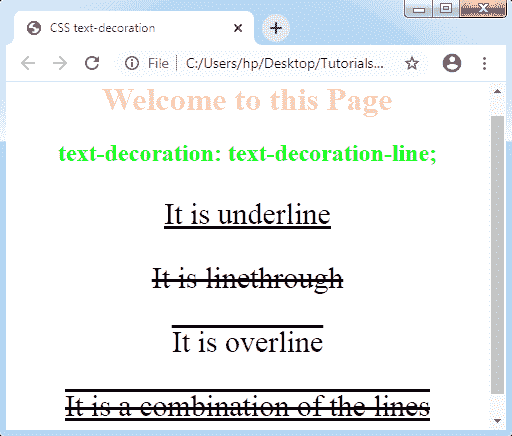
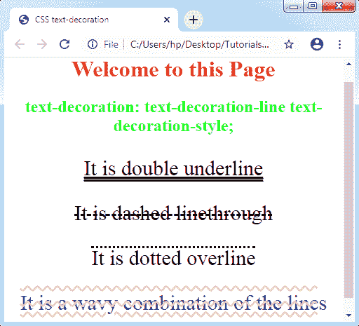
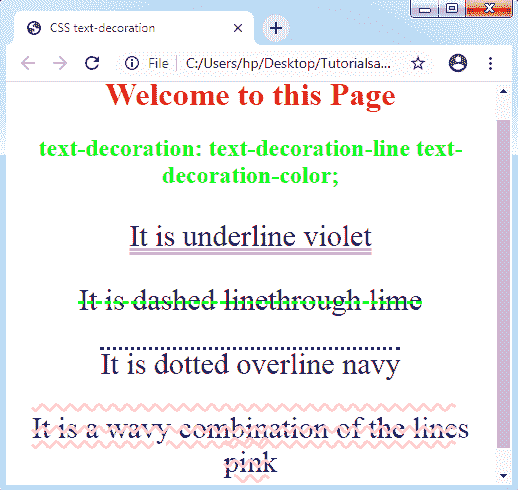

# CSS 文本装饰

> 原文：<https://www.tutorialandexample.com/css-text-decoration/>

**CSS****Text-decoration**:CSS 的一个本质属性，用于**修饰文本的内容**。它可以在文本的上方、下方和上方添加行。此属性设置文本上装饰线的显示。

它照亮了文本以及各种类型的线条。用于**文字装饰样式、文字装饰颜色、**和**文字装饰线条**。

该属性的语法如下:

**语法:**

```
text-decoration: text-decoration-line text-decoration-color text-decoration-style|initial|inherit;  
```

让我们借助一个例子来理解它的价值:

*   **正文-装饰-线条**

 **用来做各种文字修饰，比如**下划线**、**上划线**，或者**划线**。此外，它可以为任何选定的文本添加行组合。

**举例:**

在下面的例子中，我们使用了划线、下划线或上划线值。我们也将理解如何同时应用这些价值。

```
<!DOCTYPE html>
<html>
<head>
<title> CSS text-decoration </title>
<style>
h1
{
 color: pink;
}
h2
{
 color: lime;
}
body
{
 text-align: center;
}
p
{
 font-size: 30px;
}
.p1
{
 text-decoration: underline;
}
.p2
{
 text-decoration: line-through;
}
.p3
{
 text-decoration: overline;
}
.p4
{
 text-decoration: overline underline line-through;
}
</style>
</head>
<body>
<h1> Welcome to this Page </h1>
<h2> text-decoration: text-decoration-line; </h2>
<div>
<p class= "p1"> It is underline </p>
<p class= "p2"> It is line-through </p>
<p class= "p3"> It is overline </p>
<p class= "p4"> It is a combination of the lines </p>
</div>
</body>
</html>
```

**输出:**



*   **正文-装饰-样式**

 **这个 CSS 值设置线条的样式。它的一些值有**虚线**、**双**、**虚线**、**实线**、**波浪形**。

请看下图:

**举例:**

```
<!DOCTYPE html>
<html>
<head>
<title> CSS text-decoration </title>
<style>
h1
{
 color: red;
}
h2
{
 color: lime;
}
body
{
 text-align: center;
}
p
{
 font-size: 30px;
}
.p1
{
 text-decoration: underline double;
}
.p2
{
 text-decoration: line-through dashed;
}
.p3
{
 text-decoration: dotted overline;
}
.p4
{
 text-decoration: pink wavy overline underline line-through;
 color: navy;
}
</style>
</head>
<body>
<h1> Welcome to this Page </h1>
<h2> text-decoration: text-decoration-line text-decoration-style; </h2>
<div>
<p class= "p1"> It is double underline </p>
<p class= "p2"> It is dashed line-through </p>
<p class= "p3"> It is dotted overline </p>
<p class= "p4"> It is a wavy combination of the lines </p>
</div>
</body>
</html>
```

**输出:**



*   **文字-装饰-颜色**

 **这个 CSS 属性被应用来给出很多装饰颜色。我们可以使用任何颜色，但是以有效的格式作为它的值。

**举例:**

```
<!DOCTYPE html>
<html>
<head>
<title> CSS text-decoration </title>
<style>
h1
{
 color: red;
}
h2
{
 color: lime;
}
body
{
 text-align: center;
}
p
{
 font-size: 30px;
}
.p1
{
 text-decoration: underline double violet;
}
.p2
{
 text-decoration: line-through dashed lime;
}
.p3
{
 text-decoration: dotted overline blue;
}
.p4
{
 text-decoration: pink wavy overline underline line-through;
 color: navy;
}
</style>
</head>
<body>
<h1> Welcome to this Page </h1>
<h2> text-decoration: text-decoration-line text-decoration-style text-decoration-color; </h2>
<div>
<p class= "p1"> It is underline violet </p>
<p class= "p2"> It is dashed line-through lime </p>
<p class= "p3"> It is dotted overline navy</p>
<p class= "p4"> It is a wavy combination of the lines pink </p>
</div>
</body>
</html>
```

**输出:**

******