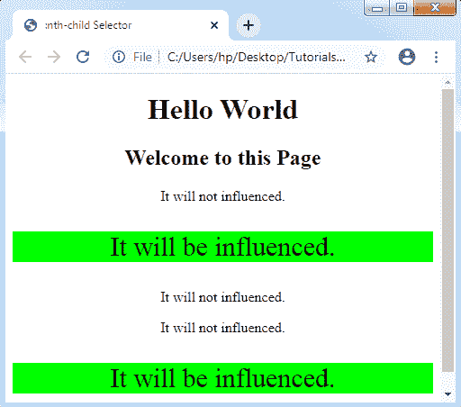
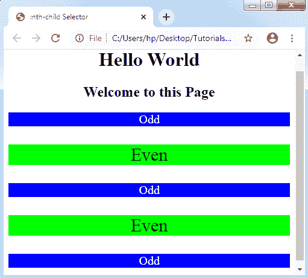

# CSS:第 n 个选择器

> 原文：<https://www.tutorialandexample.com/css-nth-selector/>

CSS ***第 n 个选择器*** 可以用来根据元素的位置匹配元素，而不考虑其父元素的类型。在这里，n 可以是任意的 ***数字*** 、 ***公式*** ，或者是一个 ***关键字*** 。

这些选择器用于根据元素在兄弟组中的位置匹配元素。它还匹配所有元素，即第 ***个第 n 子元素*** 。

**语法:**

```
:nth-child(n) 
{  
  //CSS Property  
}  
```

*****【n】***以上语法中，括号中指定的是一个自变量。它表示匹配元素的模式。它可能是奇数、偶数或函数符号。**

 ***奇数值描绘位于 ***奇数列*** 中的各种组件，如 1、3 和 5，而 ***偶数值*** 描绘位于 ***偶数列*** 中的多个组件，如 2、4 和 6。*

 ***功能符号(An+B)——**描述了那些兄弟位置与 ***An+B*** 模式匹配的组件，其中:

**答:**是整数步长的大小。

**n:** 为正整数，即从 0 开始。

**B:** 是整数偏移量。

让我们考虑以下一些重要的例子:

**例 1:**

在下面的例子中，我们使用 3n+4 个函数符号来描述元素:

(3×0)+4 = 4，(3×1)+4 =7 等等。

```
<!DOCTYPE html>
<html>
<head>
<title> :nth-child Selector </title>
<style>
p:nth-child(3n+4)
{
 background: lime;
 color: black;
 font-size: 30px;
}
</style>
</head>
<body style= "text-align: center">
<h1> Hello World </h1>
<h2> Welcome to this Page </h2>
<p> It will not influenced. </p>
<p> It will be influenced. </p>
<p> It will not influenced. </p>
<p> It will not influenced. </p>
<p> It will be influenced. </p>
</body>
</html>
```

**输出:**



**例 2:**

在下面的例子中，我们使用偶数和奇数关键字来匹配那些索引为偶数或奇数的组件。注意，任何第一个孩子的索引都是 1。

```
<!DOCTYPE html>
<html>
<head>
<title> :nth-child Selector </title>
<style>
p:nth-child(even)
{
 background: lime;
 color: black;
 font-size: 30px;
}
p:nth-child(odd)
{
 background: blue;
 color: white;
 font-size: 20px;
}
</style>
</head>
<body style= "text-align: center">
<h1> Hello World </h1>
<h2> Welcome to this Page </h2>
<p> Odd </p>
<p> Even </p>
<p> Odd </p>
<p> Even </p>
<p> Odd </p>
</body>
</html>
```

**输出:**

***