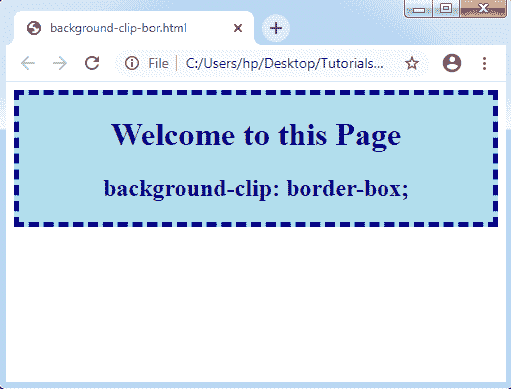
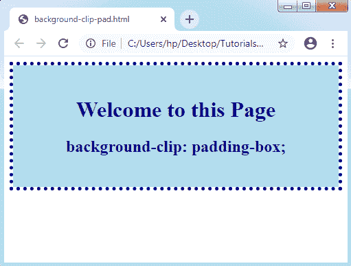
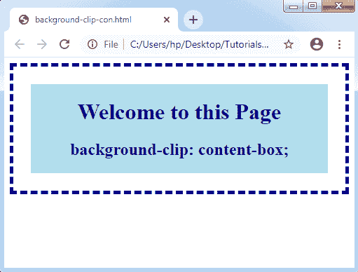

# CSS 背景-剪辑

> 原文：<https://www.tutorialandexample.com/css-background-clip/>

**CSS 背景剪辑**:背景剪辑属性描述了**背景的绘制区域**。它通过使用任何裁剪框来限制图像或背景颜色出现的区域。一切都将是看不见的或被丢弃的，这是在盒子之外。

如果元素的背景在内容框、填充框和边框下扩展，则设置。

**语法:**

```
background-clip: border-box| padding-box| content-box| inherit; 
```

**属性值**

 **下面讨论了可能的值:

**边框**

 **它被用作默认值。border-box 指定将在边框内设计背景的颜色和图像。它还设置背景的颜色，该颜色分布在整个分布上。

**举例:**

```
<!DOCTYPE html>
<html>
<head>
<style>
div
{
 background-color: lightblue;
 background-clip: border-box;
 text-align: center;
 border: 5px dashed  navy;
}
h1,h2
{
 color: navy;
}
</style>
</head>
<body>
<div>
<h1> Welcome to this Page </h1>
<h2> background-clip: border-box; </h2>
</div>
</body>
</html>
```

**输出:**



**填充框**

 **它用于处理边框内的背景。背景的颜色和图像是在填充框中设计的。

**举例:**

```
<!DOCTYPE html>
<html>
<head>
<style>
div
{
 background-color: lightblue;
 background-clip: padding-box;
 padding: 25px;
 text-align: center;
 border: 5px dotted  navy;
}
h1,h2
{
 color: navy;
}
</style>
</head>
<body>
<div>
<h1> Welcome to this Page </h1>
<h2> background-clip: padding-box; </h2>
</div>
</body>
</html>
```

**输出:**



**内容框**

 **content-box 值用于设置任何内容的背景颜色。在这种情况下，背景绘制在内容框中。背景的颜色和图像将在内容框内设计。

**举例:**

```
<!DOCTYPE html>
<html>
<head>
<style>
div
{
 background-color: lightblue;
 background-clip: content-box;
 padding: 25px;
 text-align: center;
 border: 5px dashed  navy;
}
h1,h2
{
 color: navy;
}
</style>
</head>
<body>
<div>
<h1> Welcome to this Page </h1>
<h2> background-clip: content-box; </h2>
</div>
</body>
</html>
```

**输出:**

********