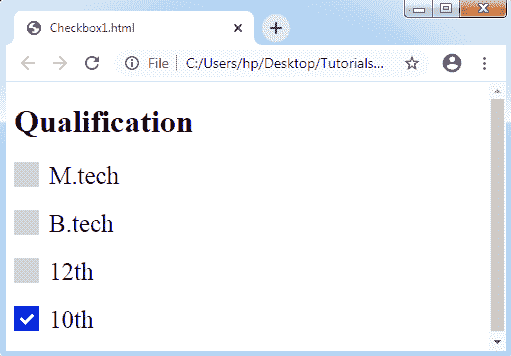
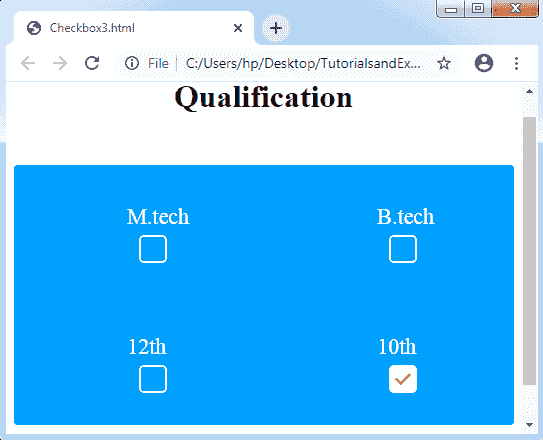

# CSS 复选框样式

> 原文：<https://www.tutorialandexample.com/css-checkbox-style/>

**CSS 复选框样式**:是 HTML 的一个元素，用来获取各种用户的输入。很难设计任何复选框的样式。但是有些元素使得复选框的设计变得简单，例如 ***伪元素*** 。

一般来说，所有的网站都使用这些 HTML 元素。然而，如果不应用任何样式，这些元素在所有网站上看起来都是一样的。因此，设计它们可以让我们的网站更有吸引力，与众不同。我们必须隐藏真正的复选框来设计复选框。使用 CSS 来设计不同的复选框是一个有创意和有趣的事情。它会给任何默认复选框一个漂亮的新视图。

让我们考虑一些例子来清楚地理解复选框的时尚概念:

**例 1:**

在下面的例子中，我们将使用 ***'~'*** 符号，它是一个兄弟组合符。它选择任何前面的选择器前面的每个元素。我们还应该应用一个伪类 ***:hover*** 来设计一个复选框，如果任何用户将鼠标指向它。

```
<!DOCTYPE html> 
<html> 
<style> 
.container
{ 
  display: block; 
  position: relative; 
  padding-left: 35px; 
  margin-bottom: 20px; 
  cursor: pointer; 
  font-size: 25px; 
} 
/* Hide the default checkbox */ 
.container input
{ 
  visibility: hidden; 
  cursor: pointer; 
} 
/* Create a custom checkbox */ 
.mark
{ 
  position: absolute; 
  top: 0; 
  left: 0; 
  height: 25px; 
  width: 25px; 
  background-color: lightgray; 
} 
.container:hover input ~ .mark
{ 
  background-color: gray; 
} 
.container input:checked ~ .mark
{ 
  background-color: blue; 
} 
/* Create the mark/indicator (hidden when not checked) */ 
.mark:after
{ 
  content: ""; 
  position: absolute; 
  display: none; 
} 
/* Show the mark when checked */ 
.container input:checked ~ .mark:after
{ 
  display: block; 
} 
/* Style the mark/indicator */ 
.container .mark:after
{ 
  left: 9px; 
  top: 5px; 
  width: 5px; 
  height: 10px; 
  border: solid white; 
  border-width: 0 3px 3px 0; 
  transform: rotate(45deg); 
} 
</style> 
<body> 
<h1>Qualification</h1> 
<label class="container">M.tech 
  <input type="checkbox"> 
   
</label> 
<label class="container">B.tech
  <input type="checkbox"> 
   
</label> 
<label class="container">12th 
  <input type="checkbox"> 
   
</label> 
<label class="container">10th 
  <input type="checkbox" checked="check"> 
   
</label> 
</body> 
</html> 
```

**输出:**



**例 2:**

在下面的示例中，我们将看到一个修改过的复选标记。

```
<!DOCTYPE html> 
<html> 
<style> 
.container
{ 
  display: block; 
  position: relative; 
  padding-left: 45px; 
  margin-bottom: 15px; 
  cursor: pointer; 
  font-size: 20px; 
} 
/* Hide the real checkbox */ 
input[type= checkbox]
{ 
  visibility: hidden; 
} 
/* Create a custom checkbox */ 
.mark
{ 
  position: absolute; 
  top: 0; 
  left: 0; 
  height: 25px; 
  width: 25px; 
  background-color: lightgray; 
} 
/*background color to be displayed if the checkbox is checked*/
.container input:checked ~ .mark
{ 
  background-color: blue; 
}  
/*checkmark to be displayed in the checkbox*/ 
/*It is bot displayed if unchecked*/
.mark:after
{ 
  content: ""; 
  position: absolute; 
  display: none; 
} 
/*display the checkmark when checked*/ 
.container input:checked ~ .mark:after
{ 
  display: block; 
} 
/*creating a square to be the sign of checkbox*/ 
.container .mark:after
{ 
  left: 6px; 
  bottom: 6px; 
  width: 6px; 
  height: 6px; 
  border: solid white; 
  border-width: 4px 4px 4px 4px; 
} 
</style> 
<body> 
<h1>Qualification</h1> 
<label class="container">M.tech 
  <input type="checkbox"> 
   
</label> 
<label class="container">B.tech
  <input type="checkbox"> 
   
</label>
<label class="container">12th 
  <input type="checkbox"> 
   
</label> 
<label class="container">10th 
  <input type="checkbox" checked="check"> 
   
</label> 
</body> 
</html> 
```

**输出:**


**例 3:**

我们将看到复选框样式的另一个例子。在下面的例子中，我们感觉到了连锁反应，这使得任何复选框都更加有趣。它将为我们的复选框提供一个独特的视图。我们使用了 ***'~'*** 符号，它是一个兄弟组合符，类似于上面的例子。每个元素都将通过使用前面带有前一个选择器的符号来选择。我们还可以应用一些伪类像 ***:checked*** ， ***:before*** ， ***:after*** 等。

通过使用 CSS，我们在一个复选框中创建了一个涟漪效应，如下所示:

```
<!DOCTYPE html>
<html>
<head>
<style>
body
{
 text-align: center;
}
.check
{
 width: 500px;
 margin: 50px auto;
 clear: both;
 display: block;
 background-color: #009BFF;
 border-radius: 4px;
}
.check::after
{
 clear: both;
 display: block;
 content: "";
}
.check .checkbox-container
{
 float: left;
 width: 50%;
 box-sizing: border-box;
 text-align:center;
 padding: 40px 0px;
}
/* Styling Checkbox Starts */
.checkbox-label
{
 color: white;
 display: block;
 position: relative;
 margin: auto;
 cursor: pointer;
 font-size: 22px;
 line-height: 24px;
 height: 50px;
 width: 24px;
 clear: both;
}
.checkbox-label input
{
 position: absolute;
 opacity: 0;
 cursor: pointer;
}
.checkbox-label .mark
{
 top:30px;
 position: absolute;
 height: 24px;
 width: 24px;
 background-color: transparent;
 border-radius: 5px;
 transition: all 0.3s ease-in;
 border: 2px solid white;
}
.checkbox-label input:checked ~ .mark
{
 background-color: white;
 border-radius: 5px;
 transform: rotate(0deg) scale(1);
 opacity:1;
 border: 2px solid white;
}
.checkbox-label .mark::after
{
 position: absolute;
 content: "";
 border-radius: 5px;
}
.checkbox-label input:checked ~ .mark::after
{
 transform: rotate(45deg) scale(1);
 left: 8px;
 top: 3px;
 width: 6px;
 height: 12px;
 border: solid red;
 border-width: 0 2px 2px 0;
 border-radius: 0;
}
/* For Ripple Effect */
.checkbox-label .mark::before
{
 position: absolute;
 content: "";
 border-radius: 10px;
 border: 5px solid yellow;
 transform: scale(0);   
}
.checkbox-label input:checked ~ .mark::before
{
 left: -3px;
 top: -3px;
 width: 24px;
 height: 24px;
 border-radius: 5px;
 transform: scale(3);
 opacity:0;  
 transition: all 0.3s ease-out;
}
</style>
</head>
<body>
<h1>Qualification</h1>
<div class="check">
<div class="checkbox-container">
<label class="checkbox-label">M.tech
  <input type="checkbox">
  
</label>
</div>
<div class="checkbox-container">
<label class="checkbox-label">B.tech
  <input type="checkbox">
  
</label>
</div>
<div class="checkbox-container">
<label class="checkbox-label">12th
  <input type="checkbox">
  
</label>
</div>
<div class="checkbox-container">
<label class="checkbox-label">10th
  <input type="checkbox" checked="check">
  
</label>
</div>
</div>
</body>
</html>
```

**输出:**

