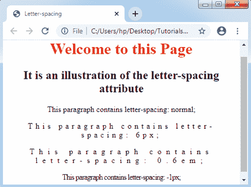

# CSS 字母间距

> 原文：<https://www.tutorialandexample.com/css-letter-spacing/>

**CSS 字母间距**:L***etter-spacing***属性用于**管理文本块或元素内所有字母之间的间距**。此属性设置文本中许多字符之间的间距行为。

它允许我们减少或增加各种文本字符之间的空间。

这也有助于改变任何相邻字符之间的间距。

**语法:**

```
letter-spacing: normal | length | initial | inherit; 
```

**属性值**

**正常:**是 ***默认值*** 在 ***字符*** 之间不能给任何空格。正常值不会修改字母之间的任何默认间距。如果我们将属性的任何值设置为 0，这些值是相似的。

**length:** 描述字符间多出来的一个空格。长度值允许各种负值，用来收紧文本外观，而不是放松它。可以通过在任何字母之间使用更大的长度来定义最大间距。它支持***【px】***， ***字体-相对值(em，rem)*** 。

**举例:**

以下示例中使用了不同的字母间距属性值来检查不同的结果。此外，我们将应用许多可能的长度值来查看字符之间的任何间距。

以下示例将定义多个字符之间的间距设置。

```
<!DOCTYPE html>
<html>
<head>
<title> Letter-spacing </title>
</head>
<body style= "text-align: center;">
<h1 style= "color: red;">
Welcome to this Page
</h1>
<h2>
It is an illustration of the letter-spacing attribute
</h2>
<p style= "letter-spacing: normal;">
This paragraph contains letter-spacing: normal;
</p>
<p style= "letter-spacing: 6px;">
This paragraph contains letter-spacing: 6px;
</p>
<p style= "letter-spacing: 0.6em;">
This paragraph contains letter-spacing: 0.6em;
</p>
<p style= "letter-spacing: -1px;">
This paragraph contains letter-spacing: -1px;
</p>
</body>
</html>
```

**输出:**

