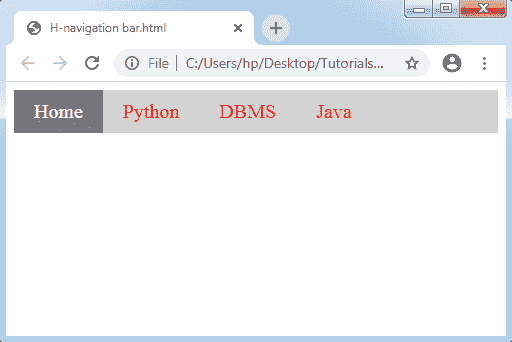
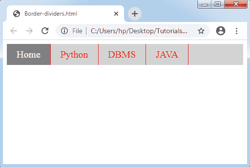
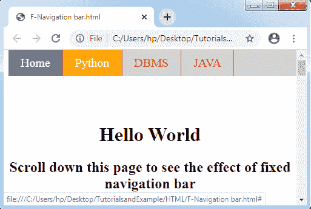
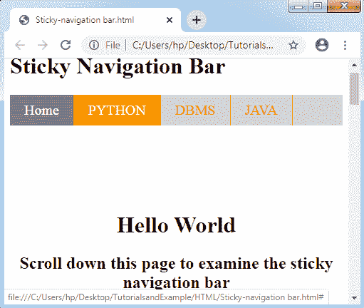
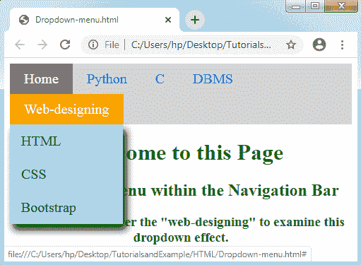
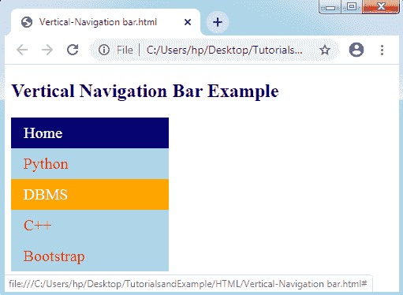
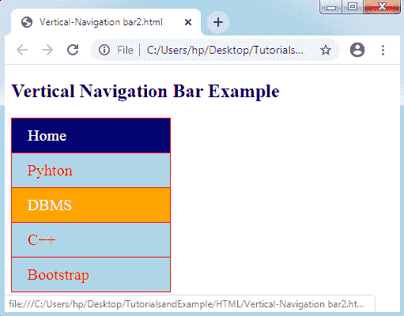
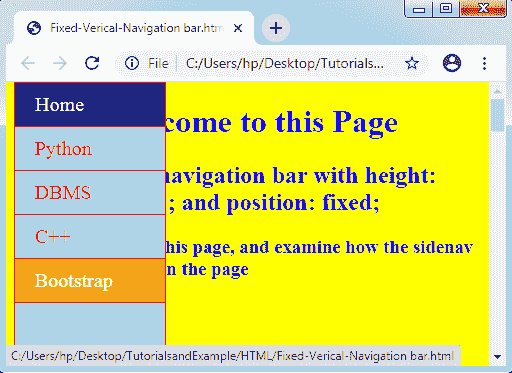

# CSS 导航栏

> 原文：<https://www.tutorialandexample.com/css-navigation-bar/>

**CSS 导航条**:一个**导航系统**或者**导航条**碰到 **GUI** 可以帮助很多访问者访问信息。一个**导航栏**是网页上的一个 **UI** 组件，里面包含了很多网站其他部分的链接。

大多数情况下，导航系统会按照链接的水平列表顺序显示在页面的顶部。它可以放在标题或徽标的下面，尽管它必须始终放在网页主要内容的前面。

每个网站都有易于使用和高效的导航，这使得许多访问者可以方便快捷地访问任何部分。它也起着至关重要的作用。

下面详细讨论一下**水平**和**垂直导航系统**。看一看。

### 水平导航栏

通常，水平导航系统会按照链接水平列表的顺序显示在页面的顶部区域。

让我们借助一个例子来了解如何制作水平导航系统。

**举例:**

在下面的例子中，我们插入了一个属性，即 **overflow: hidden** 来限制**李**标签向列表外移动。属性 **display: block** 将许多链接显示为一个块组件，并创建整个可点击的链接空间。

此外，我们还插入了属性 **float: left** ，该属性添加了 float，用于获取任何块组件，以便稍后将它们相互移动。

如果我们想要全角的背景色，我们应该将属性**背景色**应用到 **< ul >** ，而不是使用任何**<>**元素。

```
<!DOCTYPE html> 
<html> 
<head> 
<style> 
ul
{ 
 list-style-type: none; 
 margin: 0; 
 padding: 0px; 
 overflow: hidden; 
 background-color: lightgray; 
} 
li
{ 
 float: left; 
} 
li a
{ 
 display: block; 
 color: red; 
 font-size:20px; 
 text-align: center; 
 padding: 10px 20px; 
 text-decoration: none; 
} 
.active
{ 
 background-color: gray; 
 color: white; 
} 
li a:hover
{ 
 background-color: orange; 
 color: white; 
} 
</style> 
</head> 
<body> 
<ul> 
  <li><a class="active" href="#home">Home</a></li> 
  <li><a href="#">Python</a></li> 
  <li><a href="#">DBMS</a></li> 
  <li><a href="#">Java</a></li> 
</ul> 
</body> 
</html> 
```

**输出:**



### 边界分隔器

它允许我们使用属性 ***border-right*** 在导航系统内的任何链接之间插入边界。下图清楚地描述了这一点。

**举例:**

```
<!DOCTYPE html> 
<html> 
<head> 
<style> 
ul
{ 
  list-style-type: none; 
  margin: 0; 
  padding: 0px; 
  overflow: hidden; 
  background-color: lightgray; 
} 
li
{ 
  float: left; 
  border-right: 1px solid red; 
} 
li a
{ 
  display: block; 
  color: red; 
  font-size:20px; 
  text-align: center; 
  padding: 10px 20px; 
  text-decoration: none; 
} 
.active
{ 
  background-color: gray; 
  color: white; 
} 
li a:hover
{ 
  background-color: orange; 
  color: white; 
} 
</style> 
</head> 
<body> 
<ul> 
  <li><a class="active" href="#home">Home</a></li> 
  <li><a href="#">Python</a></li> 
  <li><a href="#">DBMS</a></li> 
  <li><a href="#">JAVA</a></li> 
</ul> 
</body> 
</html> 
```

**输出:**



### 固定导航栏

如果我们滚动任何一页，这个导航栏会停在页面的顶部或底部。让我们考虑下面给出的例子:

**举例:**

```
<!DOCTYPE html> 
<html> 
<head> 
<style> 
ul
{ 
  list-style-type: none; 
  position: fixed; 
  width:100%; 
  top:0; 
  margin: 0; 
  padding: 0px; 
  overflow: hidden; 
  background-color: lightgray; 
} 
li
{ 
  float: left; 
    border-right: 1px solid red; 
} 
li a
{ 
  display: block; 
  color: red; 
 font-size:20px; 
  text-align: center; 
  padding: 10px 20px; 
  text-decoration: none; 
} 
.active
{ 
background-color: gray; 
color: white; 
} 
li a:hover
{ 
  background-color: orange; 
  color: white; 
} 
</style> 
</head> 
<body> 
<ul> 
  <li><a class="active" href="#home">Home</a></li> 
  <li><a href="#">Python</a></li> 
  <li><a href="#">DBMS</a></li> 
  <li><a href="#">JAVA</a></li> 
</ul> 
<h1 style="padding-top: 100px; text-align: center;">Hello World</h1> 
<h2 style="padding-bottom: 2000px; text-align: center;">Scroll down this page to see the effect of fixed navigation bar</h2> 
</body> 
</html> 
```

**输出:**



### Sticky Navbar

属性 ***position: sticky*** 用于根据用户的滚动位置放置元素。

CSS 的这个属性允许一个元素在滚动到任何特定点时被卡住。其中任何粘性元素在 ***相对*** 和 ***固定*** 属性之间切换。

**举例:**

```
<!DOCTYPE html> 
<html> 
<head> 
<style> 
ul
{ 
  list-style-type: none; 
  position: sticky; 
  width:100%; 
  top:0; 
  margin: 0; 
  padding: 0px; 
  overflow: hidden; 
  background-color: lightgray; 
} 
li
{ 
  float: left; 
    border-right: 1px solid red; 
} 
li a
{ 
  display: block; 
  color: red; 
 font-size:20px; 
  text-align: center; 
  padding: 10px 20px; 
  text-decoration: none; 
} 
.active
{ 
background-color: gray; 
color: white; 
} 
li a:hover
{ 
  background-color: orange; 
  color: white; 
} 
</style> 
</head> 
<body> 
<h1> Sticky Navigation Bar</h1> 
<ul> 
  <li><a class="active" href="#home">Home</a></li> 
  <li><a href="#">PYTHON</a></li> 
  <li><a href="#">DBMS</a></li> 
  <li><a href="#">JAVA</a></li> 
</ul> 
<h1 style="padding-top: 100px; text-align: center;">Hello World</h1> 
<h2 style="padding-bottom: 2000px; text-align: center;">Scroll down this page to examine the sticky navigation bar</h2> 
</body> 
</html> 
```

**输出:**



### 下拉导航条

#### 我们如何在任何导航栏中制作下拉菜单？

为了找到上述此类问题的解决方案，让我们考虑下面给出的一个例子:

**举例:**

```
<!DOCTYPE html> 
<html> 
<head> 
<style> 
ul
{ 
  list-style-type: none; 
  margin: 0; 
  padding: 0; 
  overflow: hidden; 
  background-color: lightgray; 
} 
li
{ 
  float: left; 
} 
li a, .dropbtn
{ 
  display: inline-block; 
  color: blue; 
 font-size:20px; 
  text-align: center; 
  padding: 10px 20px; 
  text-decoration: none; 
} 
.active
{ 
background-color: gray; 
color: white; 
} 
li a:hover , .dropdown:hover .dropbtn
{ 
  background-color: orange; 
  color: white; 
} 
.dropdown-content
{ 
  display: none; 
  position: absolute; 
  background-color: lightblue; 
  min-width: 160px; 
  box-shadow: 5px 8px 10px 0px black; 
 } 
.dropdown-content a
{ 
  color: black; 
  padding: 12px 16px; 
  text-decoration: none; 
  display: block; 
  text-align: left; 
} 
.dropdown-content a:hover
{ 
background-color: gray; 
color:white; 
} 
.dropdown:hover .dropdown-content
{ 
  display: block; 
} 
h1,h2,h3
{ 
text-align:center;  
color: green; 
} 
</style> 
</head> 
<body> 
<ul> 
  <li><a class="active" href="#home">Home</a></li> 
  <li><a href="#">Python</a></li> 
  <li><a href="#">C</a></li> 
  <li><a href="#">DBMS</a></li> 
  <li class="dropdown"> 
    <a href="#" class="dropbtn">Web-designing</a> 
    <div class="dropdown-content"> 
      <a href="#">HTML</a> 
      <a href="#">CSS</a> 
      <a href="#">Bootstrap</a> 
    </div> 
  </li> 
</ul> 
<h1>Welcome to this Page</h1> 
<h2>Dropdown Menu within the Navigation Bar</h2> 
<h3>Point the cursor over the "web-designing" to examine this dropdown effect.</h3> 
</body> 
</html> 
```

**输出:**



### 垂直导航栏

我们将在下面的例子中理解垂直导航栏的构建。

**举例:**

```
<!DOCTYPE html> 
<html> 
<head> 
<style> 
ul
{ 
  list-style-type: none; 
  margin: 0; 
  padding: 0; 
  width: 200px; 
  background-color: lightblue; 
} 
li a
{ 
  display: block; 
  color: red; 
  font-size:20px; 
  padding: 8px 16px; 
  text-decoration: none; 
} 
.active
{ 
  background-color: navy; 
  color: white; 
} 
li a:hover
{ 
  background-color: orange; 
  color: white; 
} 
</style> 
</head> 
<body> 
<h2>Vertical Navigation Bar Example</h2> 
<ul> 
  <li><a href="#" class = "active">Home</a></li> 
  <li><a href = "#">Python</a></li> 
  <li><a href = "#">DBMS</a></li> 
  <li><a href = "#">C++</a></li> 
  <li><a href = "#">Bootstrap</a></li> 
</ul> 
</body> 
</html> 
```

**输出:**



我们可以在中间指定链接对齐，并在它们之间插入边框。考虑下面的一个例子。

**举例:**

在下面的例子中，我们将插入属性 text-align:center；用

```
<!DOCTYPE html> 
<html> 
<head> 
<style> 
ul
{ 
  list-style-type: none; 
  margin: 0; 
  padding: 0; 
  width: 200px; 
  background-color: lightblue; 
  border: 1px solid red; 
} 
li a
{ 
  display: block; 
  color: red; 
  font-size:20px; 
  padding: 10px 20px; 
  text-decoration: none; 
  border-bottom: 1px solid red; 
} 
ul:last-child
{ 
  border-bottom: none; 
} 
.active
{ 
  background-color: navy; 
  color: white; 
} 
li a:hover
{ 
  background-color: orange; 
  color: white; 
} 
</style> 
</head> 
<body> 
<h2>Vertical Navigation Bar Example</h2> 
<ul> 
  <li><a href="#" class = "active">Home</a></li> 
  <li><a href = "#">Pyhton</a></li> 
  <li><a href = "#">DBMS</a></li> 
  <li><a href = "#">C++</a></li> 
  <li><a href = "#">Bootstrap</a></li> 
</ul> 
</body> 
</html> 
```

**输出:**



### 全高固定垂直导航条

还有，我们正在借助位置做一个全高固定侧导航栏:固定；财产和高度:100%；财产。让我们考虑下面的例子:

**举例:**

```
<!DOCTYPE html> 
<html> 
<head> 
<style> 
body
{ 
background-color: yellow; 
} 
ul
{ 
list-style-type: none; 
margin: 0; 
padding: 0; 
height:100%; 
top:0; 
width:150px; 
overflow: auto; 
background-color: lightblue; 
border: 1px solid red; 
position: fixed; 
} 
li a
{ 
display: block; 
color: red; 
font-size:20px; 
padding: 10px 20px; 
text-decoration: none; 
border-bottom: 1px solid red; 
} 
.active
{ 
background-color: navy; 
color: white; 
} 
li a:hover
{ 
background-color: orange; 
color: white; 
} 
</style> 
</head> 
<body> 
<ul> 
<li><a href = "#" class = "active">Home</a></li> 
<li><a href = "#">Python</a></li> 
<li><a href = "#">DBMS</a></li> 
<li><a href = "#">C++</a></li> 
<li><a href = "#">Bootstrap</a></li> 
</ul> 
<div style="margin-left:20%;padding-bottom:2000px;color:blue;"> 
<h1>Welcome to this Page</h1> 
<h2>Side navigation bar with height: 100%; and position: fixed;</h2> 
<h3>Scroll this page, and examine how the sidenav sticks on the page</h3> 
</div> 
</body> 
</html> 
```

**输出:**

