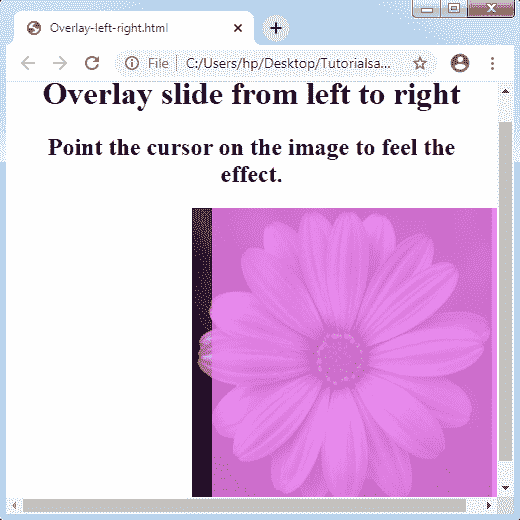

# CSS 覆盖

> 原文：<https://www.tutorialandexample.com/css-overlay/>

CSS 覆盖层(CSS Overlay):它是用一种涂层来覆盖某物的表面。 **CSS 覆盖**将任何东西覆盖在其他东西的顶部区域。它创建了一个更有吸引力的网页。设计也相当容易。

设计一个覆盖结果指定将两个 **div** 元素放在任何相同的位置。不过，这两种元素在需要时都会出现。如果我们创建任何第二个出现的 **div** 元素，我们可以单击或悬停在一个 **div** 上。一个 **div** 元素是一个**覆盖 div** ，它包含了当任何用户悬停在图像上时将显示的内容。第二个 **div** 元素是保存图像及其覆盖图的任何容器。

### 淡化覆盖效果

这个覆盖指定了如果我们将光标移动到图像上，那么它将显示在图像的顶部区域。让我们考虑一个例子，如下所示:

**举例:**

```
<!DOCTYPE html>
<html>
<head>
<title> Image Overlay </title>
<style>
.container img
{
 width: 300px;
 height: 300px;
}
.container
{
 position: relative;
 width: 25%;
 height: auto;
}
.overlay
{
 position: absolute;
 transition: 0.5s ease;
 height: 300px;
 width: 100px;
 top: 0;
 left: 0;
 background-color: violet;
 opacity: 0;
}
.container:hover .overlay
{
 opacity: 0.9;
}
</style>
</head>
<body>
<center>
<h1> Fade Overlay Effect </h1>
<h2> Point the cursor on the image to feel the effect. </h2>
<div class= "container">

<div class= "overlay"></div>
</div>
</center>
</body>
</html>
```

**输出:**


### 图像叠加幻灯片

通过使用图像叠加幻灯片，我们可以借助四种不同类型的幻灯片来制作任何叠加效果，如**左**、**右**、**上**和**下**。我们用一个例子来讨论。

**从上到下覆盖幻灯片**

现在，我们将借助一个示例来了解如何从任何顶部表面在覆盖图中制作幻灯片。

**举例:**

```
<!DOCTYPE HTML>  
<html>  
<head>  
<style>  
.container img
{  
 width: 300px;  
 height: 300px;  
}  
.container
{  
 position: relative;  
 width: 25%;  
 height: auto;
}   
.container:hover .overlay
{  
 opacity: 0.8;  
 height: 300px;  
}  
.overlay
{  
 position: absolute;  
 transition: 0.7s ease;  
 opacity: 0;  
 width: 100px;  
 height: 0;  
 top: 0;  
 right: 20px;
 left: 0;  
 background-color: violet;  
}  
</style>  
</head>  
<body>  
<center>          
<h1> Overlay slide from top to bottom </h1> 
<h2> Point the cursor on the image to feel the effect. </h2> 
<div class="container">  
  
<div class="overlay"></div>  
</div>  
</center>  
</body>  
</html> 
```

**输出:**


### 从下到上覆盖幻灯片

当我们将光标放在任何图像上时，它会从底部滑到顶部。为了理解这一点，我们假设一个例子。

**举例:**

```
<!DOCTYPE HTML>  
<html>  
<head>  
<style>  
.container img
{  
 width: 300px;  
 height: 300px;  
}  
.container
{  
 position: relative;  
 width: 25%;  
 height: auto;
}   
.container:hover .overlay
{  
 opacity: 0.8;  
 height: 300px;  
}  
.overlay
{  
 position: absolute;  
 transition: 0.7s ease;  
 opacity: 0;  
 width: 100px;  
 height: 0;  
 bottom: 0;  
 right: 20px;
 left: 0;  
 background-color: violet;  
}  
</style>  
</head>  
<body>  
<center>          
<h1> Overlay slide from bottom to top </h1> 
<h2> Point the cursor on the image to feel the effect. </h2> 
<div class="container">  
  
<div class="overlay"></div>  
</div>  
</center>  
</body>  
</html> 
```

**输出:**


### 从左到右覆盖幻灯片

顾名思义，从左向右滑动就有了。请参见下面的示例。

**举例:**

```
<!DOCTYPE HTML>  
<html>  
<head>  
<style>  
.container img
{  
 width: 300px;  
 height: 300px;  
}  
.container
{  
 position: relative;  
 width: 25%;  
 height: auto; 
}   
.container:hover .overlay
{  
 opacity: 0.8;  
 width: 300px;  
}  
.overlay
{  
 position: absolute;  
 transition: 0.7s ease;  
 opacity: 0;  
 width: 0;  
 height: 100%;  
 bottom: 0;  
 left: 20px;  
 background-color: violet;  
}  
</style>  
</head>  
<body>  
<center>  
<h1> Overlay slide from left to right </h1> 
<h2> Point the cursor on the image to feel the effect. </h2> 
<div class="container">  
  
<div class="overlay"></div>  
</div>  
</center>  
</body>
</html>  
```

**输出:**



### 从右向左覆盖幻灯片

这种滑动方式和上面提到的各种效果很像，只不过会从右表面滑动到左表面。

**举例:**

```
<!DOCTYPE HTML>  
<html>  
<head>  
<style>  
.container img
{  
 width: 300px;  
 height: 300px;  
}  
.container
{  
 position: relative;  
 width: 25%;  
 height: auto; 
}   
.container:hover .overlay
{  
 opacity: 0.8;  
 width: 300px;  
}  
.overlay
{  
 position: absolute;  
 transition: 0.7s ease;  
 opacity: 0;  
 width: 0;  
 height: 100%;  
 bottom: 0;  
 right: 20px;  
 background-color: violet;
}  
</style>  
</head>  
<body>  
<center>  
<h1> Overlay slide from right to left </h1> 
<h2> Point the cursor on the image to feel the effect. </h2> 
<div class="container">  
  
<div class="overlay"></div>  
</div>  
</center>  
</body>
</html>  
```

**输出:**


### 图像覆盖标题

在图像叠加的结果中，如果我们将光标放在图像上，我们可以在上面看到一个标题。请看下图。

**举例:**

```
<!DOCTYPE HTML>  
<html>  
<head>  
<meta name= "viewport" content= "width=device-width, initial-scale=1"> 
<style>
body
{  
 text-align: center;
}  
* {box-sizing: border-box;}
.container
{  
 position: relative;  
 width: 50%;  
 max-width: 300px;
}   
img
{
 display: block;
 width: 100%;
 height: auto;
}
.overlay
{  
 position: absolute;
 bottom: 0; 
 background: rgba(0, 0, 0, 0.2);
 width: 100%;
 opacity: 0;    
 transition: .9s ease;
 font-size: 25px;  
 padding: 20px;
}  
.container:hover .overlay
{  
 opacity: 1.5; 
}             
</style>  
</head>  
<body>  
<h1> Image Overlay Title Effect </h1> 
<h2> Point the cursor on the image to feel the effect. </h2>
<center>   
<div class= "container">  
  
<div class= "overlay"> Welcome to this Page </div>  
</div>  
</center>  
</body>
</html>  
```

**输出:**


**图像叠加图标**

在这种叠加效果中，鼠标悬停时会出现一个图标来覆盖整个图像。我们还将在图标上设置一个链接，以便在任何页面之间进行切换。考虑下面给出的插图:

**举例:**

```
<!DOCTYPE HTML>  
<html>  
<head>  
<meta name= "viewport" content= "width=device-width, initial-scale=1"> 
<link rel="stylesheet" href="https://cdnjs.cloudflare.com/ajax/libs/font-awesome/4.7.0/css/font-awesome.min.css"> 
<style>
.container
{  
 position: relative;  
 width: 100%;  
 max-width: 400px;
}   
.img
{
 display: block;
 width: 100%;
 height: auto;
}
.overlay
{  
 position: absolute;
 top: 0; 
 height: 100%; 
 width: 100%; 
 opacity: 0; 
 transition: 1s ease; 
 background-color: violet;  
}  
.container:hover .overlay
{  
 opacity: 1; 
}      
.icon
{
 color: blue;
 font-size: 100px;
 position: absolute;
 top: 50%;
 left: 50%;
 transform: translate(-50%, -50%);
}      
</style>  
</head>  
<body>  
<center>         
<h1> Image Overlay icon Effect </h1> 
<h2> Point the cursor on the image to feel the effect. </h2>   
<div class= "container">  
  
<div class= "overlay">
<a href= "#" class= "icon">
<i class= "fa fa-home"></i>
</a>
</div>  
</div>  
</center>  
</body>
</html>  
```

**输出:**

