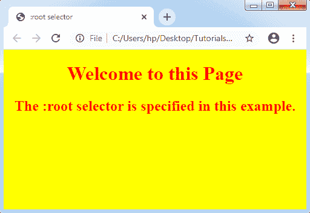
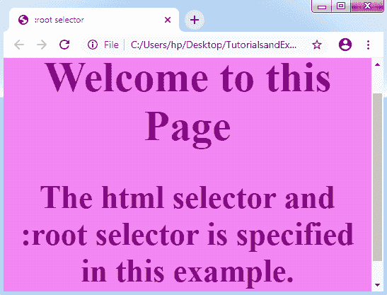

# CSS:根选择器

> 原文：<https://www.tutorialandexample.com/css-root-selector/>

**CSS:根选择器**

 **这个 CSS 伪类匹配任何文档的根元素。它选择文档 DOM 或树中最高级别的父级**。**

的元素在 HTML 中总是根元素。但是:root 选择器类似于 html 选择器。这是因为两个元素都指向同一个元素，尽管 selector :root 包含了更高的特异性。

**语法:**

```
:root {  
    // CSS property  
}  
```

**举例:**

```
<!DOCTYPE html>
<html>
<head>
<title> :root selector </title>
<style>
:root
{
 background: yellow;
 color: red;
 text-align: center;
}
</style>
</head>
<body>
<h1> Welcome to this Page </h1>
<h2> The :root selector is specified in this example. </h2>
</body>
</html>
```

**输出:**



让我们尝试另一种方法，其中**:根选择器**或 html 选择器将同时实现。如果这两个选择器都将在特性问题内实现，那么:root 选择器将获胜。

在下面的例子中，我们在两个选择器中使用了相似的属性，即:根选择器和 html 选择器。由于更高的特异性，将执行:root 选择器属性。尽管一些属性是在 html 选择器中定义的，而不是在:root 选择器中定义的，但是 html 选择器的属性将会起作用。

**举例:**

```
<!DOCTYPE html>
<html>
<head>
<title> :root selector </title>
<style>
:root
{
 background: violet;
 color: purple;
 text-align: center;
}
html
{
 background: yellow;
 color: red;
 font-size: 30px;
}
</style>
</head>
<body>
<h1> Welcome to this Page </h1>
<h2> The html selector and :root selector is specified in this example. </h2>
</body>
</html>
```

正如我们在上面的例子中所定义的，颜色和背景色属性都是在:根选择器和 html 选择器中定义的。尽管在结果中:root 选择器属性将会执行，因为:root 选择器具有更高的特异性。

**输出:**

**