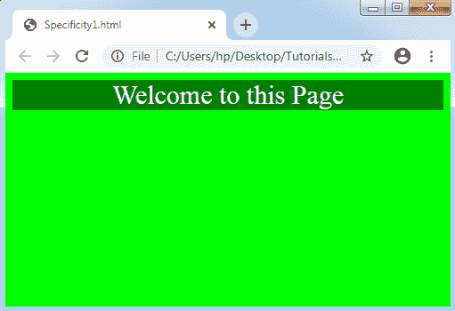
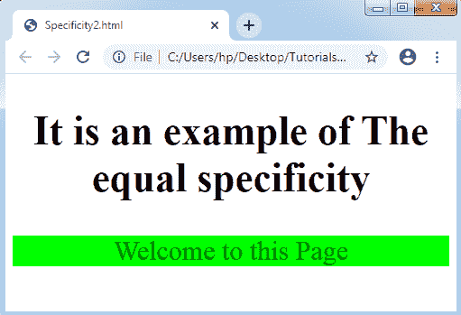
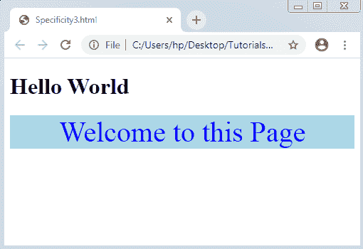

# CSS 特异性

> 原文：<https://www.tutorialandexample.com/css-specificity/>

CSS 特异性:如果 CSS 的一个或多个冲突的规则表达了一个相似的元素，浏览器将使用一些规则来检查这个特定的元素。**特性**可以以一种形式指定，它帮助几个浏览器确定哪个属性值对一个元素最方便。此外，它还指定对元素使用哪种样式声明。

在开始讨论特异性之前，让我们先了解一些要点，如下所示:

*   当多个选择器在搅拌任何相同的元素时，只有 **CSS 特异性**起重要作用。当任何浏览器需要确定用于任何匹配元素的样式时，CSS 特异性就会出现并完成它。
*   当两个以上的选择器具有相同的特异性值时，考虑当前的一个。
*   继承值和通用选择器 **(*)** 具有较低的 **(0)** 特异性。
*   CSS 中的**样式属性**与任何选择器相比增加了更高的特异性，除了！**重要的**样式表选择器中的 CSS 属性。
*   **！重要的** CSS 属性改变了选择器的特异性。如果两个或更多的选择器具有相同的特异性，它包括**！重要**。

**特异性层级**

所有的选择器都在特异性的层次中占有一席之地。这里有四种类型，我们在其中定义选择器的特异性水平。

**Inline styles:** 这个层次类型可以直接固定到要设计的元素上。例如:<p style = " color:blue；">。它将有更大的优先权。

**IDs:** 它是一个特殊的标识符，用于包含第二大优先级的页面的许多元素。例如:#para。

**类、伪类、属性:**增加了类、伪类、属性(比如:hover，:focus 等。).

**伪元素和元素:**添加伪元素(like :before 和:after)和元素名称(h1，div)。他们的优先级最低。

### 特异性规则

CSS 特异性可以定义为一个权重，它可以用于 CSS 的任何声明。此外，它由任何匹配选择器中每个选择器类型的编号来标识。

具体性规则在下面的例子中提到。

1.  **ID 选择器的特异性大于属性选择器**

我们举个例子来定义一下。

**举例:**

在这个例子中，我们使用了一个 id 选择器和 CSS 属性 background-color。

```
<!DOCTYPE html>
<html>
<head>
<style>
body
{
text-align: center;
font-size: 30px;
color: white;
background-color: lime;
}
#div1
{
background-color: lime;
}
div#div1        /*Higher specificity*/
{
background-color: green;
}
div[id=div1]
{
background-color: red;
}
</style>
</head>
<body>
<div id="div1"> Welcome to this Page </div>
</body>
</html>
```

**输出:**



*   **在同等特异性下，当前规则将考虑**

当任何相似的规则被使用两次时，任何当前的规则将在外部样式表中被考虑。

**举例:**

在下面的例子中，元素名称的特异性是相同的。因此，将使用元素的当前指定名称。

```
<!DOCTYPE html>
<html>
<head>
<style>
body
{
text-align: center;
font-size: 30px;
}
div
{
background-color: lightblue;
color: blue;
}
div
{
background-color: lime;
color: green;
}
</style>
</head>
<body>
<h2> It is an example of The equal specificity </h2>
<div id="div1"> Welcome to this Page </div>
</body>
</html>
```

**输出:**



*   **类选择器特异性高于任何元素选择器**

类选择器(。高，。导航等。)与任何元素选择器(如 p、h1 和 div)相比具有更高的特异性。

**举例:**

```
<!DOCTYPE html>
<html>
<head>
<style>
.intro
{
background-color: lightblue;
color: blue;
text-align: center;
font-size: 40px;
}
div
{
background-color: lime;
color: green;
text-align: right;
}
</style>
</head>
<body>
<h1> Hello World </h1>
<div class= "intro"> Welcome to this Page </div>
</body>
</html>
```

**输出:**

