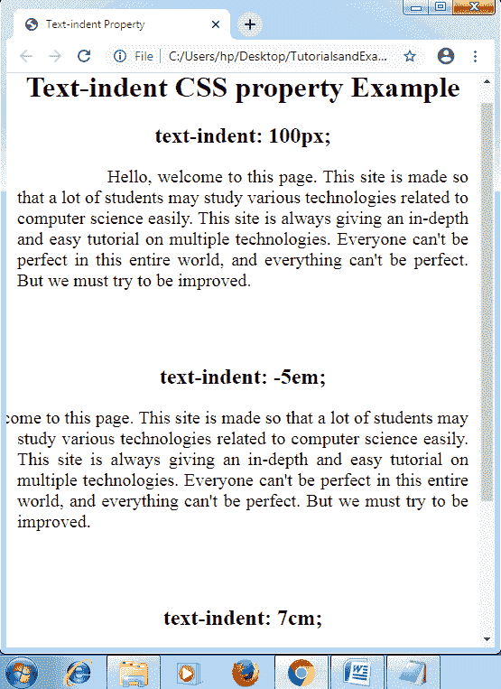
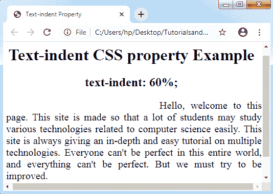

# CSS 文本-缩进

> 原文：<https://www.tutorialandexample.com/css-text-indent/>

**文本缩进**

 **CSS 的 Text-indent 属性用于设置文本块中任何首行的缩进。它描述了在文本行之前建立的水平间距。

它还允许 CSS 中的负值。当指定负值时，第一行的缩进将向生命侧。

**语法:**

```
text-indent: length | inherit | initial;  
```

**属性值**

**length:** 上面指定的长度用于设置固定缩进，以及一些单位，如 px、em、pt、cm 等。它的默认值为 0。此外，它允许负值。如果它的值是负数，那么第一行的缩进将在左边。

**百分比:**描述任意包含块的宽度百分比内的空间量。

**initial:** 用于将属性设置为默认属性。这个属性值包含另外两个实验属性，下面将对其进行解释。浏览器内部不支持以下两个值。

**挂:**此值为实验值，非官方值。它反转任何缩进的行。除了第一行，它可以缩进所有的行。参考书目通常和这个值一起被提及，其中任何第一行都有左边距，其他内容缩进。

**每行:**这些属性值也是实验值。该值可以影响所有的行和随后的第一行，受影响的行断开(使用< br >)。

**举例:**

在下面的例子中，我们应用 CSS 文本缩进属性以及一些长度值，如 cm、em 和 px。此外，我们使用 CSS 文本对齐:justify 属性来查找异常结果。

```
<!DOCTYPE html>
<html>
<head>
<title> Text-indent Property </title>
<style>
div
{
 font-size: 20px;
 width: 500px;
 height: 200px;
 text-align: justify;
}
.exppx
{
 text-indent: 100px;
}
.expem
{
 text-indent: -5em;
}
expcm
{
 text-indent: 7cm;
}
</style>
</head>
<body>
<center>
<h1> Text-indent CSS property Example </h1>
<h2> text-indent: 100px; </h2>
<div class= "exppx">
Hello, welcome to this page. This site is made so that a lot of students may study various technologies related to computer science easily. This site is always giving an in-depth and easy tutorial on multiple technologies. Everyone can't be perfect in this entire world, and everything can't be perfect. But we must try to be improved.
</div>
<h2> text-indent: -5em; </h2>
<div class= "expem">
Hello, welcome to this page. This site is made so that a lot of students may study various technologies related to computer science easily. This site is always giving an in-depth and easy tutorial on multiple technologies. Everyone can't be perfect in this entire world, and everything can't be perfect. But we must try to be improved.
</div>
<h2> text-indent: 7cm; </h2>
<div class= "expcm">
Hello, welcome to this page. This site is made so that a lot of students may study various technologies related to computer science easily. This site is always giving an in-depth and easy tutorial on multiple technologies. Everyone can't be perfect in this entire world, and everything can't be perfect. But we must try to be improved.
</div>
</center>
</body>
</html>
```

**输出:**



**举例:**

让我们再举一个使用百分比值的例子。

```
<!DOCTYPE html>
<html>
<head>
<title> Text-indent Property </title>
<style>
div
{
 font-size: 20px;
 width: 500px;
 height: 200px;
 text-align: justify;
}
.expper
{
 text-indent: 60%;
}
</style>
</head>
<body>
<center>
<h1> Text-indent CSS property Example </h1>
<h2> text-indent: 60%; </h2>
<div class= "expper">
Hello, welcome to this page. This site is made so that a lot of students may study various technologies related to computer science easily. This site is always giving an in-depth and easy tutorial on multiple technologies. Everyone can't be perfect in this entire world, and everything can't be perfect. But we must try to be improved.
</div>
</center>
</body>
</html>
```

**输出:**

**