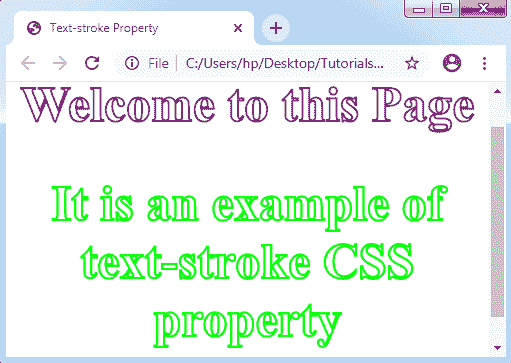
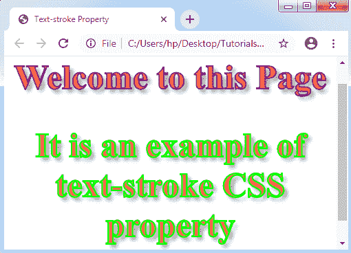

# CSS 文本描边

> 原文：<https://www.tutorialandexample.com/text-stroke/>

**文字-笔画**

 *****文本笔画*** CSS 属性将笔画插入到任何文本中，并给它们一个修饰选项。它描述了各种文本字符的笔画宽度和颜色。

它是以下属性的简写:

**text-stroke-width:** 该属性指定了笔画的粗细效果，并保存了单位的值。

**text-stroke-color:** 这个属性保存颜色值。

***Text-stroke*** 属性只应用了一个 ***-webkit-*** 前缀。

**举例:**

```
<!DOCTYPE html>
<html>
<head>
<title> Text-stroke Property </title>
<style>
body
{
 text-align: center;
}
.exp
{
 color: white;
 font-size: 50px;
 -webkit-text-stroke-width: 2px;
 -webkit-text-stroke-color: purple;
}
</style>
</head>
<body>
<h1 class= "exp"> Welcome to this Page </h1>
<h2 class= "exp" style= "-webkit-text-stroke-color: lime;"> It is an example of text-stroke CSS property </h2>
</body>
</html>
```

**输出:**



让我们再举一个文本笔划 CSS 属性的例子。

**举例:**

```
<!DOCTYPE html>
<html>
<head>
<title> Text-stroke Property </title>
<style>
body
{
 text-align: center;
}
.exp
{
 font-size: 50px;
 -webkit-text-stroke-width: 2px;
 -webkit-text-stroke-color: purple;
 -webkit-text-fill-color: tomato;
 text-shadow: 5px 5px 6px gray;
}
</style>
</head>
<body>
<h1 class= "exp"> Welcome to this Page </h1>
<h2 class= "exp" style= "-webkit-text-stroke-color: lime;"> It is an example of text-stroke CSS property </h2>
</body>
</html>
```

**输出:**

**