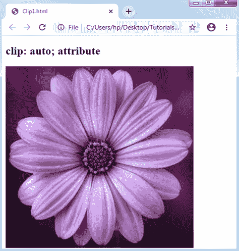
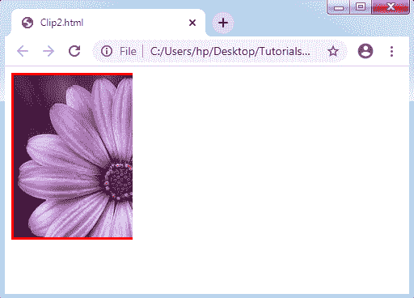

# CSS 剪辑

> 原文：<https://www.tutorialandexample.com/css-clip/>

**CSS 剪辑**

CSS 中的 Clip 属性描述了元素的可见区域。它适用于绝对定位的元素(位置:绝对；).通常，当图像比现有元素更重要时使用它。

它允许我们描绘一个被描述为任意四个坐标的矩形来裁剪绝对定位的元素。

**语法:**

```
clip: auto | shape | initial | inherit;  
```

**属性值**

**auto** **:** 该属性值作为默认值，按原样显示元素。使用此值，将不会定义任何剪辑。

**举例:**

```
<!DOCTYPE html>
<html>
<head>
<style>
.auto
{
 position: absolute;
 width: 400px;
 height: 400px;
 clip: auto;
}
</style>
</head>
<body>
<h2> clip: auto; attribute </h2>

</body>
</html>
```

**输出:**



**形状** **:** 该属性值用于裁剪元素。任何元素的定义区域都可以使用该值进行剪裁。它的正宗值是这样的——**rect(上、右、下、左)；**

**举例:**

```
<!DOCTYPE html>
<html>
<head>
<style type= "text/css">
div
{
  background: url(flower3.png); 
  clip: rect(0px, 150px, 250px, 0px); 
  border:3px solid red; 
  height:200px; 
  width: 250px; 
  position: absolute; 
}
</style>
</head>
<body>
<div></div>
</body>
</html>
```

**输出:**

