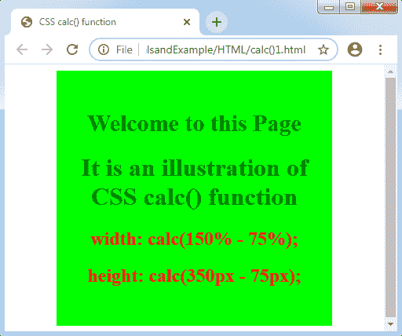
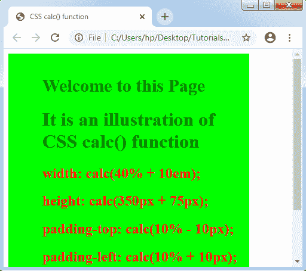
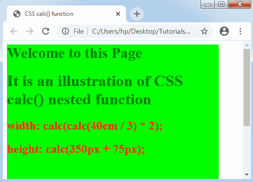

# CSS calc()

> 原文：<https://www.tutorialandexample.com/css-calc/>

CSS calc():CSS**calc()**函数是一个内置类型的 CSS 函数，它允许我们实现计算。用于计算**角度、整数频率、数字、时间、百分比、**和**长度**。它还使用一些算术运算符，如加法(+)、减法(-)、除法(/)和乘法(*)。

这是 CSS 的一个有效概念，因为它允许我们合并单位，如像素和百分比。

**语法:**

```
calc( Expression );  
```

#### 属性值

CSS 中的这个函数保存任何单独的参数表达式。这种表达式的结果可以作为任何值回收。它可以是一个使用**算术运算符** (+、-、*、/)的简单表达式，定义它是必不可少的。

**要点**

*   一些算术运算符，如减法(-)和加法(+)必须始终用空格括起来。否则，该表达式将被视为任何无效表达式。例如，表达式 **calc(60%-4px)** 是无效的，因为该表达式被解释为百分比，由任何负长度来表示。再来一个表达式， **calc(60%- 4px)** 解释为任意长度，任意减法运算符。
*   但是运算符/和*不需要任何空格，尽管建议插入它们以保持一致性。
*   **calc()** 函数嵌套是可能的。

**举例:**

在下面的例子中，我们将使用函数 **calc()** 来指定 div 组件的高度和宽度。我们将在 **calc()** 函数中使用减法以及类似的单位。

表达式的结果将被定义为属性值。所以高度值是 275px，宽度值是 75%。

```
<!DOCTYPE html>
<html>
<head>
<title> CSS calc() function </title>
<style>
.exp
{
 width: calc(150% - 75%);
 height: calc(350px - 75px);
 background-color: lime;
 padding-top: 50px;
}
.exp1
{
 font-size: 30px;
 font-weight: bold;
 color: green;
}
h1
{
 color: green;
}
h2
{
 color: red;
}
</style>
</head>
<body>
<center>
<div class= "exp">
<div class= "exp1"> Welcome to this Page </div>
<h1> It is an illustration of CSS calc() function </h1>
<h2> width: calc(150% - 75%); </h2>
<h2> height: calc(350px - 75px); </h2>
</div>
</center>
</body>
</html>
```

从上面的例子中，可以直接定义高度和宽度值。但是这个例子中的表达式包含类似的单元。如果单位不同，就很难直接写出数值。

**输出:**



让我们举另一个例子，我们将使用一些混合单位。

**示例:使用混合单元**

```
<!DOCTYPE html>
<html>
<head>
<title> CSS calc() function </title>
<style>
.exp
{
 width: calc(40% + 10em);
 height: calc(350px + 75px);
 background-color: lime;
 padding-top: calc(10% - 10px);
 padding-left: calc(10% + 10px);
}
.exp1
{
 font-size: 30px;
 font-weight: bold;
 color: green;
}
h1
{
 color: green;
}
h2
{
 color: red;
}
</style>
</head>
<body>
<div class= "exp">
<div class= "exp1"> Welcome to this Page </div>
<h1> It is an illustration of CSS calc() function </h1>
<h2> width: calc(40% + 10em); </h2>
<h2> height: calc(350px + 75px); </h2>
<h2> padding-top: calc(10% - 10px); </h2>
<h2> padding-left: calc(10% + 10px); </h2>
</div>
</body>
</html>
```

**输出:**



**让我们再举一个例子，我们将使用一些混合单位。**

 ****举例:calc()嵌套函数**

```
<!DOCTYPE html>
<html>
<head>
<title> CSS calc() function </title>
<style>
.exp
{
 width: calc(calc(40em / 3) * 2);
 height: calc(350px + 75px);
 background-color: lime;
}
.exp1
{
 font-size: 30px;
 font-weight: bold;
 color: green;
}
h1
{
 color: green;
}
h2
{
 color: red;
}
</style>
</head>
<body>
<div class= "exp">
<div class= "exp1"> Welcome to this Page </div>
<h1> It is an illustration of CSS calc() nested function </h1>
<h2> width:  calc(calc(40em / 3) * 2); </h2>
<h2> height: calc(350px + 75px); </h2>
</div>
</body>
</html>
```

**输出:**

**