# CSS 背景混合模式

> 原文：<https://www.tutorialandexample.com/css-background-blend-mode/>

**背景混合模式**

background-blend-mode 属性设置组件的每个背景层(颜色/图像)的混合模式。它说明了元素背景图像如何与元素背景颜色很好地融合在一起。我们可以使用这个属性将背景中的图像混合在一起，或者将它们与背景颜色混合在一起。

Edge/Internet Explorer 不支持此属性。

**语法:**

```
background-blend-mode: normal | multiply | screen | color-dodge | difference | darken | lighten | saturation | luminosity | overlay | hard-light | soft-light | exclusion | hue | color-burn | color;  
```

这个 CSS 属性有大量的属性值，下面将对其进行讨论和解释。

**正常** **:** 该值为默认值。它将属性的模式设置为正常。

**相乘** **:** 可以将背景图像和背景颜色相乘，处理比以前更暗的图像。它将混合模式设置为乘法。

**举例:**

```
<!DOCTYPE html> 
<html> 
<head> 
<style> 
#div1 img{ 
width: 300px; 
height: 300px; 
} 
#example{  
  width: 400px; 
  height: 400px; 
  background-repeat: no-repeat; 
  background-image: url("Horse.png"), url("Water.jpg"); 
  background-blend-mode: multiply; 
} 
</style> 
</head> 
<body> 
<center> 
<div id = "div1"> 
<h2> Real Images </h2> 
 
 
</div> 
<h2> background-blend-mode: multiply; </h2> 
<div id="example"></div> 
</center> 
</body> 
</html> 
```

**输出:**

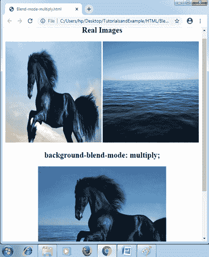

**屏幕** **:** 设置混合模式为屏幕，改变颜色和图像。其效果类似于在任何投影屏幕上显示两幅图像。

**举例:**

```
<!DOCTYPE html>
<html>
<head>
<style>
#div1 img
{
 width: 300px;
 height: 300px;
}
#example
{
 width: 400px;
 height: 400px;
 background-repeat: no-repeat;
 background-image: url("Horse.png"), url("Water.jpg");
 background-blend-mode: screen;
}
</style>
</head>
<body>
<center>
<div id= "div1">
<h2> Real Images </h2>


</div>
<h2> background-blend-mode: screen; </h2>
<div id= "example"></div>
</center>
</body>
</html>
```

**输出:**

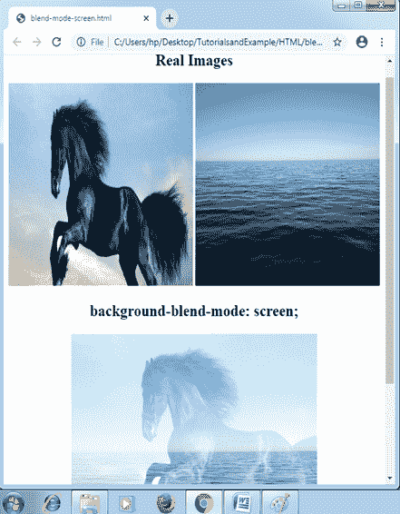

**颜色-减淡** **:** 屏幕模式和这个属性值很像。它将混合模式设置为颜色减淡。这种模式将通过变换背景中的图像来划分背景的颜色，从而产生结果。

**举例:**

```
<!DOCTYPE html>
<html>
<head>
<style>
#div1 img
{
 width: 300px;
 height: 300px;
}
#example
{
 width: 400px;
 height: 400px;
 background-repeat: no-repeat;
 background-image: url("Horse.png"), url("Water.jpg");
 background-blend-mode: color-dodge;
}
</style>
</head>
<body>
<center>
<div id= "div1">
<h2> Real Images </h2>


</div>
<h2> background-blend-mode: color-dodge; </h2>
<div id= "example"></div>
</center>
</body>
</html>
```

**输出:**

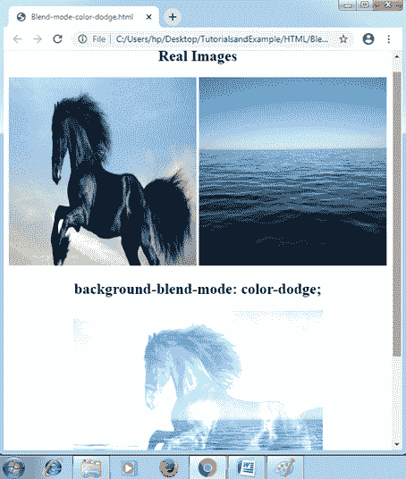

**差值** **:** 设置混合模式为**差值**。这种模式将通过从任何最亮的颜色中减去任何最暗的颜色来产生结果。

**举例:**

```
<!DOCTYPE html>
<html>
<head>
<style>
#div1 img
{
 width: 300px;
 height: 300px;
}
#example
{
 width: 400px;
 height: 400px;
 background-repeat: no-repeat;
 background-image: url("Horse.png"), url("Water.jpg");
 background-blend-mode: difference;
}
</style>
</head>
<body>
<center>
<div id= "div1">
<h2> Real Images </h2>


</div>
<h2> background-blend-mode: difference; </h2>
<div id= "example"></div>
</center>
</body>
</html>
```

**输出:**

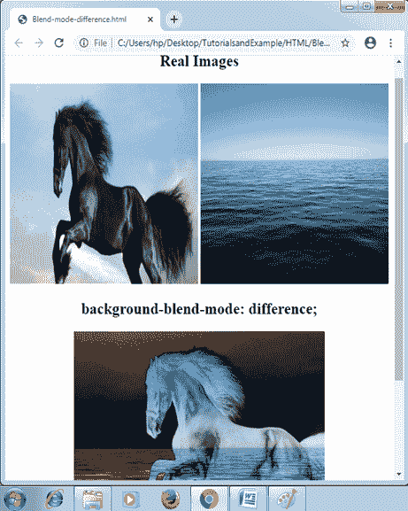

**变暗** **:** 设置混合模式为变暗。

**举例:**

```
<!DOCTYPE html>
<html>
<head>
<style>
#div1 img
{
 width: 300px;
 height: 300px;
}
#example
{
 width: 400px;
 height: 400px;
 background-repeat: no-repeat;
 background-image: url("Horse.png"), url("Water.jpg");
 background-blend-mode: darken;
}
</style>
</head>
<body>
<center>
<div id= "div1">
<h2> Real Images </h2>


</div>
<h2> background-blend-mode: darken; </h2>
<div id= "example"></div>
</center>
</body>
</html>
```

**输出:**


**变亮** **:** 将混合模式设置为变亮。

**举例:**

```
<!DOCTYPE html>
<html>
<head>
<style>
#div1 img
{
 width: 300px;
 height: 300px;
}
#example
{
 width: 400px;
 height: 400px;
 background-repeat: no-repeat;
 background-image: url("Horse.png"), url("Water.jpg");
 background-blend-mode: lighten;
}
</style>
</head>
<body>
<center>
<div id= "div1">
<h2> Real Images </h2>


</div>
<h2> background-blend-mode: lighten; </h2>
<div id= "example"></div>
</center>
</body>
</html>
```

**输出:**

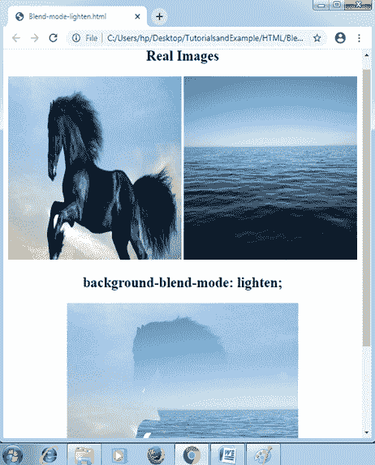

**饱和度** **:** 其最终结果将是顶部的颜色**饱和度**，而使用底部颜色的**光度**和**色相**。

**举例:**

```
<!DOCTYPE html>
<html>
<head>
<style>
#div1 img
{
 width: 300px;
 height: 300px;
}
#example
{
 width: 400px;
 height: 400px;
 background-repeat: no-repeat;
 background-image: url("Horse.png"), url("Water.jpg");
 background-blend-mode: saturation;
}
</style>
</head>
<body>
<center>
<div id= "div1">
<h2> Real Images </h2>


</div>
<h2> background-blend-mode: saturation; </h2>
<div id= "example"></div>
</center>
</body>
</html>
```

**输出:**

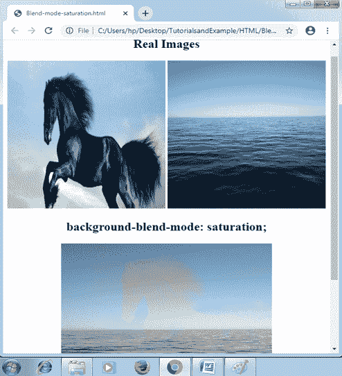

**光度** **:** 该值将混合模式设置为光度。它的最终结果将是顶部亮度的颜色，同时使用底部颜色的**饱和度**和**色调**。

**举例:**

```
<!DOCTYPE html>
<html>
<head>
<style>
#div1 img
{
 width: 300px;
 height: 300px;
}
#example
{
 width: 400px;
 height: 400px;
 background-repeat: no-repeat;
 background-image: url("Horse.png"), url("Water.jpg");
 background-blend-mode: luminosity;
}
</style>
</head>
<body>
<center>
<div id= "div1">
<h2> Real Images </h2>


</div>
<h2> background-blend-mode: luminosity; </h2>
<div id= "example"></div>
</center>
</body>
</html>
```

**输出:**

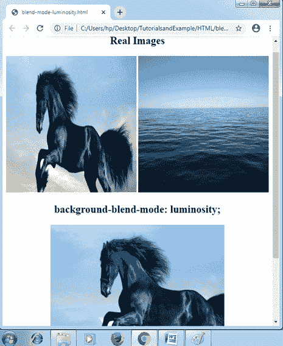

**叠加** **:** 该属性值将混合模式设置为叠加。

**举例:**

```
<!DOCTYPE html>
<html>
<head>
<style>
#div1 img
{
 width: 300px;
 height: 300px;
}
#example
{
 width: 400px;
 height: 400px;
 background-repeat: no-repeat;
 background-image: url("Horse.png"), url("Water.jpg");
 background-blend-mode: overlay;
}
</style>
</head>
<body>
<center>
<div id= "div1">
<h2> Real Images </h2>


</div>
<h2> background-blend-mode: overlay; </h2>
<div id= "example"></div>
</center>
</body>
</html>
```

**输出:**

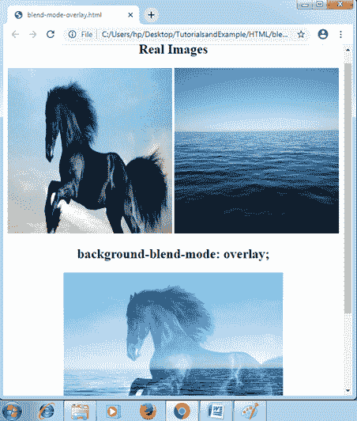

**强光** **:** 该值将混合模式设置为强光。

**举例:**

```
<!DOCTYPE html>
<html>
<head>
<style>
#div1 img
{
 width: 300px;
 height: 300px;
}
#example
{
 width: 400px;
 height: 400px;
 background-repeat: no-repeat;
 background-image: url("Horse.png"), url("Water.jpg");
 background-blend-mode: hard-light;
}
</style>
</head>
<body>
<center>
<div id= "div1">
<h2> Real Images </h2>


</div>
<h2> background-blend-mode: hard-light; </h2>
<div id= "example"></div>
</center>
</body>
</html>
```

**输出:**

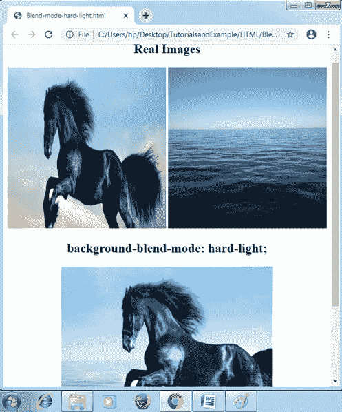

**柔光:**该值将混合模式设置为柔光。

**举例:**

```
<!DOCTYPE html>
<html>
<head>
<style>
#div1 img
{
 width: 300px;
 height: 300px;
}
#example
{
 width: 400px;
 height: 400px;
 background-repeat: no-repeat;
 background-image: url("Horse.png"), url("Water.jpg");
 background-blend-mode: soft-light;
}
</style>
</head>
<body>
<center>
<div id= "div1">
<h2> Real Images </h2>


</div>
<h2> background-blend-mode: soft-light; </h2>
<div id= "example"></div>
</center>
</body>
</html>
```

**输出:**

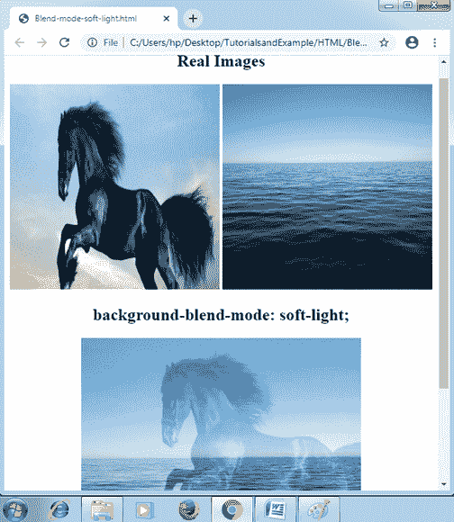

**排除** **:** 设置混合模式为排除。

**举例:**

```
<!DOCTYPE html>
<html>
<head>
<style>
#div1 img
{
 width: 300px;
 height: 300px;
}
#example
{
 width: 400px;
 height: 400px;
 background-repeat: no-repeat;
 background-image: url("Horse.png"), url("Water.jpg");
 background-blend-mode: exclusion;
}
</style>
</head>
<body>
<center>
<div id= "div1">
<h2> Real Images </h2>


</div>
<h2> background-blend-mode: exclusion; </h2>
<div id= "example"></div>
</center>
</body>
</html>
```

**输出:**

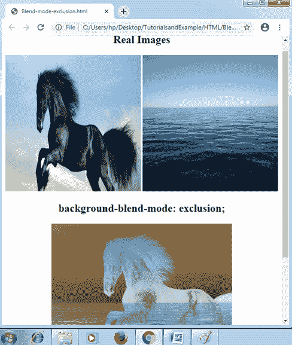

**色调** **:** 其结果是色调的背景图像组合以及任何背景颜色的饱和度和亮度。

**举例:**

```
<!DOCTYPE html>
<html>
<head>
<style>
#div1 img
{
 width: 300px;
 height: 300px;
}
#example
{
 width: 400px;
 height: 400px;
 background-repeat: no-repeat;
 background-image: url("Horse.png"), url("Water.jpg");
 background-blend-mode: hue;
}
</style>
</head>
<body>
<center>
<div id= "div1">
<h2> Real Images </h2>


</div>
<h2> background-blend-mode: hue; </h2>
<div id= "example"></div>
</center>
</body>
</html>
```

**输出:**


**烧色:**设置混合模式为烧色。

**举例:**

```
<!DOCTYPE html>
<html>
<head>
<style>
#div1 img
{
 width: 300px;
 height: 300px;
}
#example
{
 width: 400px;
 height: 400px;
 background-repeat: no-repeat;
 background-image: url("Horse.png"), url("Water.jpg");
 background-blend-mode: color-burn;
}
</style>
</head>
<body>
<center>
<div id= "div1">
<h2> Real Images </h2>


</div>
<h2> background-blend-mode: color-burn; </h2>
<div id= "example"></div>
</center>
</body>
</html>
```

**输出:**

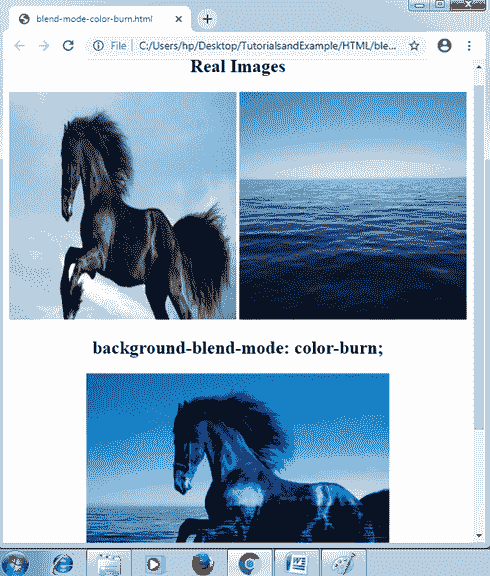

**颜色** **:** 可以设置混合到颜色的模式。它携带任何背景图像的饱和度和色调以及任何背景颜色的亮度。

**举例:**

```
<!DOCTYPE html>
<html>
<head>
<style>
#div1 img
{
 width: 300px;
 height: 300px;
}
#example
{
 width: 400px;
 height: 400px;
 background-repeat: no-repeat;
 background-image: url("Horse.png"), url("Water.jpg");
 background-blend-mode: color;
}
</style>
</head>
<body>
<center>
<div id= "div1">
<h2> Real Images </h2>


</div>
<h2> background-blend-mode: color; </h2>
<div id= "example"></div>
</center>
</body>
</html>
```

**输出:**

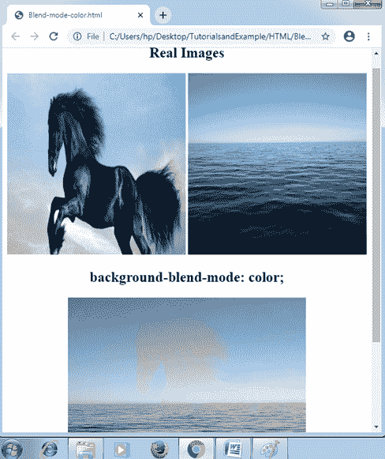