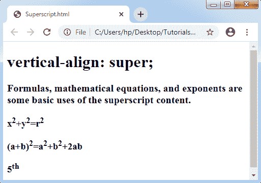
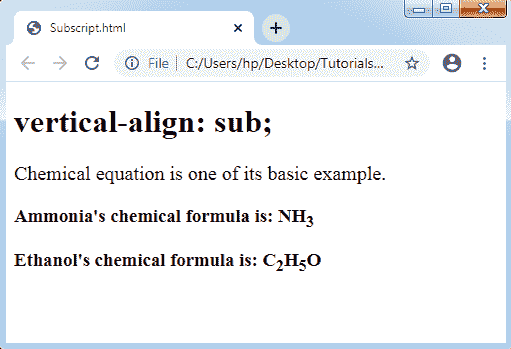

# CSS 上标和下标

> 原文：<https://www.tutorialandexample.com/css-superscript-and-subscript/>

**上标和下标**

为了指定文本的上标和下标，HTML 为我们提供了两个标签，分别是<**sup**T12】和<T2sub>。上标内容看起来比普通行短半个字符。一般来说，这些标签用于寻址脚注、数学方程(如**x<sup>2</sup>+y<sup>2</sup>= r<sup>2</sup>**)等。

下标内容显示在较短的字体中，不像上标和半字符显示在常规行中。一般可用于寻址化学式如 **H <sub>2</sub> SO <sub>4</sub> ，H <sub>2</sub> O，**以及数学方程式等。

CSS ***垂直对齐*** 属性用于完成类似的事情。下标和上标也可以使用 CSS 来指定。这个 CSS 属性描述了文本的垂直对齐方式。

现在，让我们了解如何使用一个*属性来完成下标和上标。*

 ***语法:**

```
vertical-align: baseline | super | sub ;  
```

**值**

**基线:**该值为默认值。它将内容与父元素的基线对齐。

**超级:**此值为上标。它用于引发任何文本。

**Sub:** 这个值是下标。它用于降低任何文本。

当我们应用该属性的 ***sub*** 和 ***super*** 值时，内容将变成下标和上标。

**上标-示例:**

```
<!DOCTYPE html>
<html>
<head>
<style>
#super
{
 vertical-align: super;
 font-size: medium;
}
p
{
 font-weight: bold;
 font-size: 20px;
}
</style>
</head>
<body>
<h1> vertical-align: super; </h1>
<p> Formulas, mathematical equations, and exponents are some basic uses of the superscript content. </p>
<h3>x2+y2=r2</h3>
<h3>(a+b)2=a2+b2+2ab</h3>
<h3>5th</h3>
</body>
</html>
```

**输出:**



**下标-示例:**

```
<!DOCTYPE html>
<html>
<head>
<style>
#sub
{
 vertical-align: sub;
 font-size: medium;
}
p
{
 font-size: 20px;
}
</style>
</head>
<body>
<h1> vertical-align: sub; </h1>
<p> Chemical equation is one of its basic example. </p>
<h3> Ammonia's chemical formula is: NH3 </h3>
<h3> Ethanol's chemical formula is: C2H5O </h3>
</body>
</html>
```

**输出:**

*