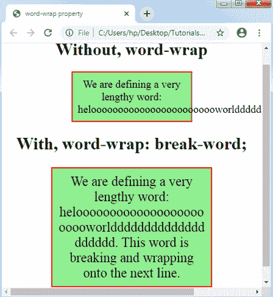
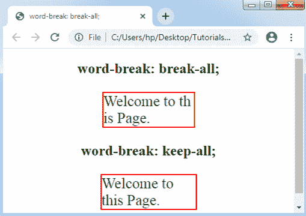
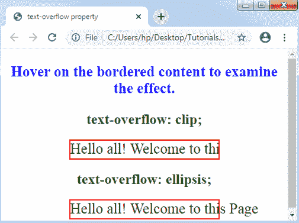
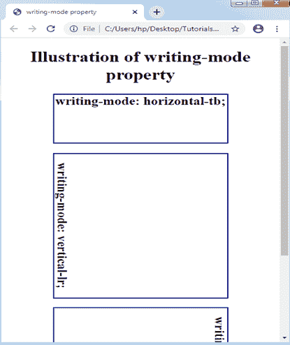

# CSS 文本效果

> 原文：<https://www.tutorialandexample.com/css-text-effects/>

**CSS 中的文本效果**

我们可以在 HTML 文档中使用不同的文本效果。很少属性可以应用于插入文本效果。

在 CSS 的帮助下，我们还可以设计各种影响不同文本的 web 文档。文本效果属性支持我们将文本设计得清晰而有吸引力。我们在下面列出了一些基本的 CSS 文本效果属性:

*   **自动换行**
*   **断字**
*   **文本溢出**
*   **书写模式**

让我们逐一解释以上属性，并附有一个例子。

### 自动换行

它适用于打破任何长词，然后，对任何下一行换行。如果任何无法破解的单词太长而不适合任何包含框，可以使用 ***自动换行*** 属性来避免溢出。

**语法:**

```
word-wrap: normal| break-word| inherit ;  
```

**属性值**

**正常:**仅在允许的断点处断字。

**break-word:**CSS 的这个属性应用于断开不同的不可断开的单词。

**initial:** 将该属性设置为默认值。

**继承:**用于通过父组件获取该属性。

**举例:**

```
<!DOCTYPE html>
<html>
<head>
<title> word-wrap property </title>
<style>
.exp
{
 width: 200px;
 border: 2px solid red;
 padding: 10px;
 font-size: 20px;
 background-color: lightgreen;
}
.exp1
{
 width: 11em;
 border: 2px solid red;
 padding: 10px;
 word-wrap: break-word;
 font-size: 25px;
 background-color: lightgreen;
}
</style>
</head>
<center>
<body>
<h1> Without, word-wrap </h1>
<p class= "exp"> We are defining a very lengthy word:
heloooooooooooooooooooooooworldddddddddddddddddddd.
</p>
<h1> With, word-wrap: break-word; </h1>
<p class= "exp1"> We are defining a very lengthy word:
heloooooooooooooooooooooooworldddddddddddddddddddd. This word is breaking and wrapping onto the next line.
</p>
</body>
</center>
</html>
```

**输出:**



### 断词

这个 CSS 属性描述了单词在任何一行的末尾必须如何换行。可以使用该属性定义换行规则。

**语法:**

```
word-break: normal |keep-all |  break-all | inherit ;  
```

***注:******正常*** 值为其默认值。因此，当我们没有定义值时，它将自动应用。

**属性值**

**keep-all:** 该值用于将任何单词拆分为其默认样式。

**break-all:** 该属性值在多个字符中添加任意断词，以避免任何类型的单词溢出。

**举例:**

```
<!DOCTYPE html>
<html>
<head>
<title> word-break: break-all; </title>
<style>
.exp
{
 width: 150px;
 border: 2px solid red;
 word-break: break-all;
 text-align: left;
 font-size: 25px;
 color: green;
}
.exp1
{
 width: 156px;
 border: 2px solid red;
 word-break: keep-all;
 text-align: left;
 font-size: 25px;
 color: green;
}
</style>
</head>
<center>
<body>
<h2> word-break: break-all; </h2>
<p class= "exp">
 Welcome to this Page.
</p>
<h2> word-break: keep-all; </h2>
<p class= "exp1">
 Welcome to this Page.
</p>
</body>
</center>
</html>
```

**输出:**



### 文本溢出

它描述了溢出内容的图示，这对于任何用户都是不可见的。这个 CSS 属性向用户显示不可见的文本。它支持我们确定内容是必须剪切还是显示几个点(省略号)。

***注:*** 其本身并不适用。我们需要应用 ***溢出:隐藏；*** 和 ***空白:nowrap*** 伴随着这个属性。

**语法:**

```
text-overflow: clip | ellipsis;  
```

**属性值**

**clip:** 该值为默认值。它被用来剪切溢出的内容。

**省略号:**显示三个点(…)或省略号，显示剪辑的内容。该值显示在该区域内，减少了 txt 量。

**举例:**

```
<!DOCTYPE html>
<html>
<head>
<title> text-overflow property </title>
<style>
.exp
{
 white-space: nowrap;   
 height: 30px; 
 width: 250px;                
 overflow: hidden;   
 border: 2px solid red;  
 font-size: 25px;  
 text-overflow: clip;  
}
.exp1
{
 white-space: nowrap;   
 height: 30px; 
 width: 250px;                
 overflow: hidden;   
 border: 2px solid red;  
 font-size: 25px;  
 text-overflow: ellipsis; 
}
h2
{
 color: green;
}
div:hover
{
 overflow: visible;
}
p
{
 font-size: 25px; 
 font-weight: bold; 
 color: blue; 
}
</style>
</head>
<center>
<body>
<p> Hover on the bordered content to examine the effect. </p>
<h2> text-overflow: clip; </h2>
<div class= "exp"> Hello all! Welcome to this Page </div>
<h2> text-overflow: ellipsis; </h2>
<div class= "exp1"> Hello all! Welcome to this Page </div>
</body>
</center>
</html>
```

**输出:**



### 书写模式

此属性描述内容将在垂直或水平方向指定。如果指定的方向是水平的，那么就从 ***右到左(垂直-rl)*** 或者从 ***左到右(垂直-lr)*** 。

**语法:**

```
writing-mode: horizontal-tb | vertical-lr | vertical-rl | inherit ; 
```

**属性值**

**horizontal-tb:** 该属性值作为该属性的默认值，内容将在水平方向。将从上到下和从左到右考虑它。

**vertical-rl:** 该值用于显示垂直方向的内容。内容将被认为是从上到下和从右到左。

**vertical-lr:** 该值与 vertical-rl 相同，尽管内容将从左侧到右侧考虑。

**举例:**

```
<!DOCTYPE html>
<html>
<head>
<title> writing-mode property </title>
<style>
h2
{
 border: 2px solid navy;
 width: 300px;
 height: 100px;
}
#tb
{
writing-mode: horizontal-tb;
}
#lr
{
writing-mode: vertical-lr; 
} 
#rl
{ 
writing-mode: vertical-rl; 
} 
</style>
</head>
<center>
<body>
<h1> Illustration of writing-mode property </h1>
<h2 id= "tb"> writing-mode: horizontal-tb; </h2>
<h2 id= "lr" style= "height: 300px;"> writing-mode: vertical-lr; </h2><br>
<h2 id= "rl" style= "height: 300px;"> writing-mode: vertical-rl; </h2>
</body>
</center>
</html>
```

**输出:**

