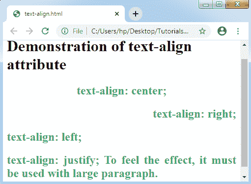

# CSS Text-align

> 原文：<https://www.tutorialandexample.com/css-text-align/>

**文本对齐**

CSS 的 text-align 属性设置表格单元格框的**水平对齐方式**或任何块元素。 **text-align** 属性和 CSS 属性 **vertical-align** 是一样的，只是朝向任意水平方向。

**语法:**

text-align:justify | center | right | left | initial | inherit；

**属性值**

**justify:** 一般用在杂志和报纸上。它可以拉伸元素的任何内容，以显示所有行的相似宽度。

**居中:**任何行内文本都可以使用该值居中。

**right:** 该值将内容向右侧对齐。

**left:** 该值将内容向左侧对齐。

让我们考虑这个 CSS 属性的演示。

**举例:**

```
<!DOCTYPE html>
<html>
<head>
</head>
<style>
h2
{
 color: mediumseagreen;
}
</style>
<body>
<h1> Demonstration of text-align attribute </h1>
<h2 style= "text-align: center;">
text-align: center;
</h2>
<h2 style= "text-align: right;">
text-align: right;
</h2>
<h2 style= "text-align: left;">
text-align: left;
</h2>
<h2 style= "text-align: justify;">
text-align: justify; To feel the effect, it must be used with large paragraph.
</h2>
</body>
</html>
```

**输出:**

