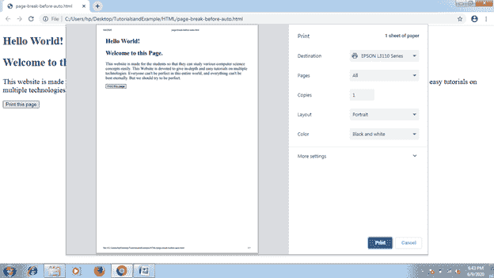
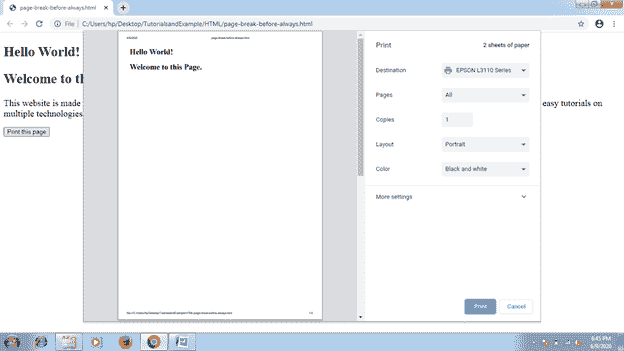
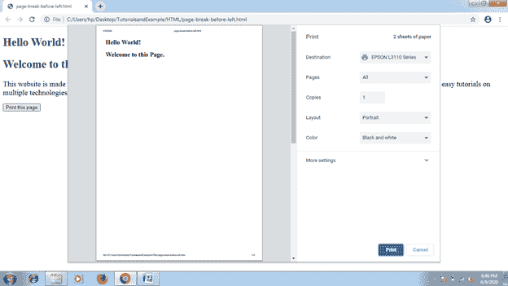

# CSS 分页之前属性

> 原文：<https://www.tutorialandexample.com/css-page-break-before-attribute/>

**分页前属性**

顾名思义，page-break-before 属性用于在打印任何文档时，在任何元素之前包含分页符。它在打印文档时在任何指定项目前添加分页符。我们不需要在绝对定位的元素或任何空的 **< div >** 标签上应用这个 CSS 属性，这些标签不能产生任何框。

它说明了在一个元素的框之前可以允许或者不允许任何分页符。CSS 属性如**分页符前**、**分页符内**、**分页符后**支持我们指定文档打印时的行为。

**语法:**

```
page-break-before:  auto | always | left | right | avoid | initial | inherit;  
```

**属性值**

上述属性值的表格描述如下。


| **值** | **描述** |
| **自动** | 该值用作默认值。如果需要，它会在任何项目前添加分页符。 |
| **总是** | 它总是在任何指定项目之前强制分页。 |
| **避开** | 该属性值尽可能避免在任何项目之前分页。 |
| **左** | 它会在任何项目之前强制分页，以便下一页可以显示为左侧页面。 |
| **右** | 它强制在任何项目之前进行一些分页，以便下一页可以表示为右侧页面。 |
| **初始** | 初始值将分页符属性设置为默认值。 |
| **继承** | 当描述该属性值时，相应的项目在属性计算值之前应用其父项目**分页符。** |


下面我们就来一一详细的举一些上面讨论的价值观的例子。

**举例:自动**

该值用作默认值。如果需要，它会自动在任何项目前包含分页符。在下面的例子中，我们将使用一个按钮和两个 **< div >** 组件。该按钮将负责页面打印。我们将检查点击按钮后的价值效应。

```
<!DOCTYPE html>
<html>
<head>
<style type= "text/css">
div
{
 font-size: 20px;
 page-break-before: auto;
}
</style>
</head>
<body>
<div>
<h2> Hello World! </h2>
<h2> Welcome to this Page. </h2>
</div>
<div>
This website is made for the students so that they can study various computer science concepts easily. This Website is devoted to give in-depth and easy tutorials on multiple technologies. Everyone can't be perfect in this entire world, and everything can't be best eternally. But we should try to be perfect.
</div>
<br>
<button onclick= "fun()">Print this page</button>
<script>
function fun()
{
 window.print();
}
</script>
</body>
</html>
```

**输出:**



**示例:始终**

它总是强制包含分页符。但是，有没有必要。我们将使用按钮进行页面打印。要检查效果，我们必须单击按钮。

在

项之前使用了分页符，因此按钮不能在下一页打印，如下例所示。如果在任何项目之后使用，则在 **< div >** 项目之后会出现分页符，这将导致按钮被打印在下一页上。

```
<!DOCTYPE html>
<html>
<head>
<style type= "text/css">
div
{
 font-size: 20px;
 page-break-before: always;
}
</style>
</head>
<body>
<div>
<h2> Hello World! </h2>
<h2> Welcome to this Page. </h2>
</div>
<div>
This website is made for the students so that they can study various computer science concepts easily. This Website is devoted to give in-depth and easy tutorials on multiple technologies. Everyone can't be perfect in this entire world, and everything can't be best eternally. But we should try to be perfect.
</div>
<br>
<button onclick= "fun()">Print this page</button>
<script>
function fun()
{
 window.print();
}
</script>
</body>
</html>
```

**输出:**



**举例:左侧**

**左**值强制包含一个或两个分页符。因此，下一页的格式可以类似于左侧页面。

```
<!DOCTYPE html>
<html>
<head>
<style type= "text/css">
div
{
 font-size: 20px;
 page-break-before: left;
}
</style>
</head>
<body>
<div>
<h2> Hello World! </h2>
<h2> Welcome to this Page. </h2>
</div>
<div>
This website is made for the students so that they can study various computer science concepts easily. This Website is devoted to give in-depth and easy tutorials on multiple technologies. Everyone can't be perfect in this entire world, and everything can't be best eternally. But we should try to be perfect.
</div>
<br>
<button onclick= "fun()">Print this page</button>
<script>
function fun()
{
 window.print();
}
</script>
</body>
</html>
```

**输出:**



**举例:右**

**右**值强制包含一个或两个分页符。因此，下一页的格式可以类似于右侧页面。

```
<!DOCTYPE html>
<html>
<head>
<style type= "text/css">
div
{
 font-size: 20px;
 page-break-before: right;
}
</style>
</head>
<body>
<div>
<h2> Hello World! </h2>
<h2> Welcome to this Page. </h2>
</div>
<div>
This website is made for the students so that they can study various computer science concepts easily. This Website is devoted to give in-depth and easy tutorials on multiple technologies. Everyone can't be perfect in this entire world, and everything can't be best eternally. But we should try to be perfect.
</div>
<br>
<button onclick= "fun()">Print this page</button>
<script>
function fun()
{
 window.print();
}
</script>
</body>
</html>
```

**输出:**

