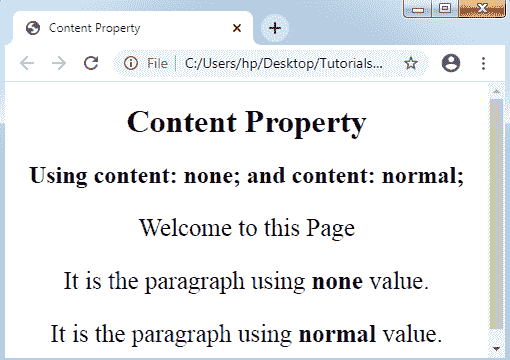
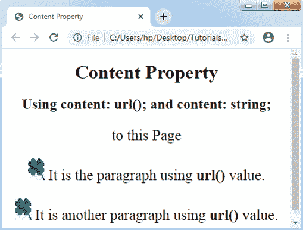
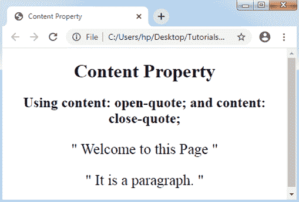
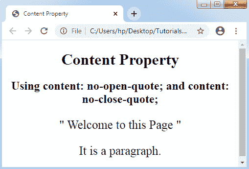
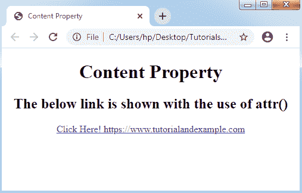

# CSS 内容属性

> 原文：<https://www.tutorialandexample.com/css-content-property/>

**内容属性**

内容属性产生动态内容。它可以应用于之后**:**:**之前的任何伪元素。这些 CSS 属性在每个浏览器中都是完全受支持的，并且适用于包含网页上的内容。**

它可以用任何产品值替换一个项目。

**语法:**

```
content: normal | none | counter | string | attr | open-quote | close-quote | no-close-quote | no-open-quote | url | initial | inherit;  
```

**属性值**

CSS 的这个属性有很多值，指定如下:


| **值** | **描述** |
| **正常** | 该值用作默认值。 |
| **无** | 它不能设置任何内容。 |
| **计数器** | 该值可用于将任何内容设置为计数器。一般是数字。该值可以用**计数器()**或**计数器()**功能显示。 |
| **字符串** | 此属性值设置字符串值。该值必须始终用引号括起来。这些值在任何 HTML 元素之前或之后产生字符串。 |
| **属性** | 此属性值包括任何元素之前或之后的任何指定元素的值。如果选择器不包含任何特定的属性，可以添加空字符串。 |
| **公开报价** | 该值包括任何左引号。它可用于将文本设置为开始引用。 |
| **结束报价** | 该值包括任何右引号。它可用于将文本设置为结束引用。 |
| **无收盘报价** | 当指定了右引号时，将应用它来消除文本中指定的右引号。 |
| **无开盘价** | 当指定了左引号时，它被应用来消除文本中指定的左引号。 |
| **网址** | 该属性值将文本设置为媒体，可以是音频、视频、图像等。 |
| **初始** | 初始值将内容属性设置为默认值。 |
| **继承** | 该值根据其父项获取属性。 |


让我们举几个上面讨论的价值观的例子如下:

**示例:无和正常值**

在下面的例子中，我们在前使用伪元素**:，在段落元素前添加内容**【欢迎】**。内容不能被插入到那些使用了 **none** 和 **normal** 值的段落元素中。**

```
<!DOCTYPE html>
<html>
<head>
<title> Content Property </title>
<style>
body
{
text-align: center;
}
p
{
font-size: 25px;
}
p::before
{
content: "Welcome";
}
#para::before
{
content: none;
}
#para1::before
{
content: normal;
}
</style>
</head>
<body>
<h1> Content Property </h1>
<h2> Using content: none; and content: normal; </h2>
<p> to this Page </p>
<p id= "para"> It is the paragraph using <b> none </b> value. </p>
<p id= "para1"> It is the paragraph using <b> normal </b> value. </p>
</body>
</html>
```

**输出:**



**示例:url 和字符串值**以下示例中，内容**“Hello all！!将使用内容属性和伪元素**:**之前插入 Welcome"** 。

```
<!DOCTYPE html>
<html>
<head>
<title> Content Property </title>
<style>
body
{
text-align: center;
}
p
{
font-size: 25px;
}
p::before
{
content: “Hello all!! Welcome”;
}
#para::before
{
content: url("img.png");
}
#para1::before
{
content: url("img.png");
}
</style>
</head>
<body>
<h1> Content Property </h1>
<h2> Using content: url(); and content: string; </h2>
<p> to this Page </p>
<p id= "para"> It is the paragraph using <b> url() </b> value. </p>
<p id= "para1"> It is another paragraph using <b> url() </b> value. </p>
</body>
</html>
```

**输出:**



**示例:收盘价和开盘价值**

**闭引号**只能与**开引号**一起使用，如下所示:

```
<!DOCTYPE html>
<html>
<head>
<title> Content Property </title>
<style>
body
{
text-align: center;
}
p
{
font-size: 25px;
}
p::before
{
content: open-quote;
}
p::after
{
content: close-quote;
}
</style>
</head>
<body>
<h1> Content Property </h1>
<h2> Using content: open-quote; and content: close-quote; </h2>
<p> Welcome to this Page </p>
<p> It is a paragraph. </p>
</body>
</html>
```

**输出:**



**示例:无收盘价和无开盘价值**

在下面的例子中，我们在段落条目上使用了**右引号**和**右引号**，并且我们使用了**。para** 类超过**非闭引号**和**非开引号上的段落。**

```
<!DOCTYPE html>
<html>
<head>
<title> Content Property </title>
<style>
body
{
text-align: center;
}
p
{
font-size: 25px;
}
p::before
{
content: open-quote;
}
p::after
{
content: close-quote;
}
p.para::before
{
content: no-open-quote;
}
p.para::after
{
content: no-close-quote;
}
</style>
</head>
<body>
<h1> Content Property </h1>
<h2> Using content: no-open-quote; and content: no-close-quote; </h2>
<p> Welcome to this Page </p>
<p class= "para"> It is a paragraph. </p>
</body>
</html>
```

**输出:**



**示例:attr()值**

函数 **attr()** 允许我们添加任何特定元素的值。如果任何相应的项目不包含任何属性，则可以返回任何空字符串。

在下图中，我们应用了函数 **attr()** ，即屏幕上显示的链接。

```
<!DOCTYPE html>
<html>
<head>
<title> Content Property </title>
<style>
body
{
text-align: center;
}
a::after
{
content: attr(href);
}
</style>
</head>
<body>
<h1> Content Property </h1>
<h2> The below link is shown with the use of <b> attr() </b> </h2>
<a href= https://www.tutorialandexample.com> Click Here!
</a>
</body>
</html>
```

**输出:**

