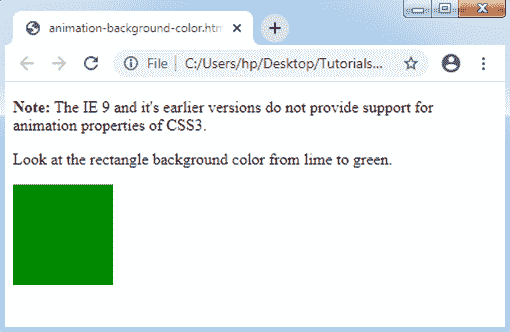
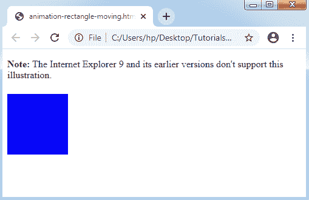

# CSS 动画

> 原文：<https://www.tutorialandexample.com/css-animation/>

**CSS 动画**:CSS 的**动画** **属性**用于在任何网页上制作动画。作为 **JavaScript** 和 **Flash** 做的动画替换。

**CSS3 @关键帧的规则**

动画可以在 **@keyframe** 的规则内制作。它可以用来处理 **CSS 动画**序列中的各种中间步骤。

**动画制作**

动画使组件能够从单一样式逐渐变为其他样式。我们可以尽可能多地包含我们希望包含的属性。此外，我们可以用百分比来描述修改。100%表示动画完成，0%表示动画开始。

### 它是如何工作的

如果动画是在@keyframe 规则内制作的，那么应该用选择器对其进行约束。否则，动画将不会有任何效果。

通过描述至少以下两个属性，动画被限制为选择器:

1.  动画名称
2.  动画持续时间

**动画属性**


| **属性** | **说明** |
| **关键帧** | 该属性用于描述动画。 |
| **动画** | 它是一个简写属性，用于设置每个属性，不包括动画填充模式和动画播放状态属性。 |
| **动画-延迟** | 此属性描述动画开始时。 |
| **动画方向** | 此属性描述动画是否必须在交替或保留循环中播放。 |
| **动画时长** | 该属性描述了通过动画完成一个循环所花费的时间。 |
| **动画填充模式** | 这个属性描述了组件的静态风格。(如果没有播放动画。) |
| **动画-迭代-计数** | 此属性表示时间的数字；必须播放动画。 |
| **动画播放状态** | 该属性描述了动画暂停或运行的时间。 |
| **动画名称** | 此属性描述@keyframes 动画名称。 |
| **动画-计时-功能** | 该属性描述动画的速度曲线。 |


考虑下面的例子。

1.  **示例:背景颜色变化**

让我们来看一个简单的动画演示，它将矩形的背景颜色从石灰色修改为绿色。

```
<!DOCTYPE html> 
<html> 
<head> 
<style>  
div { 
width: 100px; 
height: 100px; 
background: lime; 
-webkit-animation: myfirst 6s; /* Opera, Safari, Chrome */ 
animation: myfirst 5s; 
} 
/* Opera, Safari, Chrome */ 
@-webkit-keyframes myfirst { 
from {background: lime;} 
to {background: green;} 
} 
/* Standard syntax */ 
@keyframes myfirst { 
from {background: lime;} 
to {background: green;} 
} 
</style> 
</head> 
<body> 
<p><b>Note:</b> The IE 9 and it's earlier versions do not provide support for animation properties of CSS3\. </p> 
<p> Look at the rectangle background color from lime to green. </p>
<div></div> 
</body> 
</html> 
```

**输出:**



*   **举例:矩形移动**

让我们用其他例子来展示百分比值的动画。

```
<!DOCTYPE html> 
<html> 
<head> 
<style>  
div { 
width: 100px; 
height: 100px; 
background: red; 
position: relative; 
-webkit-animation: myfirst 5s; /* Opera, Safari, Chrome */ 
animation: myfirst 5s; 
} 
/* Opera, Safari, Chrome */ 
@-webkit-keyframes myfirst { 
0% {background:pink; left:0px; top:0px;} 
25% {background:red; left:300px; top:0px;} 
50% {background:lime; left:200px; top:300px;} 
75% {background:yellow; left:0px; top:200px;} 
100% {background:blue; left:0px; top:0px;} 
} 
/* Standard syntax */ 
@keyframes myfirst { 
0% {background:pink; left:0px; top:0px;} 
25% {background:red; left:300px; top:0px;} 
50% {background:lime; left:300px; top:200px;} 
75% {background:yellow; left:0px; top:200px;} 
100% {background:blue; left:0px; top:0px;} 
} 
</style> 
</head> 
<body> 
<p><b>Note:</b> The Internet Explorer 9 and its earlier versions don't support this illustration. </p> 
<div></div> 
</body> 
</html> 
```

**输出:**

