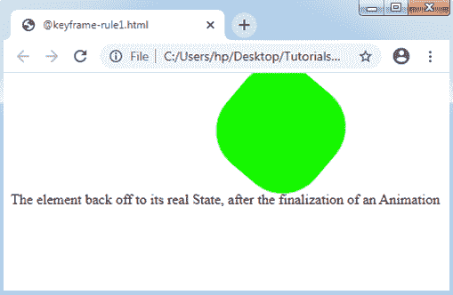
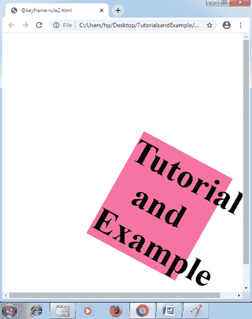

# CSS @关键帧规则

> 原文：<https://www.tutorialandexample.com/css-keyframes-rule/>

**CSS @keyframes 规则**

它描述了动画的规则，该规则描述了组件在每个状态下的 CSS 属性以及时间轴。

我们可以使用@keyframe 制作复杂动画的属性。动画可以用各种样式的 CSS 来制作，这些 CSS 可以无限重复，也可以用有限的时间来制作。普通动画可能包含两个关键帧，尽管复杂动画包含各种关键帧。

**语法:**

```
@keyframes animation-name {keyframes-selector {css-styles;}}  
```

要使用关键帧，我们必须使用属性 animation-name 创建 **@keyframe** 规则，以匹配动画及其关键帧声明。

CSS 的这个属性接受下面详细讨论的三个值:

#### 属性值

**animation-name:** 该值为必需值，代表动画名称。

**关键帧选择器:**该值描述任何关键帧出现时动画的百分比。它的值介于 0%-100%之间，从(类似于 0%)到(类似于 100%)。关键帧的百分比可以按顺序定义，因为这个百分比将按它们出现的顺序来控制。

**css-styles:** 该属性值代表 css 样式的一个或多个属性。

如果任何关键帧规则没有定义结束和开始动画状态，那么任何浏览器都将应用实际组件的样式。可以忽略在关键帧规则中不会显示动画的属性。

#### 关键帧的定时功能

为了控制动画的规则，我们可以应用如下讨论的值:

**线性:**它规定了从开始边缘到结束边缘的过渡感知的速率。

**ease:** 规定动画会逐渐开始，一段时间后速度会加快，before end 的速度会再次变慢。

**缓入:**这个功能和缓入功能一样，虽然一个动画会很快结束。

**缓出:**该功能也与缓出功能相同，尽管动画会快速启动。

让我们来理解 CSS 的@keyframe 规则，以及下面的例子。

**例:1**

```
<!DOCTYPE html> 
<html> 
<head> 
<style>  
div 
{ 
width:200px; 
height:200px; 
animation:demo 5s ease-in infinite, trans 5s ease-in-out infinite; 
border-radius:40px; 
} 
@keyframes demo 
{ 
0% {background:orange;} 
50% {background:lime; width:100px; height:100px;} 
100% {background:blue; width:300px; height:300px;} 
} 
@keyframes trans 
{ 
0% {transform:translate(0px) scale(1.4) rotate(80deg);} 
50% {transform:translate(250px) scale(1.2) rotate(40deg);} 
100% {transform:translate(350px) scale(1) rotate(0deg);} 
} 
</style> 
</head> 
<body> 
<div></div> 
<p> The element back off to its real State, after the finalization of an Animation </p> 
</body> 
</html> 
```

**输出:**



**例:2**

```
<!DOCTYPE html>  
<html>  
<head>  
<style>   
h1
{  
color: black;  
text-align: center;  
}  
div
{  
position: relative;  
animation: exp 7s infinite;  
}  
@keyframes exp
{  
0%
{  
top: 500px;   
width: 0px; 
font-size:10px; 
transform: translate(0px) scale(1.4) rotate(80deg); 
}  
25%
{  
top: 400px;   
background: lime;   
font-size:20px; 
width: 50px;  
transform: translate(100px) scale(1.3) rotate(60deg); 
}  
50%
{  
top: 300px;   
background: tomato; 
font-size:30px; 
width: 150px;  
transform: translate(200px) scale(1.2) rotate(40deg); 
}  
75%
{  
top: 200px;   
background: violet;   
width: 250px;  
font-size:40px; 
transform: translate(300px) scale(1.1) rotate(20deg); 
}  
100%
{  
top: 100px;   
background: blue; 
font-size:50px; 
width: 500px;            
transform: translate(400px) scale(1) rotate(0deg); 
}  
}  
</style>  
</head>  
<body>  
<div>  
<h1> Tutorial and Example </h1>  
</div>  
</body>  
</html>  
```

**输出:**



**要点:**

下面讨论了关于该规则的一些要点:

*   我们可能会申请从关键字而不是 0%的使用。
*   我们可能指的是关键字而不是 100%的用法。
*   甚至当我们使用**到**和**到**关键字时，它们之间的值会被声明在 0%以内。
*   对于一个有效的动画，应该声明开始时间和结束时间。
*   这些声明将避免涉及！重要。