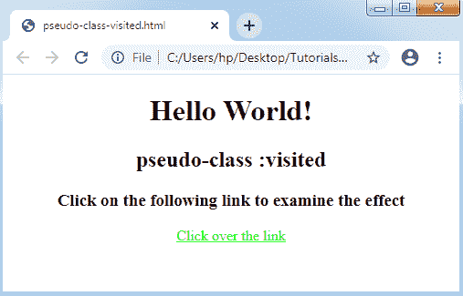

# CSS 伪类

> 原文：<https://www.tutorialandexample.com/css-pseudo-class/>

**伪类**

伪类可以被描述为关键字，该关键字可以与指定所选元素的唯一状态的任何选择器混合。它可以被包含到选择器中，以将关于其状态的效果插入到现有元素中。例如，如果用户将光标指向元素，可以应用 **:hover** 来向元素添加独特的效果。

伪类名不区分大小写。

**语法:**

使用了伪类和冒号(:)。语法如下:

```
selector: pseudo-class 
{  
property: value;  
}  
```

这里，我们定义了 CSS 的几个伪类。我们将解释几个最常用和最基本的伪类。CSS 伪类以表格形式解释如下:


| **伪类** | **描述** |
| **:活动** | 它可以应用于将样式包含到活动元素中。 |
| **:悬停** | 它包括当用户将光标指向元素时对元素的独特效果。 |
| **:链接** | 它将样式插入到一个未访问的链接中。 |
| **:访问过** | 它将样式插入到已访问的链接中。 |
| **:郎** | 它可以用来表示在任何指定元素中使用的语言。 |
| **:焦点** | 这个类选择一个当前被用户聚焦的元素。 |
| **:第一个孩子** | 这个类包括元素的一个独特效果，它是其他元素的第一个子元素。 |


让我们考虑一下上面讨论过的伪类，并给出一些说明。

**伪类-:悬停**

如果任何用户将光标指向该元素，则:hover 伪类包含该元素的样式。如果我们希望创建有用的，那么它应该在两个伪类之后使用，即“:visited”和“:link”。

**举例:**

```
<!DOCTYPE html>
<html> 
<head> 
<style> 
body
{ 
text-align:center; 
} 
h1:hover
{ 
color: blue; 
} 
h2:hover
{ 
color: tomato; 
} 
</style> 
</head> 
<body> 
<h1> Hello world </h1> 
<h2> It is an illustration of pseudo class :hover </h2> 
</body> 
</html> 
```

**输出:**


**伪类-:活动**

此伪类在激活或单击元素时使用。它选择一个激活的元素。

让我们考虑一下下面的演示:

**举例:**

```
<!DOCTYPE html>  
<html>  
<head>  
<style>  
body
{ 
text-align: center; 
} 
a:active
{  
color: red;  
}  
h1, h2, h3
{  
color: green;
}  
</style>  
</head>  
<body>  
<h1> Hello World! </h1>  
<h2> pseudo-class :active </h2>  
<h3> Click on the following link to examine the effect </h3> 
<a href="#"> Click over the link</a> 
</body>  
</html> 
```

**输出:**


**伪类-:已访问**

它选择一个被访问的链接，并包含一个独特的风格给他们。它有可能的值，可以是任何有效格式的颜色名称。

**举例:**

```
<!DOCTYPE html>  
<html>  
<head>  
<style>  
body
{ 
text-align: center; 
} 
a:visited
{  
color: lime;  
}   
</style>  
</head>  
<body>  
<h1> Hello World! </h1>  
<h2> pseudo-class :visited </h2>  
<h3> Click on the following link to examine the effect </h3> 
<a href="#"> Click over the link</a> 
</body>  
</html> 
```

**输出:**



**伪类-:郎**

该类为需要多种语言的文档提供支持。它允许我们描绘不同语言的独特规则。

**举例:**

在下面的例子中，我们将描述 **p:lang(fr)** ，它将选择具有属性 **lang="fr"** 的组件。

```
<!DOCTYPE html>  
<html>  
<head>  
<style>  
body
{ 
text-align: center; 
} 
p:lang(fr)
{
font-family: Verdana;  
color: tomato;  
}   
</style>  
</head>  
<body>   
<p> Without pseudo-class :lang </p>  
<p lang="fr"> With pseudo-class :lang using the fr value </p> 
</body>  
</html> 
```

**输出:**


**伪类-:焦点**

它选择用户当前关注的组件。一般来说，如果用户点击它，它就应用在触发器和表单的输入组件中。

**举例:**

```
<!DOCTYPE HTML>
<html>
<style>
form
{
text-align: center;
}
input:focus
{
border:5px solid lightgreen;
box-shadow:10px 10px 10px black;
color: blue;
width:300px;
}
</style>
<body>
<form>
<h1>Name: <input type="text" value="Enter your name"></h1>
</form>
</body>
</html>
```

**输出:**


**伪类-:第一个孩子**

这个伪类用于匹配特定组件，即其他组件的第一个子组件。它包括任何相应组件的独特效果。

注意:我们必须在文档的顶部声明来创建伪类，即“:first-child ”,以便在 IE8 及其早期版本中实现。

让我们考虑下面的演示来理解它。

**举例:**

```
<!DOCTYPE HTML> 
<html> 
<head> 
<style> 
h1:first-child
{ 
text-indent: 200px; 
color: red; 
} 
</style> 
</head> 
<body> 
<div> 
<h1> First heading inside the div. It will be sectioned, and its color will be red. </h1> 
<h1> Second heading inside the div, and it will not be influenced.</h1> 
</div> 
</body> 
</html> 
```

**输出:**


**通用工具提示悬停**

工具提示描述了当用户将光标指向组件时的额外信息。让我们使用伪类 **":hover"** 来制作工具提示。

**举例:**

```
<!DOCTYPE html> 
<html> 
<head> 
<style> 
body
{ 
text-align: center; 
} 
h2
{ 
display: none; 
background-color: purple; 
color: white; 
padding: 20px; 
} 
div
{ 
font-size: 40px; 
} 
div:hover h2
{ 
display: block; 
} 
</style> 
</head> 
<body> 
<h1> Point your mouse on the below text to examine the effect </h1>  
<div>Hello World!! 
<h2>Welcome to this Page </h2> 
</div> 
</body> 
</html> 
```

**输出:**


**CSS 伪类和类**

CSS 类可以与伪类相连接。语法如下:

**语法:**

```
selector.class: pseudo-class {  
property: value;  }  
```

我们可以用如下的例子来考虑它:

**举例:**

```
<!DOCTYPE html> 
<html> 
<head> 
<style> 
body
{ 
text-align: center; 
} 
div.hello:hover
{ 
color: blue; 
font-size: 40px; 
}  
</style> 
</head> 
<body> 
<h1> CSS pseudo-classes and classes </h1> 
<h2> Point your cursor on the below text </h2> 
<div class="hello"> Hello World!! </p> 
</body> 
</html> 
```

**输出:**

