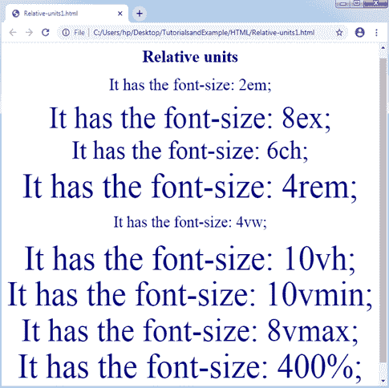
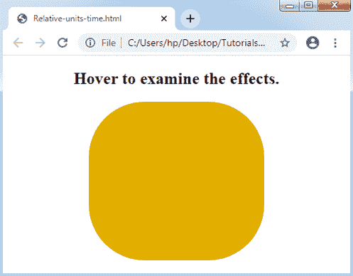
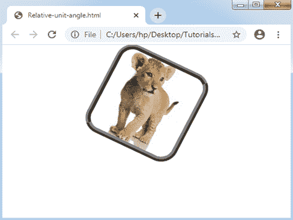
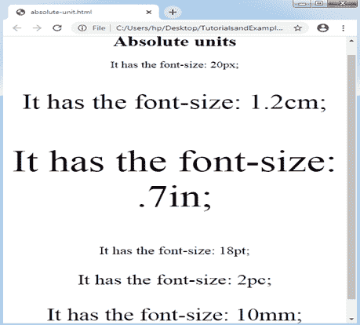

# CSS 单位

> 原文：<https://www.tutorialandexample.com/css-units/>

**CSS 单位**

在 CSS 中，有如此多的单位可以用来显示长度的度量。一个 CSS 单元被应用于**检查属性**的大小，这是用户为内容或元素设置的。CSS 单位需要描述任何度量，如边距:30px 其中**像素**或 **px** 是 CSS 的一个单位。这些单位用于设置**长度、填充、边距**和许多其他内容。

我们来了解一些关键点。

*   我们不能在单位和数字之间使用空格。
*   对于 0，可以忽略一个单位。
*   一些 CSS 属性允许长度为负值。

CSS 单元可以有两种类型:

*   相对长度
*   绝对长度

**相对长度**

这种长度适合于设计任何响应站点，因为它可以相对于父窗口或任何大小的窗口进行缩放。它描述长度，即相对于其他长度属性。

如果屏幕大小变化很大，那么相对长度的单位会更好，因为这些单位会在不同的呈现媒体之间缩放(取决于设备)。我们可以类似地应用任何相对单位，比如响应单位的缺省值。相对长度有助于忽略不同屏幕尺寸的更新设计。

下表讨论并解释了一些相对长度:


| **单位** | **名称** |
| **em** | 这个单位与元素的字体大小有关。 |
| **ex** | 这些单位相对于组件字体的 x 高度。很少使用。任何 x 高度都可以通过小写字母“x”height 来检查。 |
| **ch** | 这种单位与 ex 单位非常相似，但不是使用字母“x”的高度，而是测量整数“0”(零)的宽度。 |
| **雷姆** | 它被认为是根元素的字体大小。 |
| **vh** | 这些单位对应于视口的高度。1vh=视口高度的 1%或 1/100。 |
| **大众** | 这些单位相对于视口的宽度。1vh=视口宽度的 1%或 1/100。 |
| **虚拟机** | 这些单位是相对于视口的较小尺寸的。1vh=视口下部尺寸的 1%或 1/100。 |
| **vmax** | 这些单位相对于视口的较小尺寸。1vh=视口下部尺寸的 1%或 1/100。 |
| **%** | 该单位用于表示类似百分比的度量，即相对于其他值的度量。 |


考虑下面的例子:

**举例:**

```
<!DOCTYPE html> 
<html> 
<head> 
<style> 
body
{ 
text-align: center; 
} 
p
{ 
line-height: 0.1cm; 
color: navy; 
} 
</style> 
</head> 
<body> 
<h1> Relative units </h1> 
<p style = "font-size: 2em;" > It has the font-size: 2em; </p> 
<p style = "font-size: 8ex;" > It has the font-size: 8ex; </p> 
<p style = "font-size: 6ch;" > It has the font-size: 6ch; </p> 
<p style = "font-size: 4rem;" > It has the font-size: 4rem; </p> 
<p style = "font-size: 4vw;" > It has the font-size: 4vw; </p> 
<p style = "font-size: 10vh;" > It has the font-size: 10vh; </p> 
<p style = "font-size: 10vmin;" > It has the font-size: 10vmin; </p> 
<p style = "font-size: 8vmax;" > It has the font-size: 8vmax; </p> 
<p style = "font-size: 400%;" > It has the font-size: 400%; </p> 
</body> 
</html> 
```

**输出:**



**举例:时间**

一些动画属性需要值来及时显示。


| **单位** | **描述** |
| **s** | 该值是以秒为单位的持续时间。 |
| **毫秒** | 该值是以毫秒为单位的持续时间。1 毫秒=任何一秒的 1/100 |


```
<!DOCTYPE html> 
<html> 
<head> 
<style>  
div 
{ 
width: 200px; 
height: 200px; 
background: lime; 
border-radius: 50px; 
transition-property: background, width, height; 
transition-duration: 1s, 2s, 3s; 
} 
div:hover 
{  
width:300px; 
background: orange; 
height:300px; 
border-radius: 80px; 
} 
</style> 
</head> 
<body> 
<center> 
<h2> Hover to examine the effects. </h2> 
<div></div> 
</center> 
</body> 
</html> 
```

**输出:**



**举例:角度**

CSS 的变换属性需要值以角度显示。


| **单位** | **描述** |
| **deg** | 它显示了度数内的角度。 |
| 毕业生 | 它显示了 gradians 内部的角度，是任何一圈的 1/400。 |
| **转** | 它显示了转弯内部的角度，也就是 360 度。 |


```
<!DOCTYPE html> 
<html> 
<head> 
<style> 
img 
{ 
border: 9px ridge gray; 
border-radius: 30px; 
margin: 10px;  
transition-duration: 2s; 
} 
#img1:hover
{  
transform: rotate(30deg); 
transform-origin: bottom left 50px; 
} 
</style> 
</head> 
<body> 
<center> 
 
</center> 
</body> 
</html> 
```

**输出:**



**绝对长度**

绝对长度是**定长型**的单位。长度，即使用绝对单位显示的长度，可以绝对地表示为该尺寸。由于屏幕尺寸变化很大，因此不建议使用屏幕显示。因此，如果输出的媒介是已知的，如打印布局，则必须应用任何绝对单位。

如果在项目中不考虑响应性，这些单位会很有帮助。对于一些响应网站来说，这并不是更好的选择，因为它不会随着屏幕的变化而改变。

一般来说，绝对长度将始终被认为是相同的大小。绝对长度的单位讨论如下:


| **单位** | **名称** | **描述** |
| **厘米** | 厘米 | 此单位适用于描述厘米范围内的测量。 |
| **毫米** | 毫米 | 本单元要求以毫米为单位说明测量结果。 |
| 中的 | 英寸 | 该单位表示英寸范围内的测量值。1 英寸= 96 像素= 2.54 厘米 |
| **pt** | 点 | 此单位适用于描述点内的测量值。1pt = 1 英寸的 1/72 |
| **pc** | 皮卡萨 | 该单位表示十二点活字内的尺寸。因此，6 个十二点活字等于 1 英寸。 |
| **px** | 像素 | 此单位适用于描述像素内的测量值。1px = 1/96 英寸 |


**举例:**

在下图中，我们将对一些段落应用 CSS 属性 font-size，以使用上述绝对长度的单位来表示值。

```
<!DOCTYPE html> 
<html> 
<head> 
<style> 
body
{ 
text-align: center; 
} 
</style> 
</head> 
<body> 
<h1> Absolute units </h1> 
<p style = "font-size: 20px;" > It has the font-size: 20px; </p> 
<p style = "font-size: 1.2cm;" > It has the font-size: 1.2cm; </p> 
<p style = "font-size: .7in;" > It has the font-size: .7in; </p> 
<p style = "font-size: 18pt;" > It has the font-size: 18pt; </p> 
<p style = "font-size: 2pc;" > It has the font-size: 2pc; </p> 
<p style = "font-size: 10mm;" > It has the font-size: 10mm; </p> 
</body> 
</html> 
```

**输出:**

