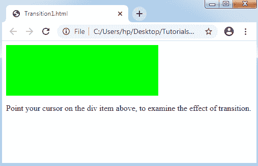
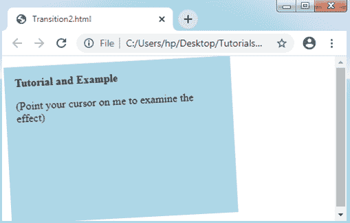

# CSS 转换

> 原文：<https://www.tutorialandexample.com/css-transition/>

**CSS 转换**

CSS 中的转换会受到影响，包括将组件从一种设计修改为另一种设计，而无需使用 JavaScript 或 Flash。

我们应该描述 CSS 转换的两个基本要素。

*   CSS 的属性，我们希望在其上包含一个效果。
*   效果持续的时间。

考虑下面的例子:

**举例:**

```
<!DOCTYPE html> 
<html> 
<head> 
<style>  
div
{ 
width: 100px; 
height: 100px; 
background: lime; 
-webkit-transition: width 1s; /* For Safari 3.1 to 6.0 */ 
transition: width 1s; 
} 
div:hover
{ 
width: 300px; 
} 
</style> 
</head> 
<body> 
<div></div> 
<p> Point your cursor on the div item above, to examine the effect of transition.</p> 
</body> 
</html> 
```

**输出:**



**CSS 过渡效果:多重**

它可以应用于包括 CSS 的一个或多个属性的过渡效果。当我们希望包含 CSS 的一个或多个属性上的过渡效果时，用逗号分隔这些属性。

下面是一幅插图，我们将在其中指定过渡对变换、高度和宽度的影响。

考虑下面的例子:

**举例:**

```
<!DOCTYPE html> 
<html> 
<head> 
<style>  
div
{ 
padding:15px; 
width: 150px; 
height: 100px; 
background: lightblue; 
-webkit-transition: width 2s, height 2s, -webkit-transform 2s; /* For Browser Safari 3.1 to 6.0 */ 
transition: width 2s, height 2s, transform 2s; 
} 
div:hover
{ 
width: 300px; 
height: 200px; 
-webkit-transform: rotate(360deg); /* Opera, Safari, Chrome */ 
transform: rotate(360deg); 
} 
</style> 
</head> 
<body> 
<div><b>Tutorial and Example</b><p> (Point your cursor on me to examine the effect)</p></div> 
</body> 
</html> 
```

**输出:**

