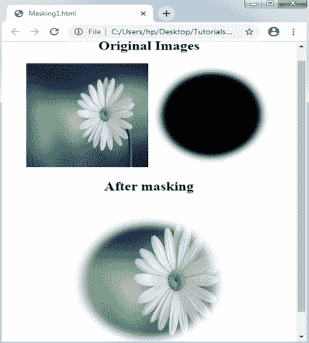
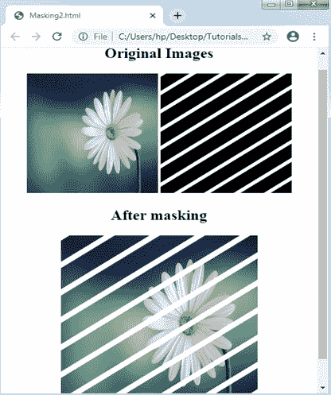
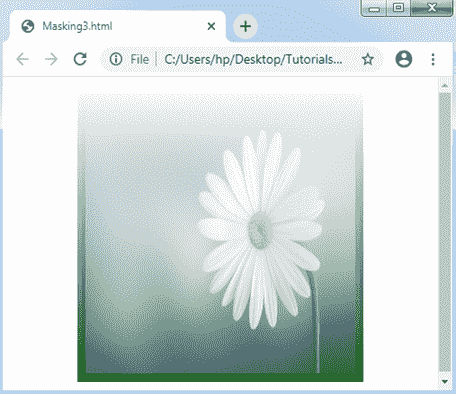
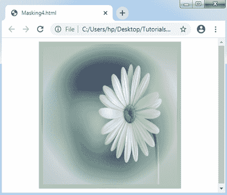
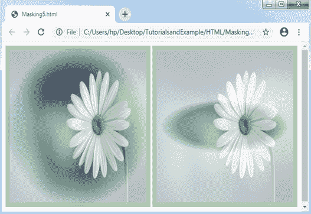

# CSS 屏蔽

> 原文：<https://www.tutorialandexample.com/css-masking/>

**CSS 屏蔽**

CSS ***蒙版*** 属性应用于**隐藏一个组件**，在任意特定点使用蒙版或剪裁图像。遮罩描述了图形图像或类似阿尔法遮罩或亮度的图像的使用。它可以是任何图形操作，即部分或全部隐藏组件的部分或对象。

使用蒙版可以隐藏或显示图像的一部分以及不同的不透明度。遮罩可以使用 CSS ***mask-image*** 属性来实现，我们必须给任何像遮罩的图像。

以下是 CSS 遮罩的一些示例。

**例:1**

在下面的例子中，我们将把遮罩放在一个图像组件上。将有两个特定的图像，我们将应用蒙版覆盖它们，通过将蒙版图像完全放在一起创建的最终图像。

```
<!DOCTYPE html> 
<html> 
<head> 
<style> 
div img{ 
width: 200px; 
height: 200px; 
} 
#masked{ 
width: 300px; 
height: 300px; 
-webkit-mask-box-image: url(circle1.png) 25; 
} 
</style> 
</head> 
<body> 
<center> 
<div id = "one"> 
<h2> Original Images </h2> 
 
 
</div> 
<h2> After masking </h2> 
 
</center> 
</body> 
</html> 
```

**输出:**



**例:2**

在下面的例子中，这里是我们将在图像上使用遮罩的其他插图。我们将应用两张图片，其中一张图片是包含条纹的蒙版图片。插图将显示如下所述在图片组件上定位遮罩。

```
<!DOCTYPE html> 
<html> 
<head> 
<style> 
div img{ 
width: 200px; 
height: 200px; 
} 
#masked{ 
width: 300px; 
height: 300px; 
-webkit-mask-box-image: url(stripes.png); 
background-color: black; 
} 
</style> 
</head> 
<body> 
<center> 
<div id = "one"> 
<h2> Original Images </h2> 
 
 
</div> 
<h2> After masking </h2> 
 
</center> 
</body> 
</html> 
```

**输出:**



**例:3**

我们可以像蒙版图片的来源一样应用 CSS 的渐变。

```
<!DOCTYPE html> 
<html> 
<head> 
<style> 
#masked
{ 
width: 300px; 
height: 300px; 
-webkit-mask-image: -webkit-gradient(linear, right top, right bottom, from(rgba(0,0,0,0)), to(rgba(0,0,0,0.9))); 
border: 9px ridge green; 
} 
</style> 
</head> 
<body> 
<center> 
 
</center> 
</body> 
</html> 
```

**输出:**



**例:4**

```
<!DOCTYPE html> 
<html> 
<head> 
<style> 
#masked
{ 
width: 300px; 
height: 300px; 
border-radius: 0px; 
-webkit-mask-image: radial-gradient(circle at 50% 50%, blue 40%, rgba(0,0,0,0.3) 70%); 
border: 9px ridge green; 
} 
</style> 
</head> 
<body> 
<center> 
 
</center> 
</body> 
</html> 
```

**输出:**



**例:5**

```
<!DOCTYPE html> 
<html> 
<head> 
<style> 
#circle
{ 
width: 300px; 
height: 300px; 
-webkit-mask-image: radial-gradient(circle at 50% 50%, blue 40%, rgba(0,0,0,0.3) 70%); 
border: 9px ridge green; 
} 
#ellipse
{ 
width: 300px; 
height: 300px; 
-webkit-mask-image: radial-gradient(ellipse 80% 30% at 50% 50%, blue 40%, rgba(0,0,0,0.3) 55%); 
border: 9px ridge green; 
} 
</style> 
</head> 
<body> 
<center> 
 
 
</center> 
</body> 
</html> 
```

**输出:**

