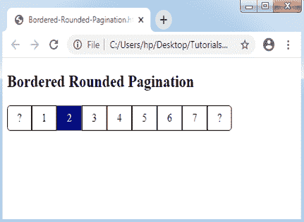
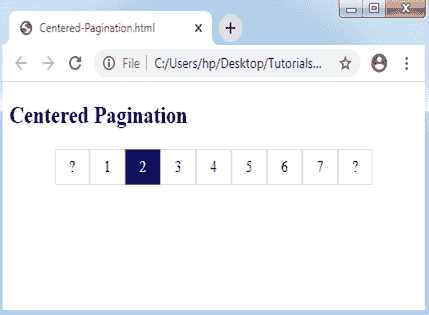

# CSS 分页

> 原文：<https://www.tutorialandexample.com/css-pagination/>

**CSS 分页**

CSS 中的分页是一种索引网站主页上不同页面的有利方法。当我们的网站包含多个页面时，我们必须在每个页面中插入一些分页排序。

一些基本的分页类型讨论如下:

**基本分页**

这是简单的分页。我们必须将分页类应用于 **< ul >** 元素，以实现这种分页。

考虑下面的例子:

**举例:**

```
<!DOCTYPE html> 
<html> 
<head><meta http-equiv="Content-Type" content="text/html; charset=windows-1252"> 
<style> 
ul.pagination
{ 
display: inline-block; 
padding: 0; 
margin: 0; 
} 
ul.pagination li {display: inline;} 
ul.pagination li a
{ 
color: black; 
float: left; 
padding: 8px 16px; 
text-decoration: none; 
} 
</style> 
</head> 
<body> 
<h2>Basic Pagination</h2> 
<ul class="pagination"> 
<li><a href="#">1</a></li> 
<li><a class="active" href="#">2</a></li> 
<li><a href="#">3</a></li> 
<li><a href="#">4</a></li> 
<li><a href="#">5</a></li> 
<li><a href="#">6</a></li> 
<li><a href="#">7</a></li> 
</ul> 
</body> 
</html> 
```

**输出:**


**基本分页和箭头**

如果我们有多个页面，它就会被应用。它提供了将箭头用于下一页和上一页的功能。

考虑下面的例子:

**举例:**

```
<!DOCTYPE html> 
<html> 
<head> 
<style> 
ul.pagination
{ 
display: inline-block; 
padding: 0; 
margin: 0; 
} 
ul.pagination li {display: inline;} 
ul.pagination li a
{ 
color: black; 
float: left; 
padding: 8px 16px; 
text-decoration: none; 
} 
</style> 
</head> 
<body> 
<h2>Basic Pagination along with Arrow</h2> 
<ul class="pagination"> 
<li><a href="#">?</a></li> 
<li><a href="#">1</a></li> 
<li><a class="active" href="#">2</a></li> 
<li><a href="#">3</a></li> 
<li><a href="#">4</a></li> 
<li><a href="#">5</a></li> 
<li><a href="#">6</a></li> 
<li><a href="#">7</a></li> 
<li><a href="#">?</a></li> 
</ul> 
</body> 
</html> 
```

**输出:**


**可悬浮分页和当前/活动链接**

当我们将光标指向所有页面链接的任何当前页面时，如果我们希望高亮显示或更改这些页面，就可以使用它。

考虑下面的例子:

**举例:**

```
<!DOCTYPE html> 
<html> 
<head> 
<style> 
ul.pagination
{ 
display: inline-block; 
padding: 0; 
margin: 0; 
} 
ul.pagination li {display: inline;} 
ul.pagination li a
{ 
color: black; 
float: left; 
padding: 8px 16px; 
text-decoration: none; 
} 
ul.pagination li a.active
{ 
background-color: navy; 
color: white; 
} 
ul.pagination li a:hover:not(.active) {background-color: lightblue;} 
</style> 
</head> 
<body> 
<h2> Hoverable and Active Pagination </h2> 
<p> Point the cursor on the numbers.</p> 
<ul class="pagination"> 
<li><a href="#">?</a></li> 
<li><a href="#">1</a></li> 
<li><a class="active" href="#">2</a></li> 
<li><a href="#">3</a></li> 
<li><a href="#">4</a></li> 
<li><a href="#">5</a></li> 
<li><a href="#">6</a></li> 
<li><a href="#">7</a></li> 
<li><a href="#">?</a></li> 
</ul> 
</body> 
</html> 
```

**输出:**


**可悬停和圆形活动分页**这种分页允许我们应用 border-radius 属性来获得圆形的“悬停”和“下一步”按钮。

考虑下面的例子:

**举例:**

```
<!DOCTYPE html> 
<html> 
<head> 
<style> 
ul.pagination
{ 
display: inline-block; 
padding: 0; 
margin: 0; 
} 
ul.pagination li {display: inline;} 
ul.pagination li a
{ 
color: black; 
float: left; 
padding: 8px 16px; 
text-decoration: none; 
border-radius: 5px; 
} 
ul.pagination li a.active
{ 
background-color: navy; 
color: white; 
border-radius: 5px; 
} 
ul.pagination li a:hover:not(.active) {background-color: lightblue;} 
</style> 
</head> 
<body> 
<h2> Hover and  Rounded Active Buttons </h2> 
<ul class="pagination"> 
<li><a href="#">?</a></li> 
<li><a href="#">1</a></li> 
<li><a class="active" href="#">2</a></li> 
<li><a href="#">3</a></li> 
<li><a href="#">4</a></li> 
<li><a href="#">5</a></li> 
<li><a href="#">6</a></li> 
<li><a href="#">7</a></li> 
<li><a href="#">?</a></li> 
</ul> 
</body> 
</html> 
```

**输出:**


**带边框的分页**

我们应用 CSS border 属性来包含这个分页的边框。

考虑下面的例子:

**举例:**

```
<!DOCTYPE html> 
<html> 
<head> 
<style> 
ul.pagination
{ 
display: inline-block; 
padding: 0; 
margin: 0; 
} 
ul.pagination li {display: inline;} 
ul.pagination li a
{ 
color: black; 
float: left; 
padding: 8px 16px; 
text-decoration: none; 
border: 1px solid black; 
} 
ul.pagination li a.active
{ 
background-color: navy; 
color: white; 
border: 1px solid grey; 
} 
ul.pagination li a:hover:not(.active) {background-color: lightblue;} 
</style> 
</head> 
<body> 
<h2> Bordered Pagination </h2> 
<ul class="pagination"> 
<li><a href="#">?</a></li> 
<li><a href="#">1</a></li> 
<li><a class="active" href="#">2</a></li> 
<li><a href="#">3</a></li> 
<li><a href="#">4</a></li> 
<li><a href="#">5</a></li> 
<li><a href="#">6</a></li> 
<li><a href="#">7</a></li> 
<li><a href="#">?</a></li> 
</ul> 
</body> 
</html> 
```

**输出:**


**加边框的圆形分页**

这种技术允许我们将圆角边框应用于分页的最后一个和第一个链接。

考虑下面的例子:

**举例:**

```
<!DOCTYPE html> 
<html> 
<head> 
<style> 
ul.pagination
{ 
display: inline-block; 
padding: 0; 
margin: 0; 
} 
ul.pagination li {display: inline;} 
ul.pagination li a
{ 
color: black; 
float: left; 
padding: 8px 16px; 
text-decoration: none; 
border: 1px solid black; 
} 
.pagination li:first-child a
{ 
border-top-left-radius: 5px; 
border-bottom-left-radius: 5px; 
} 
.pagination li:last-child a
{ 
border-top-right-radius: 5px; 
border-bottom-right-radius: 5px; 
} 
ul.pagination li a.active
{ 
background-color: navy; 
color: white; 
border: 1px solid grey; 
} 
ul.pagination li a:hover:not(.active) {background-color: lightblue;} 
</style> 
</head> 
<body> 
<h2> Bordered Rounded Pagination </h2> 
<ul class="pagination"> 
<li><a href="#">?</a></li> 
<li><a href="#">1</a></li> 
<li><a class="active" href="#">2</a></li> 
<li><a href="#">3</a></li> 
<li><a href="#">4</a></li> 
<li><a href="#">5</a></li> 
<li><a href="#">6</a></li> 
<li><a href="#">7</a></li> 
<li><a href="#">?</a></li> 
</ul> 
</body> 
</html> 
```

**输出:**



**分页间的空间**

应用 margin 属性是为了在分页内部的链接之间获得一个空间。

考虑下面的例子:

**举例:**

```
<!DOCTYPE html> 
<html> 
<head> 
<style> 
ul.pagination
{ 
display: inline-block; 
padding: 0; 
margin: 0; 
} 
ul.pagination li {display: inline;} 
ul.pagination li a
{ 
color: black; 
float: left; 
padding: 8px 16px; 
text-decoration: none; 
border: 1px solid black; 
margin: 0 4px;  
} 
ul.pagination li a.active
{ 
background-color: navy; 
color: white; 
border: 1px solid grey; 
} 
ul.pagination li a:hover:not(.active) {background-color: lightblue;} 
</style> 
</head> 
<body> 
<h2> Space among Pagination </h2> 
<ul class="pagination"> 
<li><a href="#">?</a></li> 
<li><a href="#">1</a></li> 
<li><a class="active" href="#">2</a></li> 
<li><a href="#">3</a></li> 
<li><a href="#">4</a></li> 
<li><a href="#">5</a></li> 
<li><a href="#">6</a></li> 
<li><a href="#">7</a></li> 
<li><a href="#">?</a></li> 
</ul> 
</body> 
</html> 
```

**输出:**


**分页大小**

我们可以使用 CSS 属性 font-size 来修改分页大小。

考虑下面的例子:

**举例:**

```
<!DOCTYPE html> 
<html> 
<head> 
<style> 
ul.pagination
{ 
display: inline-block; 
padding: 0; 
margin: 0; 
} 
ul.pagination li {display: inline;} 
ul.pagination li a
{ 
color: black; 
float: left; 
padding: 8px 16px; 
text-decoration: none; 
border: 1px solid black; 
font-size: 22px; 
} 
ul.pagination li a.active
{ 
background-color: navy; 
color: white; 
border: 1px solid grey; 
} 
ul.pagination li a:hover:not(.active) {background-color: lightblue;} 
</style> 
</head> 
<body> 
<h2>Pagination Size</h2> 
<p>Change the property font-size to style the pagination larger or smaller.</p> 
<ul class="pagination"> 
<li><a href="#">?</a></li> 
<li><a href="#">1</a></li> 
<li><a class="active" href="#">2</a></li> 
<li><a href="#">3</a></li> 
<li><a href="#">4</a></li> 
<li><a href="#">5</a></li> 
<li><a href="#">6</a></li> 
<li><a href="#">7</a></li> 
<li><a href="#">?</a></li> 
</ul> 
</body> 
</html> 
```

**输出:**


**居中分页**

我们必须将任何容器元素包裹起来，并应用 text-align: center 属性来设置页面中央的分页。

考虑下面的例子:

**举例:**

```
<!DOCTYPE html> 
<html> 
<head> 
<style> 
ul.pagination
{ 
    display: inline-block; 
    padding: 0; 
    margin: 0; 
} 
ul.pagination li {display: inline;} 
ul.pagination li a
{ 
    color: black; 
    float: left; 
    padding: 8px 16px; 
    text-decoration: none; 
    border: 1px solid #ddd; 
} 
ul.pagination li a.active
{ 
    background-color: navy; 
    color: white; 
    border: 1px solid grey; 
} 
ul.pagination li a:hover:not(.active) {background-color: lightblue;} 
div.center {text-align: center;} 
</style> 
</head> 
<body> 
<h2> Centered Pagination </h2> 
<div class="center"> 
<ul class="pagination"> 
    <li><a href="#">?</a></li> 
    <li><a href="#">1</a></li> 
    <li><a class="active" href="#">2</a></li> 
    <li><a href="#">3</a></li> 
    <li><a href="#">4</a></li> 
    <li><a href="#">5</a></li> 
    <li><a href="#">6</a></li> 
    <li><a href="#">7</a></li> 
    <li><a href="#">?</a></li> 
  </ul> 
</div> 
</body> 
</html> 
```

**输出:**



**导航和下一页/上一页分页**

我们可以为下一个/上一个按钮和导航包括分页。

考虑下面的例子:

**举例:**

```
<!DOCTYPE html> 
<html> 
<head> 
<style> 
ul.pagination
{ 
    display: inline-block; 
    padding: 0; 
    margin: 0; 
} 
ul.pagination li {display: inline;} 
ul.pagination li a
{ 
    color: black; 
    float: left; 
    padding: 8px 16px; 
    text-decoration: none; 
    border: 1px solid black; 
    font-size: 18px; 
} 
ul.pagination li a.active
{ 
    background-color: blue; 
    color: black; 
    border: 1px solid black; 
} 
ul.pagination li a:hover:not(.active) {background-color: lightblue;} 
</style> 
</head> 
<body> 
<p><strong>Previous/Next buttons:</strong></p> 
<ul class="pagination"> 
  <li><a href="#">?</a></li> 
  <li><a href="#">?</a></li> 
</ul> 
<p><strong>Navigation pagination:</strong></p> 
<ul class="pagination"> 
  <li><a href="#" class="active">Home</a></li> 
  <li><a href="#">Link 1</a></li> 
  <li><a href="#">Link 2</a></li> 
  <li><a href="#">Link 3</a></li> 
</ul> 
</body> 
</html> 
```

**输出:**


**面包屑分页**

一种独特的分页称为**面包屑分页**。

考虑下面的例子:

**举例:**

```
<!DOCTYPE html> 
<html> 
<head> 
<style> 
ul.breadcrumb
{ 
    padding: 8px 16px; 
    list-style: none; 
    background-color: #eee; 
} 
ul.breadcrumb li {display: inline;} 
ul.breadcrumb li+li:before
{ 
    padding: 8px; 
    color: black; 
    content: "/\00a0"; 
} 
ul.breadcrumb li a {color: green;} 
</style> 
</head> 
<body> 
<h2> Tutorial and Example </h2> 
<ul class="breadcrumb"> 
  <li><a href="#">Java</a></li> 
  <li><a href="#">Oracle</a></li> 
  <li><a href="#">PHP</a></li> 
  <li>AngularJS</li> 
</ul> 
<p><strong>Note:</strong> It is an illustration of Breadcrumb Pagination.</p> 
</body> 
</html> 
```

**输出:**

