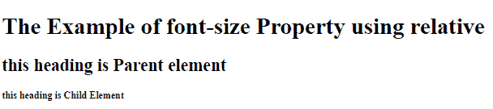

# 如何在 CSS 中改变字体大小

> 原文：<https://www.tutorialandexample.com/how-to-change-font-size-in-css>

## 如何在 CSS 中改变字体大小？

## 字体大小:-

用户可以用各种方式将注意力吸引到网站页面上的内容。可以突出句子中的一个元素。例如，你可以把它变成橙色。它可能是粗体或下划线。

除了这些格式选项之外，还可以改变内容的字体和大小来吸引读者的眼球，并生成视觉层次。

我们不必使用 HTML 标题来修改网站上文本的大小。假设我们希望调整页面上其他项目的文本大小，或者缩小或增加默认的标题大小。在这种情况下，您可以使用 CSS 来修改字体大小。让我们详细地检查一下这些步骤。

font-size 属性决定文本的大小。

在网页设计中，控制字体大小的能力至关重要。字体大小的改变不应该用来创建看起来像标题的部分或看起来像段落的标题。

对标题和段落总是使用 HTML 标签，比如 h1> - h6 >。

字体大小参数可以是绝对的，也可以是相对的。

CSS 属性控制字体大小。可以用各种方法指定字体大小，包括使用像素或 ems 的术语或数字数据。根据特定网页的要求，选择合适的解决方案。

font-size 属性提供了许多改变网站文本大小的技术。网站的需求和目标将决定我们选择的每一个。

## 绝对尺寸:

将文本大小设置为特定值。

在某些浏览器中，用户不能修改文本大小(这不利于可访问性)

只要输出的基本细节是已知的，绝对大小就是有用的。

## 相对尺寸:

设置其周围项目的大小。

在浏览器中，该功能允许用户修改字体大小。

**语法:-**

```
font-size: medium|large|x-large|xx-large|xx-small|x-small|small|;  
```

如果没有指定字体大小，典型文本(如段落)的默认大小是 16px，相当于 1em。

## 使用绝对尺寸:

默认字体大小用于绝对大小的关键字。默认字体大小通常是中等的(相当于 16 像素或 1em)，尽管这可能会因浏览器和字体系列而异。HTML 中的标准字体大小是 16 像素。

以下是绝对大小的关键字:

*   xx-小型
*   sx-小型
*   ssmall
*   我没有
*   xlarge
*   sx-大号
*   sxx-大型
*   sxxx-大型

**示例:-**

```
<!DOCTYPE html>
<html>
<head>
<style>
div.xxs { font-size: xx-small; }
div.xs { font-size: x-small; }
div.s { font-size: small; }
div.m { font-size: medium; }
div.l { font-size: large; }
div.xl { font-size: x-large; }
div.xxl { font-size: xx-large; }
div.xxxl { font-size: xxx-large; }
</style>
</head>
<body>
<h1>The Example of font-size Property</h1>
<div class="xxs">Showing behaviour of xx-small</div>
<div class="xs">Showing behaviour of x-small</div>
<div class="s">Showing behaviour of small</div>
<div class="m"> Showing behaviour of medium</div>
<div class="l">Showing behaviour of large</div>
<div class="xl">Showing behaviour of x-large</div>
<div class="xxl">Showing behaviour of xx-large</div>
<div class="xxxl">Showing behaviour of xxx-large</div>
</body>
</html> 
```

**输出:-**


绝对尺寸简化了文本的大小调整，并在页面上构建了字体层次结构。然而，并不是所有的浏览器都允许用户修改文本大小，这对于包容性设计来说是一个糟糕的选择。

## 使用相对尺寸:-

相对大小关键字根据父元素的字体大小放大或缩小文本。绝对尺寸的比例用于计算相对尺寸

如果主要组件具有较大的文本尺寸，则具有较低的规定相对尺寸的子元素将具有中等的文本尺寸。

**示例:-**

```
<!DOCTYPE html>
<html>
<head>
<style>
.eg_relative { font-size: smaller; }
</style>
</head>
<body>
<h1>The Example of font-size Property using relative </h1>
<div style="font size: large">
  <h2>this heading is Parent element</h2>
  <h2 class="eg_relative">this heading is Child Element</h2>
</div>
</body>
</html> 
```

**输出:-**



## 使用像素的字体大小:-

为你的大小值设置像素(px)允许你决定字体大小，而不管访问者的浏览器。您可以给出我们希望您的文本在浏览器中呈现的高度的确切像素数。

**示例:-**

```
<!DOCTYPE html>
<html>
<head>
<style>
div.x { font-size: 10px; }
div.y { font-size: 18px; }
div.z { font-size: 24px; }
div.w { font-size: 35px; }
div.r { font-size: 75px; }
</style>
</head>
<body>
<h1>The Example of font-size Property using pixels </h1>
<div class="x">The text is of 10px.</div>
<div class="y">The text is of 18px.</div>
<div class="z">The text is of 24px.</div>
<div class="w">The text is of 35px.</div>
<div class="r">The text is of 75px.</div></body></html> 
```

**输出:-**


## 使用 ems 的字体大小:-

em 单元根据父元素的字体大小调整字体大小。将内容的文本大小设置为 2em 会使其大小是周围文本的两倍。

对于包容性设计，选择 em 单位的文本大小至关重要。用户可以在所有浏览器中改变文本的大小，因为 ems 是一个相对的度量。

ems 化合物是唯一的缺点。让我们假设一个 2em 字体大小的 span >元素包含另一个 span >元素。嵌套的元素的大小将加倍，即 4em。

**示例:-**

```
<!DOCTYPE html>
<html>
<head>
<style>
span { font-size: 3em; }
</style>
</head>
<body>
<h1>The Example of font-size Property using ems </h1>
<div>This text is not in proper format. So The text will be twice the size of the not formated text. The word which will next be is larger than the rest of the sentence. And the text is unformatted again.</div>
</body>
</html> 
```

**输出:-**

