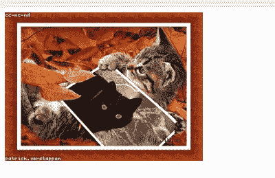
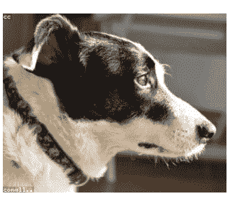
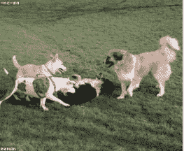

# 如何在 CSS 中调整图像的大小

> 原文：<https://www.tutorialandexample.com/how-to-resize-an-image-in-css>

## 如何在 CSS 中调整图像的大小？

responsive web 设计中使用 responsive image 属性来自动调整图像大小以适合 div 容器。resize image 属性是使用 CSS max-width 属性创建的。如果图片的宽度和高度是在 HTML 中定义的，resize 属性将不起作用。响应式 web 设计的一个最重要的方面是动态调整图像大小以匹配其容器的宽度。因为个人越来越多地使用各种各样的台式计算机，所以网页必须与所有这些计算机兼容。要防止巨大的图像超出其容器的宽度，请使用 max-width:100%；高度:自动。

在 CSS 中调整图像大小以使其适合 div，同时保持其高度和宽度的方法如下

## 1)使用 CSS 调整图像大小，使用 max-width 和 max-height 属性。

在 HTML 中添加图像时，它会占用所有可用的像素。当图像包含在容器中时，图片的大小可能大于容器的大小。该图像将占用更多的屏幕空间，占用其他项目的区域。因此，内容将不符合我们的风格，也没有吸引力。为了解决这个问题，我们可以自动利用 max-width 和 max-height CSS 值来调整图片的大小以适应容器。这些参数决定了元素的最大高度和宽度。如果元素内容的宽度和高度大于最大宽度和最大高度值，元素的大小将会减小。

**示例:-**

```
<!DOCTYPE html>
<html>
<head>
<style>
img {
 max-width: 100%;
 max-height: 100%;
}
.cat_pic {
 height: 350px;
 width: 350px;
}
</style>
</head>
<body>
<div class="cat_pic">
 
</div>
</body>
</html> 
```

**输出:-**



在下面的示例中，我们添加了一个来自 LoremFlickr 的任意图像，宽 320 像素，高 240 像素。然而，集装箱 cat pic 具有 350px 的高度和宽度。较大的照片会压缩到容器的大小，因为我们使用了最大高度和最大宽度参数。因此，图像会自动调整大小。

## 2)要在 CSS 中调整图像的大小，请使用 object-fit 属性。

要调整图像以适合其容器，甚至可以使用 CSS 中的 object-fit 属性。图像可能比容器小或大。属性允许我们缩放图片或视频以适合容器的尺寸。使用对象适合属性，我们可以确定图像如何适合。属性接受填充、包含、覆盖、无和缩小值。我们可以利用内容值使较大的图像适合容器的尺寸。

**示例:-**

```
<!DOCTYPE html>
<html>
<head>
<style>
img {
 height: 100%;
 width: 100%;
 object-fit: contain;
}
.cat_pic {
 height:350px;
 width: 350px;
}
</style>
</head>
<body>
<div class="cat_pic">
    
</div>
</body>
</html> 
```

**输出:-**



这里，我们使用了比容器尺寸更大的图片。图像有 600 像素宽，但是容器只有 300 像素宽。我们可以使用 object-fit 属性将图像压缩到容器的尺寸。因此，我们可以自动调整图像的大小。

## 3)要使用 CSS 调整图像的大小，请使用 auto-width 和 max-height 属性。

要确定图片的宽度以适合容器，我们可以使用宽度的 auto 值并设置 max-height 属性。图像的高度将被降低以匹配容器的高度。在 HTML 中插入一张类似上面的图片，并在 CSS 中将容器的高度设置为 200px。选择 img 标签，然后将宽度更改为自动，将最大高度值更改为 100%。

**示例:-**

```
<!DOCTYPE html>
<html>
<head>
<style>
.cat_pic {
 height:250px;
}
img {
 width: auto; 
 max-height: 100%; 
}
</style>
</head>
<body>
<div class="cat_pic">
    
</div>
</body>
</html> 
```

**输出:-**



以下示例中的图像是以 300 像素的高度和宽度创建的。容器的高度被设置为 200 像素。当最大高度设置设为 100%时，图像会缩小到 240 像素。因此，我们缩放了图像的高度以匹配容器的高度。

## 结论:-

在本教程中，我们学习了如何使用 CSS 中合适的属性来调整图像的大小。