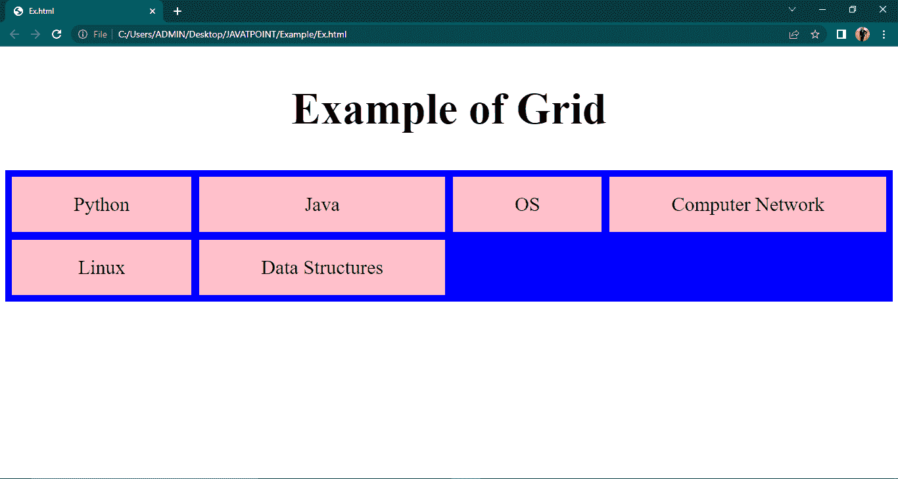
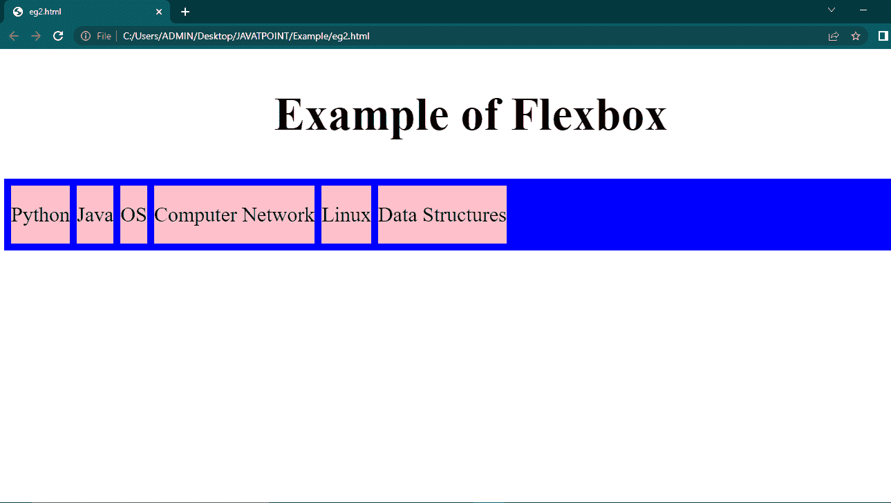

# CSS 中的网格与 Flexbox

> 原文：<https://www.tutorialandexample.com/grid-vs-flexbox-in-css>

## 网格:-

CSS 网格布局是一种基于 2D 网格的矩阵布局方法，具有列和行，通过消除对浮动和位置的需要，简化了创建的网页。像表格一样，网格布局允许我们按列和行排列对象。

CSS Grid 是级联样式表中一种强大的基于网格的布局技术，它使得在使用二维网格的浏览器中构建复杂的、完全响应的设计变得容易。随着时间的推移，基于 Web 的应用程序变得越来越复杂，开发人员寻求一种简单的工具，允许他们创建高级布局，而不需要求助于复杂的技术，如 floats。CSS 网格是解决这一问题的独一无二的解决方案，允许您仅使用级联样式表而不是 HTML 来调整项目的位置。

首先，用网格-模板列和网格-模板行定义列维度和行维度，然后用网格-列和网格-行将子组件排列到网格中。

项目被放置在网格的指定单元格内。Internet Explorer、Chrome 和 Safari Firefox 都支持网格。Opera Mini、Blackberry 浏览器、QQ 浏览器或百度浏览器不支持网格。它允许您自动创建布局或为网格内的放置指定自动放置规则。

CSS Grid 将页面划分为关键区域，同时允许开发人员调整大小、移动和堆叠构建块元素。它允许开发人员同时上下排列元素，这在 Flexbox 容器中是不可能的。

## Flexbox: -

Flexbox 是一种一维布局方法，允许更精确地对齐和分配容器内元素之间的空间。因为它是一维的，所以一次只能处理一个方向的布局——行或列。这对于像组件这样的微小布局特别有用。

由于 Flexbox 强大的对齐功能，人们可以利用浮动或定位来构建灵活、响应迅速的设计。它与所有观看屏幕和设备兼容。

Flexbox 是一种布局范例，允许您以简单有序的方式组织容器中的元素。它考虑和分配空间，而不改变下面的标记。当容器的 display 属性设置为 flex 时，容器内部的容器尺寸会伸缩，但是容器的边缘不需要随着内容的边距而收缩。没有浮动，它是移动友好和响应迅速的。

## 网格和 Flexbox 之间的差异:-

**1。灵活性和维度:**

Flexbox 让您可以更好地控制项目对齐和空间分配。Flexbox 只能处理列或行，因为它是一维的。

Grid 提供了二维布局功能，允许以可变宽度作为长度单位。这弥补了 Flex 的不足。

**2。定位:**

Flex Directional 使设计人员能够在创建和反转行或列时垂直或水平对齐项目。

CSS 网格使用网格流动性的分数测量单位和自动关键字功能来自动改变列和行。

**3。管理项目:**

父元素是 Flex 容器，子元素是 Flex 项目。通过改变项目尺寸，Flex 容器可以确保平衡的描述。这使得开发人员能够创建适应不断变化的屏幕宽度的设计。

Grid 允许你隐式和显式地放置素材。它的内置工具使它能够扩展项目，并将以前项目中的值复制到新的构造中。

**4。控制:**

CSS Flexbox 允许你以一种方式水平或垂直排列项目。在每一行中一次执行一个计算，而不考虑其他行，并且可以改变每一行中的基本原理和对齐控制。

另一方面，CSS Grid 提供了在两个方向上都能完美运行的布局特性，允许用户以自己喜欢的任何方式构建网格单元。

**5。用法:**

Flexbox 主要是一个基于内容的系统。它听完信息后会适应它。Grid 更加面向布局和基于容器，这意味着它本质上控制着结构。

CSS Grid 对于定义大规模布局很有用，而 CSS Flexbox 对于小规模的灵活元素很有用。

使用 Flexbox 可以实现容器内的可伸缩性、单边对齐和物品排序。当块与块之间有空间时，网格可以用来构建更复杂和精致的设计布局。

现在让我们借助例子来学习它。

**网格示例:-**

```
<!DOCTYPE html>
<html lang="en">
<head>
	<style>
		. container{

			display: grid;
			display: grid;
			grid: auto auto / auto auto auto auto;
			grid-gap: 12px;
			background-color: blue;
			padding: 10px;
		}
		.eg {
			background-color: pink;
			text-align: center;
			padding: 25px 0;
			font-size: 30px;
		}
		h2
		{
			text-align:center;
			font-size: 67px;
		}
	</style>
</head>
<body>
	<h2>Example of Grid </h2>
	<div class="container">
		<div class="eg">Python</div>
		<div class="eg">Java</div>
		<div class="eg">OS</div>
		<div class="eg">Computer Network</div>
		<div class="eg">Linux</div>
		<div class="eg">Data Structures</div>
	</div>
</body>
</html> 
```

**输出:-**



**柔性盒示例:-**

```
<!DOCTYPE html>
<html lang="en">
<head>
	<style>
		.container{
			display: flex;
			display: flex;
			grid: auto auto / auto auto auto auto;
			grid-gap: 10px;
			background-color: blue;
			padding: 10px;
		}
		.eg {
			background-color: pink;
			text-align: center;
			padding: 25px 0;
			font-size: 30px;}
h2
{
	text-align: center;
	font-size:67px;
}</style>
</head>
<body>
	<h2 >Example of Flexbox</h2>
	<div class="container">
		<div class="eg">Python</div>
		<div class="eg">Java</div>
		<div class="eg">OS</div>
		<div class="eg">Computer Network</div>
		<div class="eg">Linux</div>
		<div class="eg">Data Structures</div>
	</div>
</body>
</html> 
```

**输出:-**

