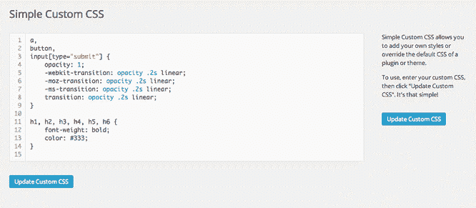

# 如何在 WordPress 中编辑 CSS

> 原文：<https://www.tutorialandexample.com/how-to-edit-css-in-wordpress>

开发一个新的网站或博客是一项艰巨的任务。我们想创造一些消费者会喜欢的东西，但我们可能不希望设置需要几个月的时间，而且如此复杂，每个副本更新都需要一个编码器。

在整个研究过程中，我们很有可能发现 WordPress 是一个可行的选择。

所以在这里我们会了解什么是 WordPress，它的特点是什么，我们如何将它与 HTML 和 CSS 融合等等。

**我们现在先来了解一下什么是 WordPress？**

## WordPress: -

WordPress 开始是 b2/cafelog 项目的一个分支，最初在 2003 年作为一个独立的项目发布。

但是，如果我们回到开始，马特·莫楞威格和迈克·利特尔合作建设 WordPress。

WordPress 是一个免费的开源内容管理系统(CMS)。这是那些不懂如何编码但想做网站和博客的人的常用工具。下载、使用和修改都是免费的。这个软件是免费的。它是用 PHP 开发的，使用 MySQL 作为数据库。WordPress 是一个多功能的内容管理系统，可以用于各种目的，包括博客、电子商务、商业和投资组合网站。WordPress 对于大型和小型网站来说都是一个很好的选择，因为它具有可访问性和灵活性。

## 使用 WordPress 的优点

### 1)开源平台:-

WordPress 是免费的开源软件。这意味着任何人都可以更改源文件并转售它们。它旨在让用户提交他们对如何改进网站的想法。有一个开源社区致力于改进 WordPress。

### 2)初学者友好型:-

WordPress 不需要计算机工程学位。WordPress 的用户界面易于理解和操作。可以快速下载主题，让网站焕然一新。可以添加一个插件来插入一个新功能，如反馈表。过去需要几个小时的工作现在可以在几分钟内完成。

### 3)免费使用:-

WordPress 是一个免费平台。该应用程序完全免费使用。WordPress.org 是一个免费网站，你可以下载和使用该软件。人们不得不花钱托管网站和域名。要使您的内容在线可用，您必须向第三方主机提供商付费。

### 4)它是安全的

企业担心安全性。我们希望知道我们的公司信息(以及我们客户的数据)是安全的，尤其是数据泄露的数量每年都在增加。如果插件得到维护，证书得到保护，WordPress 是最简单也是最安全的 CMS 平台之一。该平台提供了许多安全措施，包括锁定非活动用户和启用双因素身份认证的能力。

### 5)支持所有媒体类型:-

WordPress 没有限制主要的媒体类型。因此，人们可以用图像、图像和视频的任意组合来创建网站。在这个吸引消费者注意力的充满挑战的市场中，这个系统允许你自由创作，这很好。

### 6) WordPress 插件允许进一步定制:-

WordPress 插件是一些小的软件，我们可以用它们来改善我们网站的运行(比如 SEO，备份，联系方式等等)。WordPress 的插件可以用来增强 WordPress 的核心程序。WordPress 插件目录上有许多免费的 WordPress 插件和蓬勃发展的付费插件市场。

### 7) WordPress 主题是高度可定制的

WordPress 主题控制着你的网站的外观和感觉。设置新的 WordPress 主题可以通过点击一个按钮来改变整个网站的布局。增强的 WordPress 主题更类似于 WordPress 页面生成器，为用户提供了更多的布局灵活性。

### 8)简单明了:-

WordPress 使人们能够在网站上快速发布和构建内容。即使对初学者来说，WordPress 也很容易使用。

### 9)编码不是必需的:-

WordPress 取消了为了创建网站而学习编码的要求。WordPress 支持多种编程语言，但是我们不需要熟悉其中的任何一种就可以使用它。

### 10)强大的用户和开发者社区:-

如果我们有一个 WordPress 网站，我们可以通过访问当地的 WordPress 聚会、Word Camps 和其他活动加入更大的 WordPress 社区。WordPress 用户以友好、乐于助人和前瞻性思维著称。

## WordPress 的缺点:-

### 1)定期更新:-

安装 WordPress 是不够的。为了确保它正常工作，我们必须安装几个插件和主题。我们使用的插件越多，我们要处理的兼容性问题就越多。

此外，更新您的网站可能会导致插件停止运行，从而阻碍其功能。在更换网站之前，确保我们有这样的数据备份。

### 2)网站可以随时关闭

网站可能会因为各种原因随时关闭。

如果我们不注意，我们可能不会注意到网站关闭。它可能会停机几个小时甚至几天，对您的业务造成相当大的干扰。

### 3)定制需要编码:-

WordPress 站点的某些更新需要 HTML、CSS 和 PHP 技能。如果我们想要个性化它或者改进设计，我们可能需要写任何复杂的代码行。如果我们属于知道的那一类人，事情可能会进展得很好，但是如果我们试图在没有适当技能的情况下编写代码——这个群体中的大多数人——我们可能会对网站构成重大威胁。

## 如何在 WordPress 中编辑 CSS？

在 WordPress 中编辑 CSS 文件主要有很多方法。让我们一个一个来看。

### 1)使用自定义 CSS 定制 CSS: -

从 WordPress 4.7 开始，我们可以在不使用外部插件的情况下应用 CSS 代码。这个特性已经包含在核心中，可以用来定制额外的 CSS。它在所有主题和插件的所有 WordPress 版本中都可用。这是一个非常简单快捷的添加 CSS 的方法。此外，编辑器非常简单，易于用作显示的选择器，如类名或 id，这使得我们可以更容易地为任何项目添加任何 CSS 规则。

### 2)使用 JetPack 自定义 CSS 模块:-

最简单和最容易的方法是使用 JetPack 插件。我们可以使用这个插件，如果我们有一个 Wordpress.com 帐户。不仅如此，我们还可以使用免费插件来添加自定义 CSS，这就是 Slim Jetpack 插件。

为此，首先安装 JetPack 插件，然后激活该插件，这可能会提示连接到 WordPress 帐户。

然后进入 JetPack，点击自定义 CSS 模块。在插件被激活后，我们将在外观自定义 CSS 菜单中有一个新的标签。就这样，我们可以使用 CSS 编辑器了。这种策略的美妙之处在于 JetPack 提供了 CSS 样式，这些样式在主题的默认加载(style.css)下指定编辑器，允许您重新编写，而不用担心在将来的版本中丢失修改

### 3)使用简单的自定义 CSS 插件:-

它与 JetPack 插件相同。一旦我们安装并激活了 Jetpack 插件，下一次我们想要编辑 CSS，我们需要进入外观à自定义 CSS 并编辑我们想要的 CSS 样式，但是是的，我们应该保存更改，以便它出现在网站上。

### 4)通过 FTP 编辑:-

创建子主题和改变父主题样式是一个更复杂但同样有效的选择。我们将做与前面的方法相同的事情:在样式表父主题之后添加一个自定义样式表。移除现有主题，并用新规则替换它。为了使用这种方法，我们需要一个 CSS 编辑器，如记事本或 sublime 文本编辑器，还需要访问 FTP 或子主题包，以便我们可以通过 AppearanceàTheme 安装它。关键优势在于它是可扩展的；如果您需要添加更多的功能或布局，我们可以在子主题的 functionality 文件中完成。

### 5)在 WordPress 中直接编辑

在 WordPress 中直接编辑 CSS，这意味着直接在 style.css 文件中进行更改。简单地说，我们可以去外观编辑器。查找当前主题的 style.css 文件，并根据需要对文件进行修改。但是在使用这个特性的时候，如果你对 CSS 一无所知，就要小心了，因为任何点状错误或者没有在 style 后面插入分号都不会产生想要的输出。

## 结论:-

CSS 允许开发者设计你网站的内容。因此，在 WordPress 中使用定制 CSS 是让网站脱颖而出的绝佳方法。

**一些方式如下:**

*   用孩子的主题来改变它
*   使用块编辑器
*   利用插件
*   利用主题定制器