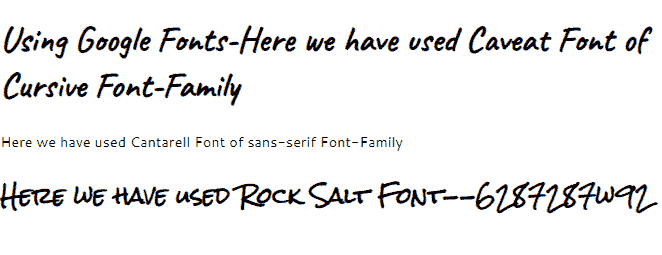
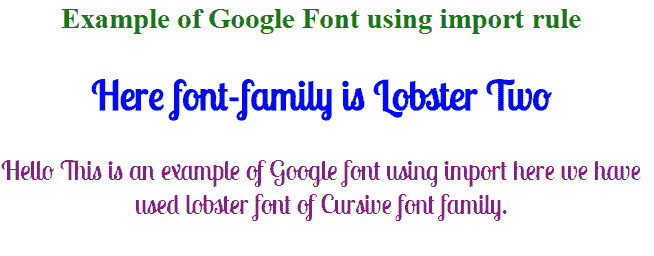

# 如何在 CSS 中使用谷歌字体

> 原文：<https://www.tutorialandexample.com/how-to-use-google-fonts-in-css>

## 字体:-

字体是用来让我们的网站看起来更漂亮。根据网页设计或布局选择合适的字体也很重要。许多字体在 HTML 和 CSS 中是可访问的；然而，如果我们不喜欢普通的 HTML/CSS 字体，想要一些新的，新鲜的，当前的，我们可以利用谷歌字体。

## 谷歌字体:-

Google Fonts 是一个 Google 在线库，允许用户通过对所有人开放的 CDN(内容交付网络)使用几个字体系列。

我们选择的字体是任何设计的一个重要方面。Google Fonts 是一个免费的在线字体服务，允许用户在我们的 CSS 文件中使用各种字体。

2010 年，谷歌字体开始作为一项工程努力，以推进网络，使其更快。

个人和商业使用谷歌字体都是免费的。由于谷歌字体网站，任何人都可以立即选择和使用多种字体，以满足他们的个人设计需求。

每个人都使用谷歌字体，但主要是平面设计师，用户界面/UX 设计师，开发人员，网页设计师，博客等。谷歌字体可以用在婚礼请柬、网站、海报和书籍上，这只是几个例子，但它的用途更多。

世界各地的字体创建者、字体铸造厂和设计社区都为谷歌字体做出了贡献。这些人和组织创造了我们在谷歌字体上看到的字体。

我们应该使用谷歌字体，因为

*   它们很容易实现。
*   有超过 900 种字体可供我们选择用于开发网站或其他任何东西。
*   字体的整体水平正在提高。
*   谷歌字体也可以下载用于印刷。
*   谷歌字体 API 使得每个人使用网络字体更加容易和快捷。谷歌字体已经在各种浏览器环境下进行了测试。

我们只需要添加链接到我们的 HTML 文档的定制级联样式表( **CSS** )，然后它引用 CSS 样式中选择的字体系列。

## 如何使用谷歌字体？

我们可以通过两种方式在开发网站或网页时使用谷歌字体。

第一种方法是将它添加到 HTML 文件中的<link>标签，第二种方法是使用@import 规则。我们将借助一个例子来研究这两种方法。

## 1)添加到 HTML 文档中的<link>标签:-


首先，去谷歌字体官网，选择我们选择的字体。

然后点击“选择这种风格”并复制我们选择的风格的链接。

现在将该链接粘贴到 HTML 文档的<link>标签中。

**语法:** -

```
<link rel = "stylesheet" href = "https://fonts.googleapis.com/css?family=Font+Name>  
```

然后，我们可以使用外部样式表或内联样式将指定的 web 字体应用于元素。

```
Selector(id,class,tag)
{
	Font-family: ‘Name_of_Font’,’Name_of_font_family’;
} 
```

**示例:-**

```
<!DOCTYPE html>
<html>
<head>
<link href="https://fonts.googleapis.com/css2?family=Caveat&display=swap" rel="stylesheet">
<link href="https://fonts.googleapis.com/css2 family=Cantarell&family=Caveat&family=Great+Vibes&family=Luckiest+Guy&family=Tapestry&display=swap" rel="stylesheet">
<link href="https://fonts.googleapis.com/css2?family=Cantarell&family=Caveat&family=Creepster&family=Great+Vibes&family=Luckiest+Guy&family=Rock+Salt&family=Tapestry&display=swap" rel="stylesheet">
<style>
h1{
  font-family: 'Caveat', cursive;
  font-size: 40px;
}
p
{
	font-family: 'Cantarell', sans-serif;
}
h2
{
	font-family: 'Rock Salt', cursive;
}
</style>
</head>
<body>
<h1>Using Google Fonts-Here we have used Caveat Font of Cursive Font-Family</h1>
<p>Here we have used Cantarell Font of sans-serif Font-Family</p>
<h2>Here we have used Rock Salt Font--6287287w92</h2>
</body>
</html> 
```

**输出:-**



因此，在上面的例子中，我们在<link>标签中使用了多种谷歌字体，并对每个选择器或标签应用了不同的谷歌字体，使其看起来不同并理解如何使用它们。

## 2)使用导入规则:-

我们在这里使用的方法与我们对<link>标签使用的方法相同。我们也可以这样做，但是我们将使用@import 规则，而不是在这里使用<link>标记。

因此，首先，转到谷歌字体，选择字体的选择，并将其导入到

**语法:-**

```
@import url(‘https://fonts.googleapis.com/css?family=Font_Family_name’)
```

**示例:-**

```
<html>
<head>
<style>
@import url('https://fonts.googleapis.com/css2?family=Lobster+Two&display=swap');
h2{
color: blue;
}
 h1{
color: green;}
#Ex{
font-family: 'Lobster Two', cursive;
font-size: 30px;}
p{
color: purple;}
</style></head>
<body>
<center>
<h1> Example of Google Font using import rule </h1>
<div id ="Ex">
<h2> Here font-family is Lobster Two </h2>
<p> Hello This is an example of Google font using import here we have used lobster font of Cursive font family. </p>
</div>
</center>
</body>
</html> 
```

**输出:-**



在上面的例子中，我们通过@import 只使用了一种字体，但是正如我们在第一个例子中所做的那样，同样对于 import，我们也可以使用多个@import 来进行样式化。