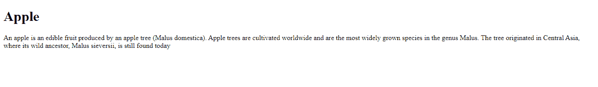
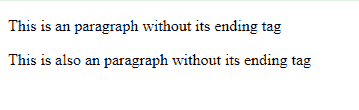
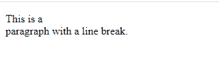

# HTML 元素

> 原文：<https://www.tutorialandexample.com/html-elements>

一个 HTML 元素不过是一个开始标签，然后是一些内容，然后是结束标签。所以我们可以说 HTML 元素是从开始标签到结束标签的一切。

**例如:**

```
<tagname>some content</tagname>
```

**现在举一个实时的例子:**

```
<h1>This is my first heading</h1>
```

注意:在 HTML 中，我们有一些没有内容的特殊元素。例如
元素。所以这些元素叫做空元素。更简单地说，我们可以说空元素没有结束标记。

**嵌套的 HTML 元素:**

在 HTML 中，元素可以嵌套，这意味着 HTML 元素可以包含其他元素。所有的 HTML 文档都由嵌套的 HTML 元素组成。以下示例有四个 HTML 元素:

**举例:**

```
<html>
<body>
<h1>Apple</h1>
<p>An apple is an edible fruit produced by an apple tree (Malus domestica). Apple trees are cultivated worldwide and are the most widely grown species in the genus Malus. The tree originated in Central Asia, where its wild ancestor, Malus sieversii, is still found today</p>
</body>
</html>

```

**输出:**



因此，在这个基本的例子中，我们可以清楚地看到 HTML 元素是如何包含其他元素的。因此，在这个例子中，我们可以看到我们有元素，它被称为根元素，用于定义整个 html 元素。它也有一个开始标签和结束标签，但是我们可以看到在这些标签之间有许多元素，比如用于定义文档主体的标签。它还有一个开始标签和结束标签。正如我们在 body 元素中看到的，我们还有另外两个元素，即

# 标签和

标签。

# 元素定义了一个标题，它也有开始和结束标签。并且那个

元素定义了一个段落。它还带有一个开始和结束标签。

**永远不要跳过结束标签:**

html 中有一些元素即使在你忘记输入结束标签后也能正确显示。比如:

标签。但是我们不应该依赖它，因为在执行的时候，如果你忘记了结束标签，它可能会出现意想不到的错误。下面的例子说明了没有结束标记的段落标记是如何工作的。

**例如:**

```
<html>
<body>
<p>This is an paragraph without its ending tag
<p>This is also an paragraph without its ending tag
</body>
</html>

```

输出:



空 HTML 标记:

没有内容的 HTML 元素称为空元素。比如:
标签用于定义 html 中的换行符，由于没有结束标签，所以是空元素。当一个标签没有结束标签时，给这个元素一个内容是没有意义的。这就是空 html 元素的工作方式。

例如:

```
<html>
<body>
<p>This is a <br> paragraph with a line break.</p>
</body>
</html>

```

输出:



HTML 不区分大小写:

HTML 不是区分大小写的语言，这意味着

与

相同。在 html 中，标准不需要小写标签。

HTML 标签:

有几个 html 标签，像、、

# ……到

###### 。我们对每个标签都有不同的描述。