# HTML5 格式

> 原文：<https://www.tutorialandexample.com/html5-formatting/>

**HTML 格式**

HTML 格式是一种为获得更好的外观而设置文本格式的方法。HTML 允许我们在不使用 CSS 的情况下格式化文本。HTML 包括许多格式化标签。这些标签用于加粗、下划线和斜体文本。HTML 和 XHTML 中有将近 14 种文本显示方式可供选择。

对于 HTML，标签分为两类:

*   物理标签
*   逻辑标签

**物理标签:**这些标签用来给文本一个视觉外观。

**逻辑标签:**逻辑或语义标签用于追加值。

这里我们将知道 14 个用于格式化 HTML 的标签。用于格式化 HTML 的文本列表如下。

| **元素名称** | **描述** |
| **< b >** | 它是一个物理标签，用于加粗标签之间的文本。 |
| **<强>** | 它是一个逻辑标签，告诉浏览器文本是重要的。 |
| **<我>** | 它是一个用于制作斜体文本的物理标签。 |
| **<em>T1】** | 它是一个逻辑标签，用于以斜体显示内容。 |
| **<标注>** | 该标签将用于突出显示文本。 |
| **<>** | 这个标签用来给写在它们之间的文本加下划线。 |
| **<>** | 使用这个标签，文本可以出现在电传打字机中。(不支持 HTML5) |
| **<sup>T1】** | 它显示的内容略高于通常的行。 |
| **<子>** | 它显示的内容略低于通常的行。 |
| **<>** | 标签用于显示删除的内容。 |
| **<出击>** | 使用这个标签会在文本行上画一个删除线。(不支持 HTML5) |
| **<ins>T1】** | 这个标签显示了添加的内容。 |
| **<大>** | 该标签与一个常规单元一起使用，以增加字体大小。 |
| **<小>** | 此标签用于将字体大小从基本字体大小减少一个单位。 |

### 1.粗体文本

**HTML < b >和< strong >元素格式**

HTML < b >元素是一个物理标签，以粗体显示文本，没有任何逻辑重要性。如果你在< b>里写了什么................元素，它用粗体字母显示。

**例子**

```
 < p><b > Write in bold text your first paragraph.</b></p >
```

**代码**

```
<!DOCTYPE>
 <html>
 <body>
 <p><b > Write in bold text your first paragraph.</b></p >
 </body>
 </html> 
```

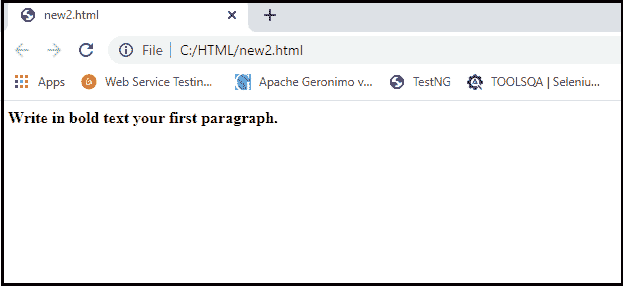

**输出**

**<强>标签**

HTML < strong >标签是一个逻辑标签，以粗体显示内容，并告知浏览器其逻辑意义。写类似< strong >的东西？???????.显示重要的文字。

**例子**

```
<p><strong>This is an important content</strong>, and this is normal content</p>  
```

**代码**

```
<!DOCTYPE>
 <html>
 <body>
 <p><strong>This is an important content</strong>, and this is normal content</p>
 </body>
 </html> 
```

**输出**

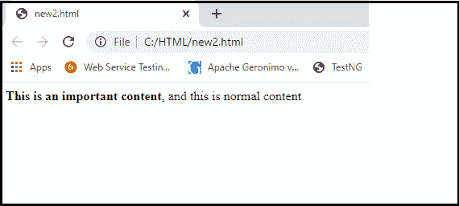

### 2.斜体文本

**HTML < i >和< em >元素格式化**

HTML < I >元素是一个物理元素，它以斜体显示包含的内容，没有任何附加的重要性。如果你在< i>里写了什么................元素，它将以斜体字母显示。

**例子**

```
<p> <i>Write Your First Paragraph in italic text.</i></p> 
```

**代码**

```
<!DOCTYPE>
 <html>
 <body>
 <p><i>Write Your First Paragraph in italic text.</i></p>
 </body>
 </html> 
```

输出

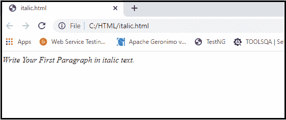

**< em >标签**

HTML < em >标签是一个逻辑特性，它用斜体显示包含的内容，在语义上有附加值。

**例子**

```
<p><em>This is an important content</em>, which displayed in italic font.</p> 
```

**代码**

```
<!DOCTYPE>
 <html>
 <body>
 <p><em>This is an important content</em>, which displayed in italic font.</p>
 </body>
 </html> 
```

**输出**

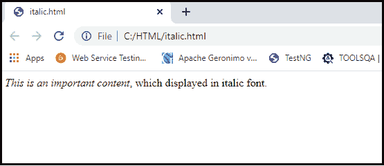

### HTML 标记的格式

如果您想标记或突出显示一个文件，内容应该写入< mark>......。

**例子**

```
 <h2> I want to put a <mark> Mark</mark> on your face</h2>
```

**代码**

```
<!DOCTYPE>
 <html>
 <body>
 <h2>  I want to put a <mark> Mark</mark> on your face</h2>
 </body>
 </html> 
```

**输出**

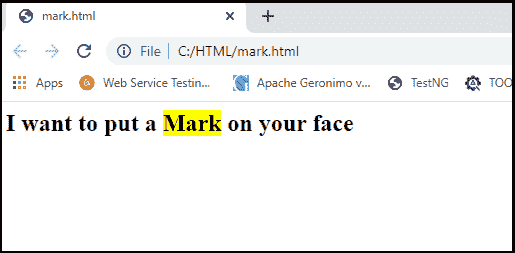

### 4.带下划线的文本

如果我们在元素< u>里面写点东西......，显示带下划线的文本。

**例子**

```
<p> <u>Write Your First Paragraph in underlined text.</u></p>  
```

**代码**

```
<!DOCTYPE>
 <html>
 <body>
 <p><u>Write Your First Paragraph in underlined text.</u></p>
 </body>
 </html> 
```

**输出**

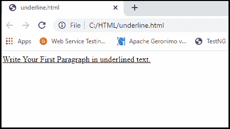

### 5.删除文本

任何写在< stroke>内的东西.......................元素将以删除线显示。这是一条跨越声明的细线。

**例子**

```
<p> <strike>Write Your First Paragraph with Strike Text</strike>.</p>  
```

**代码**

```
<!DOCTYPE>
 <html>
 <body>
 <p><strike>Write Your First Paragraph with Strike Text</strike>.</p>
 </body>
 </html> 
```

**输出**

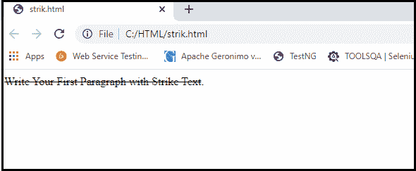

### 6.等宽字体

如果您希望每个字母具有相同的宽度，您应该将内容写在`…………`元素中。

**例子**

```
 <p>Hello <tt>Write Your First Paragraph in monospaced font.</tt></p>
```

**代码**

```
<!DOCTYPE>
 <html>
 <body>
 <p>Hello <tt>Write Your First Paragraph in monospaced font.</tt></p>
 </body>
 </html> 
```

**输出**

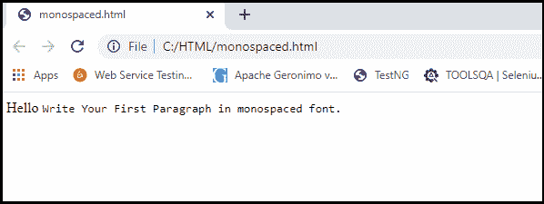

### 7.上标文本

如果您将内容放在< sup>..................元素，它显示在上标中；意味着一个字符的一半高度显示在其他字符之上。

**例子**

```
<p>Hello <sup>Write Your First Paragraph in superscript.</sup></p>     
```

**代码**

```
<!DOCTYPE>
 <html>
 <body>
 <p>Hello <sup>Write Your First Paragraph in superscript.</sup></p>
 </body>
 </html> 
```

**输出**

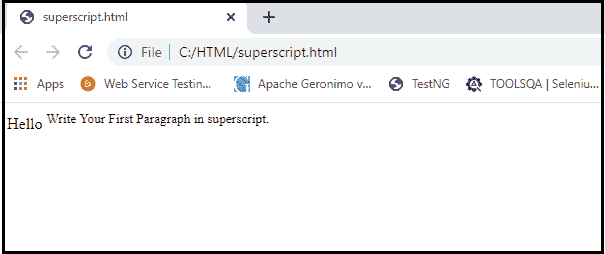

### 8.下标文本

如果你把内容放在项目< sub>里面..............，它显示在下标中；意味着显示低于其他字符一半高度的字符。

**例子**

```
<p>Hello <sub>Write Your First Paragraph in subscript.</sub></p> 
```

**代码**

```
<!DOCTYPE>
 <html>
 <body>
 <p>Hello <sub>Write Your First Paragraph in subscript.</sub></p>
 </body>
 </html> 
```

**输出**

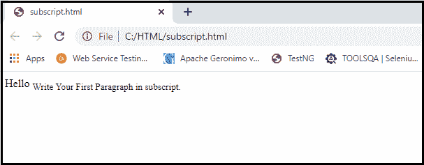

### 9.删除的文本

~~内的任何东西......~~显示为删除文本。

**例子**

```
<p>Hello <del>Delete your first paragraph.</del></p> 
```

**代码**

```
<!DOCTYPE>
 <html>
 <body>
 <p>Hello <del>Delete your first paragraph.</del></p>
 </body>
 </html> 
```

**输出**

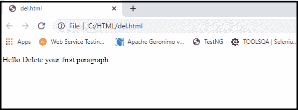

### 10.插入的文本

在<ins>内插入任何东西......</ins>将显示为插入文本。

**例子**

```
<p> <del>Delete your first paragraph.</del><ins>Write another paragraph.</ins></p>  
```

**代码**

```
<!DOCTYPE>
 <html>
 <body>
 <p><del>Delete your first paragraph.</del><ins>Write another paragraph.</ins></p>
 </body>
 </html> 
```

**输出**

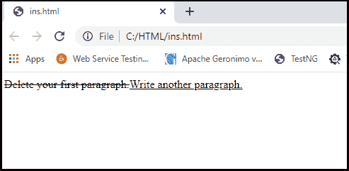

### 11.更大的文本

如果我们想添加一个比其余文本更大的字体，那么就在< big>中插入内容................。它使一种字体的大小比前一种字体大。

**例子**

```
<p>Hello <big>Write the paragraph in larger font.</big></p>  
```

**代码**

```
<!DOCTYPE>
 <html>
 <body>
 <p>Hello <big>Write the paragraph in larger font.</big></p>
 </body>
 </html> 
```

**输出**

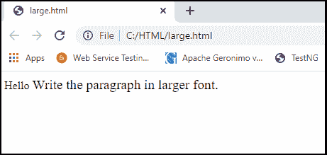

### 12.较小的文本

如果我们想让你的字体比文本的其余部分小，插入< small>中的内容................标签。它将一种字体的大小缩小到前一种。

**例子**

```
<p>Hello <small>Write the paragraph in smaller font.</small></p>
```

**代码**

```
<!DOCTYPE>
 <html>
 <body>
 <p>Hello <small>Write the paragraph in smaller font.</small></p>
 </body>
 </html> 
```

**输出**

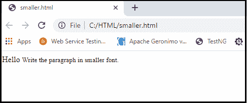