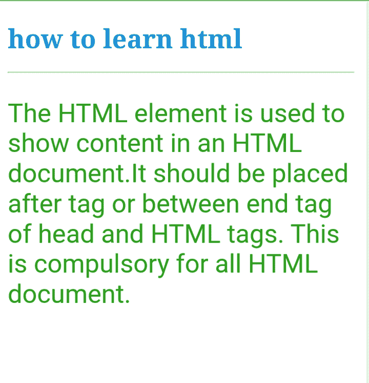

tag <link href="../Styles/Style.css" type="text/css" rel="stylesheet">

# HTML 标签

> 原文：<https://www.tutorialandexample.com/html-body-tag>

HTML 的意思是超文本标记语言，它是制作网页的首选语言。它解释了网页是如何组合在一起的。HTML 中有许多不同的元素，它们给不同类型的材料命名，如标题、段落、链接等。HTML 中最重要的元素之一是主体标签。如果没有 body 标签，就看不到 Html 文档中的内容。

元素用于显示 HTML 文档中的内容。在一个文档中，只能有一个“body”元素。应该放在<**头** > **标签**之后或者头的结束标签和 HTML 标签之间。这对所有 HTML 文档都是强制性的。

**<正文>标签**的语法

```
<body>
<h3>Hello World this is Content of your website
</h3>
</body> 
```

**HTML**中<正文>标签的例子

```
<!DOCTYPE html>
<html>
<body style="background-color:white;">
    <title>learning html</title>
<h1 style="color:rgb(17, 148, 224);"> how to learn html</h1>
<hr>
<p style="color:rgb(38, 165, 21);font-size: xx-large;font-family: 'Gill Sans', 'Gill Sans MT', Calibri, 'Trebuchet MS', sans-serif;" 
>
The HTML element <body> is used to show content in an HTML document.It should be placed after <head> tag or between end tag of head and HTML tags. This is compulsory for all HTML document.

</p>

</body>
</html> 
```

**输出:**



## 属性

### 全局属性

全局属性是该元素的一组属性。

### 一个链接

不要用这种质量！相反，将活动伪类与 CSS 颜色属性结合起来。

### 背景

帮助查找背景图片的 URL。不要利用这个属性！请改用元素的 CSS 背景属性。

### 环

未选中链接的颜色由此决定。它在 HTML5 中不受支持，所以使用:link 伪类和 CSS colour 属性。

### 背景色

内容的背景颜色由它决定，但是在 HTML5 中不支持，所以在 HTML5 中使用 CSS 背景颜色属性。

### 文本

它在 HTML 文档中显示文本颜色，但是在 HTML5 中不支持，所以在 HTML5 中使用 CSS 颜色属性。

### 我们的贵宾

它看起来像一个链接，但它的工作是不同的。它显示了被点击链接的颜色，同样，它在 HTML5 中不受支持，所以使用:visited 伪类和 CSS colour 属性。

### Onafterprint

当用户打印完文档时，调用函数。

### onbeforeprint

当用户要求打印文档时，调用函数。

### Onbeforunload

在文档卸载前不久调用该函数。

### Onblur

当文档失去焦点时调用该函数。

### 不良事件

当文件无法正确加载时调用函数。

### 富可视

当注意力指向文档时调用该函数。

### Onhashchange

当文档的当前地址的片段标识符部分发生变化时，调用该函数，该函数以散列字符(' **#'** )开始。

### Onlanguagechange

当发生变化时，用更好的语言调用函数。

### 再装

当文档文件完全加载后调用函数。

### Onmessage

当文档收到消息时调用函数。

### 离线

当网络连接丢失时调用该函数。

### Ononline

当网络连接成功时调用该函数。

### Onpopstate

在用户浏览了会话历史之后调用函数。

### 在线阅读

当用户在撤消事务历史中前进时调用该函数。

#### 储存；储备

改变存储区域后调用函数。

### 奥农多

当用户向前撤消交易历史时调用该函数。

### 右边距

HTML5 不支持文档正文的右边距，所以在 HTML5 中使用 CSS margin-right 属性。

### 书眉

HTML5 不支持文档正文的上边距，所以使用 CSS margin-top

HTML5 中的属性。

## 浏览器兼容性

*   铬
*   旅行队
*   边缘
*   迷你歌剧
*   火狐浏览器

### 结论

HTML 元素用于显示 HTML 文档中的内容。在一个文档中，只能有一个“body”元素。它支持许多浏览器，如 Chrome、Safari、Firefox 等。它还支持许多属性，如全局、背景色、On 存储、Ondo 等。没有 body 标签，你就不能在 HTML 页面上看到你的内容，所以它是一个重要的元素。