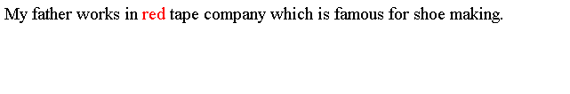
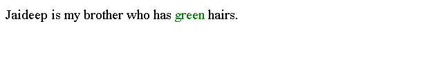
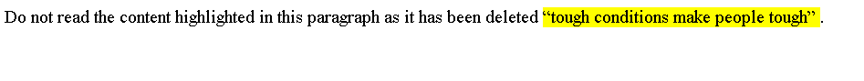

# HTML 标签

> 原文：<https://www.tutorialandexample.com/html-span-tag>

HTML 中的 span 标签被用作内联容器元素来标记特定或特殊的文本块或页面部分。

如果您想要编辑或添加任何验证，您可以借助 HTML 中的 class 或 id 属性使用 JavaScript 来完成。如果您想定制 span 标签，您可以简单地使用 CSS(层叠样式表)来完成。

**语法:**

```
<body>
<p>……………

………. 

……………</p>
</body>
```

**例子**

以下是我们使用 span 元素为一条信息着色的示例:

**例 1:**

```
<!DOCTYPE html>
<html>
<head>
<tilte> html span tag </title>
</head>
<body>
<p>My fatherworks in redtape company which is famous for shoe making.</p>
</body>
</html>
```

**输出:**



**例 2:**

```
<!DOCTYPE html>
<html>
<head>
<title> html span tag </title>
</head>
<body>
<p>Jaideep is my brother who has green hairs.</p>
</body>
</html>
```

**输出:**



span 元素是一个 HTML 元素，用于为文本的一部分提供背景色。

**例 3:**

```
<!DOCTYPE html>
<html>
<head>
<title> html span tag </title>
</head>
<body>
<p>Do not read the content highlighted in this paragraph as it has been deleted  “tough conditions makepeople tough”.</p>
</body>
</html> 
```

**输出:**



## 浏览器支持:

支持 html 节标签的浏览器列表如下:

铬:是

微软 Edge: 是的，需要第 12 版

是的，需要第一版

狩猎旅行:是的

歌剧:是的