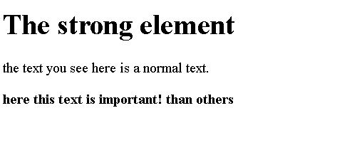
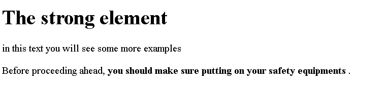

# HTML **标签**

> 原文：<https://www.tutorialandexample.com/html-strong-tag>

HTML 中的强元素用于以粗体显示真正重要的信息，以便用户或读者能够容易地理解。

**语法:**

```
<p>
<strong>…………
</strong>
</p> 
```

**例子**

在这里，我们将演示如何使用强 HTML 元素来定义任何文档的基本材料:

**例 1:**

```
<!DOCTYPE html>
<html>
<head>
<title> html strong tag </title>
</head>
<body>
<h1>The strong element</h1>
<p> the text you see here is a normal text.</p>
<p>
<strong>here this text is important!than others</strong></p>
</body>
</html> 
```

**输出:**



如果您想对任何没有任何额外重要性的特定粗体文本做同样的事情，也可以使用**标签。**

**例 2:**

```
<!DOCTYPE html>
<html>
<head>
<title> html strong tag </title>
</head>
<body>
<h1>The strong element</h1>
<p> in this text you will see some more examples</p>
<p> Before proceeding ahead, 
<strong> you should make sure putting on your safety equipments </strong>. </p>
</body>
</html> 
```

**输出:**



## 默认 CSS 设置

我们还可以借助默认 CSS 值在文档中使用**元素:**

**举例:**

```
strong {
  font-weight: bold;
}
```

## 浏览器支持:

支持 html

标签的浏览器列表如下:

Chrome:是的——需要版本 1

微软 edge:是–需要版本 12

火狐:是的——需要版本 1

野生动物园:是的

歌剧:是的