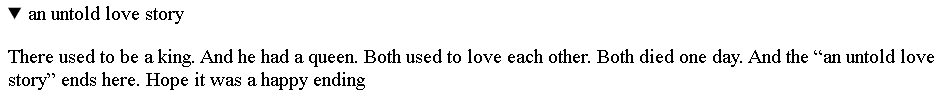
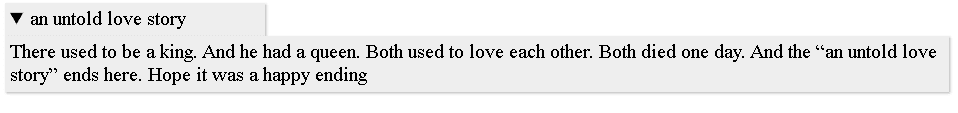

# HTML <summary>标签</summary>

> 原文：<https://www.tutorialandexample.com/html-summary-tag>

当我们只想向用户显示隐藏的详细材料的主要标题或主题名称时，我们可以通过使用 summary 标签来实现。

这使得为 html 文档中提供的细节设置可见的主题名称变得简单。单击摘要或标题可以很容易地查看或隐藏所有信息。

需要记住的重要一点是，

<summary>元素是<detail>元素的第一个子属性。</detail></summary>

**语法:**

```
<body>
<details>
<summary>………………… </summary>
<p>…………………  </p>
</details>
</body> 
```

**例子**

**例 1:**

这里我们使用

<summary>标签来讲述一个故事:</summary>

```
<!DOCTYPE html>
<html>
<head>
<title>
html summary tag
</title>
</head>
<body>
<details>
<summary>an untold love story </summary>
<p> There used to be a king. And he had a queen.  Both used to love each other. Both died one day. And the “an untold love story” ends here. Hope it was a happy ending </p>
</details>
</body>
</html>
```

**输出:**



**例 2:**

这里我们将使用 CSS 来设置 html 文档中的

<details>和<summary>标签的样式:</summary></details>

```
<!DOCTYPE html>
<html>
<head>
<title>
html summary tag
</title>
<style>
details > summary {
padding: 4px;
width: 200px;
background-color: #eeeeee;
border: none;
box-shadow: 1px 1px 2px #bbbbbb;
cursor: pointer;
}
details > p {
background-color: #eeeeee;
padding: 4px;
margin: 0;
box-shadow: 1px 1px 2px #bbbbbb;
}
</style>

</head>
<body>
<details>
<summary> an untold love story </summary>
<p> There used to be a king. And he had a queen.  Both used to love each other. Both died one day. And the “an untold love story” ends here. Hope it was a happy ending </p>
</details>
</body>
</html>
```

**输出:**



## 默认 CSS 设置:

大多数浏览器使用下面的默认 CSS 样式来显示摘要标签:

```
summary {
display: block;
} 
```

## 浏览器支持:

支持 html 摘要标签的浏览器列表如下:

Chrome: 是的，需要 12 版本。

微软 Edge: 是的，需要 79 版本。

火狐:是的，需要 49 版本。

Safari: 是的，需要版本 6。

**Opera:** 是的，需要 15 版本。